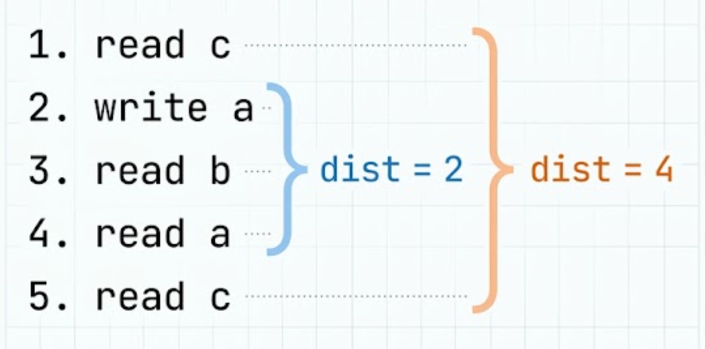

# ByteDMD

Data movement matters more than FLOPs. Recently accessed bytes can be cached, penalize non-local reads using the following cost model:

$$C=\sum_{b \in bytes} \sqrt{D(b)}$$

where $D(b)$ is the reuse distance. Square-root is motivated by VLSI routing cost in 2D.



## Usage

```python
from bytedmd import bytedmd

def myfunc(a, b, c, d, e):
    return a*b + c*d + e

assert myfunc(1, 2, 3, 4, 5) == 19
assert bytedmd(myfunc, (1, 2, 3, 4, 5)) == 15
```

## Motivation


Modern architectures spend more energy moving data than doing arithmetic, making FLOP counts an outdated cost metric. Bill Dally ([ACM Opinion](https://cacm.acm.org/opinion/on-the-model-of-computation-point/)) proposed penalizing data movement based on Manhattan distance to the processor. To avoid manual spatial mapping, Ding and Smith ([Beyond Time Complexity, 2022](https://arxiv.org/abs/2203.02536)) measure complexity using Reuse Distance, which considers distances between successive reuses of variables.

We introduce two modifications to DMD to make it compatible with Bill Dally's Manhattan distance model [docs/manhattan-diamond.md](docs/manhattan-diamond.md) - round up square roots to the nearest integer, and only consider "live variables" when computing reuse distance.  

This makes each term in the computation of DMD correspond to the wire length of fetching corresponding byte arranged in 2D in the following order:


Only counting live bytes, makes this model equivalent to a computation model which puts newly fetched values on the stack, and deletes any dead variables. Visualizing computation of `myfunc` above -- https://yaroslavvb.github.io/ByteDMD-vis/myfunc_stack.html


## Computation Model

A full formalization that fuses Bill Dally's PECM (CACM 2022) with
this cost model is in
[docs/manhattan-diamond.md](docs/manhattan-diamond.md) — single core,
two physically-separate arenas (arg + scratch) packed as Manhattan
diamonds around the ALU, with `⌈√d⌉` pricing and Bélády-optimal
liveness on scratch.

An idealized processor operates directly on an element-level LRU stack. **Computations and writes are free; only memory reads incur a cost.**

- **Two stacks:** Reads are priced against one of two stacks, each with the same $\lceil\sqrt{d}\rceil$ depth-cost shape:
  - *Argument stack* (read-only): holds the input arguments, packed left-to-right. The first argument sits at depth 1, the second at depth 2, and so on — all input elements are live and addressable from the start.
  - *Geometric stack* (read-write): holds intermediates produced during execution, ordered from least recently used (bottom) to most recently used (top). Depth is measured in bytes from the top (topmost byte = depth 1). Multi-byte scalars are treated as contiguous blocks of bytes.
- **Argument promotion:** The **first** read of an argument is priced against its depth on the argument stack; that read then promotes the argument onto the top of the geometric stack, as if it had just been produced. Every **subsequent** read of that argument is priced against the geometric stack like any other intermediate.
- **Read Cost:** Reading a byte at depth $d$ on either stack costs $\lceil\sqrt{d}\rceil$.
- **Simultaneous pricing:** All inputs to an instruction are priced against the stack state *before* any LRU bumping or argument promotion. This guarantees commutativity: `Cost(a+b) == Cost(b+a)`.
- **Only live contribute to depth of the geometric stack:** Any value that's dead (no longer used) is immediately removed from the geometric stack and remaining elements slide up to close the gap. This models an optimal compiler that keeps the stack clamped to the active working set. The argument stack is fixed and does not compact — arguments that have already been promoted no longer contribute depth on it.
- **Output epilogue:** At the end of execution, every element of the return value is read once from the geometric stack, modelling the final pass that writes the result to the caller's buffer. The write is free; the read is priced.

### Instruction Semantics

See [Instruction Set](docs/instruction_set.md) for the complete list of supported instructions.

For an instruction with inputs $x_1, \dots, x_m$ and outputs $y_1, \dots, y_n$ with $m\ge 1, n\ge 0$

1. **Price reads:** Evaluate $\sum C(x_j)$ simultaneously against the stack state *before* the instruction begins. All inputs see the same pre-instruction snapshot. Repeated inputs are charged per occurrence at the same depth (e.g., `a + a` charges `⌈√d⌉` twice where `d` is `a`'s pre-instruction depth).
2. **Update LRU:** Batch-move unique inputs to the top of the stack in read order. `b + c` and `c + b` yield the same cost (commutativity) but may differ in final stack order.
3. **Push outputs:** Allocate new output blocks and push them to the top at zero cost.

## Example Walkthrough

Consider the following function with five scalar arguments:

```python
def myfunc(a, b, c, d, e):
    return a*b + c*d + e
```

**1. Initial state (left = top, right = bottom)**
Arguments are packed left to right on the argument stack; the geometric stack starts empty:
```text
arg stack:  [a, b, c, d, e]    ← a@1, b@2, c@3, d@4, e@5
geom stack: []
```

**2. First operation: `a * b`**
`a` and `b` are both first reads — priced against the argument stack at their static depths:

$$C(a) + C(b) = \lceil\sqrt{1}\rceil + \lceil\sqrt{2}\rceil = 1 + 2 = 3$$

`a` and `b` are promoted onto the top of the geometric stack, the result `p₀ = a*b` is pushed, and liveness evicts `a` and `b` (their last use just happened):
```text
arg stack:  [a, b, c, d, e]    ← a, b promoted out but slots fixed (c@3, d@4, e@5)
geom stack: [p₀]               ← p₀ at geom depth 1
```

**3. Second operation: `c * d`**
Same pattern — two more first reads against the argument stack:

$$C(c) + C(d) = \lceil\sqrt{3}\rceil + \lceil\sqrt{4}\rceil = 2 + 2 = 4$$

`c`, `d` promoted and die; push `p₁`:
```text
arg stack:  [a, b, c, d, e]    ← only e remains unpromoted
geom stack: [p₀, p₁]           ← p₁ top (depth 1), p₀ at depth 2
```

**4. Third operation: `p₀ + p₁`**
Both operands on the geometric stack. Simultaneous pricing against the pre-op snapshot:

$$C(p_0) + C(p_1) = \lceil\sqrt{2}\rceil + \lceil\sqrt{1}\rceil = 2 + 1 = 3$$

`p₀`, `p₁` die; push `p₂`. Geom stack: `[p₂]`.

**5. Fourth operation: `p₂ + e`**
A **mixed read**: `p₂` is on the geometric stack (depth 1), `e` is a first read against the argument stack (depth 5):

$$C(p_2) + C(e) = \lceil\sqrt{1}\rceil + \lceil\sqrt{5}\rceil = 1 + 3 = 4$$

`p₂`, `e` die; the fresh sum `p₃` is pushed to geom depth 1.

**6. Output epilogue**
The caller pulls the return value back, so `p₃` is read once more from geom depth 1:

$$C_{\text{epilogue}} = \lceil\sqrt{1}\rceil = 1$$

**Total cost:** $3 + 4 + 3 + 4 + 1 = 15$. Trace: `[1, 2, 3, 4, 2, 1, 1, 5, 1]`.


## Inspecting the IR

The tracer also emits a small **intermediate representation** that makes
the two-stack lifecycle explicit. Four event types: `ARG vk @ arg=d`
(place input element `vk` on the argument stack at static depth `d`),
`STORE vk` (push intermediate `vk` on top of the geometric stack),
`READ vk@arg=d` or `READ vk@geom=d` (read priced against whichever stack
currently holds `vk` — first-read-of-an-arg is always `@arg=`, every
subsequent read of the same `vk` is `@geom=` after promotion), and
`OP name(vk@d, …)` (summary of the preceding reads — this is what
incurs cost). Op results are materialized by the `STORE` that
immediately follows the `OP`.

```python
from bytedmd import inspect_ir, format_ir

def myfunc(a, b, c, d, e):
    return a*b + c*d + e

print(format_ir(inspect_ir(myfunc, (1, 2, 3, 4, 5))))
```

```text
ARG   v1 @ arg=1                        # a at top of the arg stack
ARG   v2 @ arg=2                        # b
ARG   v3 @ arg=3                        # c
ARG   v4 @ arg=4                        # d
ARG   v5 @ arg=5                        # e — deepest arg slot
  READ v1@arg=1  cost=1                 # a first read (arg stack)
  READ v2@arg=2  cost=2                 # b first read
OP    mul(v1@1, v2@2)  cost=3           # a*b; v1, v2 promoted, die
STORE v6                                 # p0 = a*b on geom stack
  READ v3@arg=3  cost=2                 # c first read
  READ v4@arg=4  cost=2                 # d first read
OP    mul(v3@3, v4@4)  cost=4           # c*d; v3, v4 promoted, die
STORE v7                                 # p1 = c*d on geom (top), p0 below
  READ v6@geom=2  cost=2                # p0 at geom depth 2
  READ v7@geom=1  cost=1                # p1 at top
OP    add(v6@2, v7@1)  cost=3           # p2 = p0 + p1
STORE v8                                 # p2 replaces p0/p1 on geom
  READ v8@geom=1  cost=1                # p2 on geom
  READ v5@arg=5  cost=3                 # e first read (still unpromoted!)
OP    add(v8@1, v5@5)  cost=4           # mixed: one geom + one arg
STORE v9                                 # p3 = p2 + e on geom
  READ v9@geom=1  cost=1                # output epilogue: caller reads p3
# total cost = 15
```

Two-stack structure on display across four ops:

- **Both operands on arg stack** (`mul v1@1, v2@2`; `mul v3@3, v4@4`)
  — first reads of a/b and c/d, priced at their static arg depths.
- **Both operands on geom stack** (`add v6@2, v7@1`) — once the two
  products exist on the geometric stack, the second add prices them
  by live LRU depth with the usual bumping.
- **Mixed** (`add v8@1, v5@5`) — `v8` (the partial sum) is on the
  geom stack at depth 1, while `e` has never been touched yet and
  is still sitting at its original arg depth 5. A single op can
  freely combine one read from each stack.

Liveness still aggressively evicts dead variables on the geometric
stack (the arg stack is fixed — promoted args just stop
contributing).

## ByteDMD benchmarks

See "benchmarks/" folder

### Matrix-vector (4x4 matrix, 4-vector)

| Algorithm | Operation | ByteDMD Cost |
|-----------|-----------|-------------|
| matvec (i-j) | y = A @ x | 157 |
| vecmat (j-i) | y = x^T @ A | 150 |

### Matrix multiply (4x4)

| Algorithm | Operation | ByteDMD Cost |
|-----------|-----------|-------------|
| naive matmul (i-j-k) | C = A @ B | 720 |

### microGPT single-token forward pass

Architecture: `vocab=4, embd=4, heads=2, head_dim=2, 1 layer, block_size=4`.
Based on [Karpathy's microGPT](https://gist.github.com/karpathy/8627fe009c40f57531cb18360106ce95).

| Algorithm | Operation | ByteDMD Cost |
|-----------|-----------|-------------|
| microGPT (1 layer, embd=4) | single token forward | 3214 |

# Reports

In-depth reports applying ByteDMD to specific algorithms and design questions:

- [The Manhattan-Diamond Model](docs/manhattan-diamond.md) — formalization of the cost model fusing Bill Dally's PECM with the Geometric Stack: single core, two physically-separate arenas (args above, scratch below), priced by Manhattan distance. Reference for what every other report assumes.
- [Strassen vs naive matmul](docs/report-strassen-benchmarks/) — at what matrix size does Strassen's recursive algorithm beat naive matmul under ByteDMD? Includes a crossover-point experiment.
- [Modern flash attention vs naive attention](docs/report-modern-flash-attention/) — full sweep across sequence length, head dim, and block size showing flash attention's advantage growing as O(sqrt(N/Bk)) under ByteDMD while FLOPs see no benefit. Uses an optimised tracer (`bytedmd_fast.py`).
- [Antigravity flash attention experiments](docs/report-antigravity-flash-attention/) — alternative flash attention implementations and their ByteDMD costs.
- [Attention benchmark notes](benchmarks/attention_report.md) — the small-scale flash vs naive results that motivated the modern-attention deep dive.

# Python Gotcha's
The tracer implements ByteDMD by wrapping Python objects. This means that the "Instruction Set" of this metric corresponds to Python built-ins, documented under [docs/instruction_set.md](docs/instruction_set.md).

Python behavior means this implementation occasionally doesn't match README semantics and it is possible to escape the wrapping mechanism (local arrays, exception side-channels, identity ops, type introspection, f-strings, math.trunc/ceil/floor on tracked values, etc.). Known failure cases are documented in `test_gotchas.py` — avoid those patterns when writing code you want measured.


[Original Google Doc](https://docs.google.com/document/d/1sj5NqOg6Yqh10bXzGVEF5uIzSjFWAnqqTE75AMng2-s/edit?tab=t.0#heading=h.ujy6ygk7sjmb)

