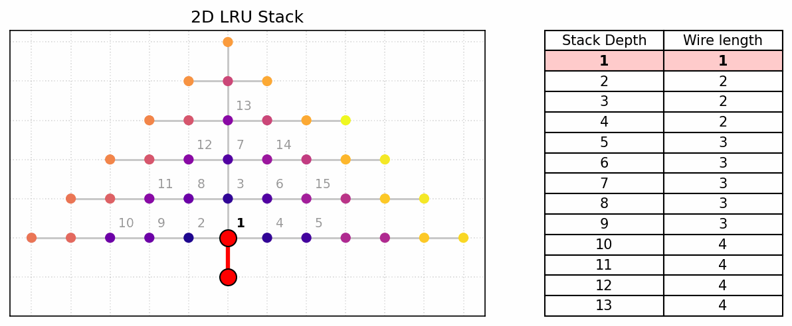

# A cost model of complexity for the 21st century: ByteDMD

To improve on FLOPs, focus on data movement. Recently used bytes can be cached, incurring smaller read cost.

$$\text{cost of read}=\sum_{b \in bytes} \sqrt{D(b)}$$

where $D(b)$ is the depth of byte $b$ in the LRU stack.

## Usage

```python
from bytedmd import bytedmd

def dot(a, b):
    return sum(i1*i2 for (i1,i2) in zip(a,b))

a = [0, 1]
b = [2, 3]
print("Dot product:  ", dot(a,b))             # 3
print("ByteDMD cost: ", bytedmd(dot, (a, b))) # 14
```

## Motivation




**TL;DR**
- The memory wall makes reducing data movement more important than reducing arithmetic.
- Instead of FLOP count, focus on the cost of data movement.
- Manage data using continuous LRU stack, use wire length in 2D to model the cost of reads


Modern architectures spend more energy moving data than doing arithmetic, making FLOP counts an outdated cost metric. Bill Dally ([ACM Opinion](https://cacm.acm.org/opinion/on-the-model-of-computation-point/)) proposed penalizing data movement based on 2D spatial distance to the processor. To avoid manual spatial mapping, Ding and Smith ([Beyond Time Complexity, 2022](https://arxiv.org/abs/2203.02536)) automated this via Data Movement Distance (DMD): a rule treating memory as an LRU stack where reading depth $d$ costs $\sqrt{d}$, modeling a cache laid out in 2D.

The original DMD treats values abstractly. ByteDMD counts accesses at byte level. This rewards algorithms that use smaller data types.

## Computation Model

An idealized processor operates directly on an element-level LRU stack. **Computations and writes are free; only memory reads incur a cost.**

- **Stack State:** Ordered from least recently used (bottom) to most recently used (top). Depth is measured in elements from the top (topmost element = depth 1). Each scalar occupies one position.
- **Initialization:** On function entry, arguments are pushed to the top in call order.
- **Read Cost:** Reading a value at element depth $d$ costs $\lceil\sqrt{d \cdot B}\rceil$ where $B$ is `bytes_per_element` (default 1).

### Instruction Semantics

For an instruction with inputs $x_1, \dots, x_m$ and outputs $y_1, \dots, y_n$:

1. **Price reads:** Evaluate $\sum C(x_j)$ against the stack state *before* the instruction begins. Repeated inputs are charged per occurrence (e.g., `a + a` charges for reading `a` twice).
2. **Update LRU:** Move inputs to the top of the stack sequentially in read order. *(Note: Because of this sequential update, `b + c` vs. `c + b` yields the same cost but different final stack states).*
3. **Push outputs:** Allocate new output blocks and push them to the top at zero cost.

## Example Walkthrough

Consider the following function with four scalar arguments:

```python
def my_add(a, b, c, d):
    return b + c
```

**1. Initial Stack** 
Arguments are pushed in call order `[a, b, c, d]`, yielding element depths from the top:
- `d`: depth 1
- `c`: depth 2
- `b`: depth 3
- `a`: depth 4

**2. Read Cost**  
Inputs are priced simultaneously against the initial stack state:

$$C(b) + C(c) = \lceil\sqrt{3}\rceil + \lceil\sqrt{2}\rceil = 2 + 2 = 4$$

**3. Update Stack**  
Inputs move to the top sequentially in read order (`b`, then `c`), followed by the new `result` being pushed:
```text
[a, d, b, c, result]
```


## Future Work
### Parallel Execution

Currently, initializing a function's arguments on the stack is considered a free operation. To model parallelism we could introduce multiple processors with their own LRU stacks. Initializing arguments onto the stack could incur a cost proportional to the distance between the data's original location and the location of the LRU stack.

[Original Google Doc](https://docs.google.com/document/d/1sj5NqOg6Yqh10bXzGVEF5uIzSjFWAnqqTE75AMng2-s/edit?tab=t.0#heading=h.ujy6ygk7sjmb)

