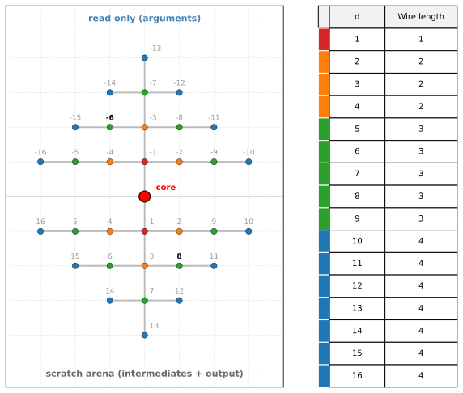

# Manhattan Diamond

(aka, simplified explicit communication model)

Bill Dally ([*On the Model of Computation*, CACM
2022](https://cacm.acm.org/opinion/on-the-model-of-computation-point/)) proposed modeling algorithm data movement explicitly on the Manhattan grid.

This is a simplified implementation of this model for a single processor, designed to price a single function call.

- Processor is in the center and the memory is arranged on a 2D grid around it.
- Space is linearly indexed, with layout chosen to make it easy to compute Manhattan distance: `ceil(sqrt(idx))` gives the cost.
- Colour bands mark Manhattan-distance rings — red = 1, orange = 2, green = 3, blue = 4 — matching the colour strip in the address table.
- Faint gray lines sketch the memory-access infrastructure: one vertical trunk along the spine plus one horizontal branch per row (widths matching the populated cell extent). Every read traverses some segment of the trunk plus one branch.

- We only price reads. Since every write and instruction call involves a read, we absorb those costs into the read cost.

- Each cell in a 2D grid, except y=0 line is indexed using a single integer
- Arguments are pre-loaded on the read-only part of the memory (negative indices)
- Outputs and temporaries are in the writeable part of the memory (positive indices)
- At the end of the function call, every output value is read (This is to make sure that there are no free reads when chaining function calls)
