# grid — heuristics × algorithms

Cache-energy estimates across 19 algorithms with contrasting locality
profiles. For each algorithm we compute three costs under the same 2D
Manhattan-distance cache model: a trace-based **lower-envelope** heuristic
(`bytedmd_live`), a hand-placed bump-pointer schedule (`manual` — the gold
standard), and a trace-based **upper-envelope** heuristic
(`bytedmd_classic`).

## Cost model

Every cell in the table below is a **total memory-access cost** computed
under the **2D Manhattan-distance cache model**
([figure](https://github.com/cybertronai/ByteDMD/blob/main/docs/manhattan_figure.svg)).
Memory cells are laid out on a 2D grid; address `a` (1-indexed in
allocation order) sits at Manhattan distance `⌈√a⌉` from the compute
origin (1 cell at distance 1, 3 at distance 2, 5 at distance 3, …; a
disc of radius r holds r² cells). The energy of one access at address
`a` is that distance, so the algorithm-level cost is

    cost = Σ ⌈√addr⌉   over every memory touch (stores free).

## Metrics (columns)

Every number in this report — `space_dmd`, `bytedmd_live`, `manual`,
and `bytedmd_classic` — is this same sum, evaluated under four different
placement strategies:

| column            | meaning                                                         |
|-------------------|-----------------------------------------------------------------|
| `space_dmd`       | Density-ranked spatial liveness: variables globally sorted by `accesses/lifespan`, read cost = ceil(sqrt(rank among currently live vars)). Models an ahead-of-time (AOT) static compiler / TPU scratchpad allocator. See [gemini/space-dmd.md](../../gemini/space-dmd.md). |
| `opt_space_dmd`   | Interval-graph MWIS auto-scratchpad: fracture each variable's lifetime into inter-access intervals (free DMA to a new address after every read), charge ceil(sqrt(peak_overlap)) per interval with peaks evaluated streaming by end-time. See [gemini/optspacedmd.md](../../gemini/optspacedmd.md). |
| `bytedmd_live`    | LRU with liveness compaction; dead variables dropped on last load (recency lower-envelope heuristic) |
| `manual`          | hand-placed bump-pointer schedule — hot scalars and scratchpads at low addresses, bulk data farther out, recursion uses push/pop |
| `bytedmd_classic` | Mattson LRU stack depth with no liveness compaction — dead variables pollute deeper rings (upper-envelope heuristic) |

## Algorithm families (rows)

| family       | variants                                                          |
|--------------|-------------------------------------------------------------------|
| matmul       | naive (AB^T), tiled, rmm (cache-oblivious), naive_strassen, fused_strassen (ZAFS) |
| attention    | naive, flash (Bk-block online softmax)                            |
| matvec       | row-major, column-major                                           |
| FFT          | iterative (in-place), recursive (out-of-place), N=256             |
| stencil      | naive row-major sweep, tile-recursive (leaf=8)                    |
| convolution  | spatial (single-channel 2D), regular (multi-channel CNN)          |
| FFT-conv     | N=256 circular convolution via two FFTs + pointwise + IFFT        |
| sort         | quicksort (in-place), heapsort (in-place), mergesort (with temps) |
| DP           | LCS dynamic programming (branch-free recurrence)                  |
| LU           | no-pivot, blocked (NB=8), recursive (2×2 split), partial pivoting |
| Cholesky     | right-looking, lower-triangle only, no pivoting                   |
| QR           | classical Householder, blocked Householder (WY), tall-skinny TSQR |

Only `fused_strassen` (Zero-Allocation Fused Strassen / ZAFS) has a
non-trivial trace difference vs naive Strassen; their abstract arithmetic
DAGs are identical, so `bytedmd_live` / `bytedmd_classic` match — only
`manual` shows the fusion win (M₁..M₇ never materialized).

## Summary table

| algorithm                                                             | space_dmd | opt_space_dmd | bytedmd_live | manual      | bytedmd_classic |
|-----------------------------------------------------------------------|----------:|--------------:|-------------:|------------:|----------------:|
| [naive_matmul(n=16)](#naive_matmul)                                   |    89,410 |       114,838 |      107,675 |     128,304 |         178,716 |
| [tiled_matmul(n=16)](#tiled_matmul)                                   |    98,206 |        82,429 |       74,560 |      86,030 |         143,280 |
| [tiled_matmul_explicit(n=16,T=4)](#tiled_matmul_explicit)             |    71,731 |       108,859 |       97,486 |      86,030 |         203,220 |
| [rmm(n=16)](#rmm)                                                     |   108,075 |        85,937 |       80,716 |      95,222 |         154,251 |
| [naive_strassen(n=16)](#naive_strassen)                               |   131,673 |       186,714 |      173,919 |     282,382 |         353,901 |
| [fused_strassen(n=16)](#fused_strassen)                               |   131,673 |       186,714 |      173,919 |     140,526 |         353,901 |
| [naive_attn(N=32,d=2)](#naive_attn)                                   |   136,933 |       152,743 |      145,972 |     242,843 |         286,197 |
| [flash_attn(N=32,d=2,Bk=8)](#flash_attn)                              |    83,163 |       101,967 |       97,856 |     137,184 |         167,803 |
| [matvec_row(n=64)](#matvec_row)                                       |    72,775 |       245,472 |      229,199 |     238,853 |         450,939 |
| [matvec_col(n=64)](#matvec_col)                                       |    88,673 |       245,368 |      177,873 |     212,776 |         433,535 |
| [fft_iterative(N=256)](#fft_iterative)                                |    29,324 |        45,209 |       44,212 |      25,528 |          68,311 |
| [fft_recursive(N=256)](#fft_recursive)                                |    22,876 |        31,242 |       30,012 |     103,290 |          63,195 |
| [stencil_naive(32x32)](#stencil_naive)                                |    30,271 |        47,574 |       44,468 |      99,276 |          92,817 |
| [stencil_recursive(32x32,leaf=8)](#stencil_recursive)                 |    26,810 |        42,445 |       37,737 |      99,276 |          85,079 |
| [spatial_conv(32x32,K=5)](#spatial_conv)                              |   330,072 |       409,290 |      373,936 |     527,312 |         678,749 |
| [regular_conv(16x16,K=3,Cin=4,Cout=4)](#regular_conv)                 |   749,043 |       792,948 |      762,860 |     963,512 |       1,289,844 |
| [fft_conv(N=256)](#fft_conv)                                          |   102,834 |       150,832 |      148,320 |     138,238 |         243,230 |
| [quicksort(N=64)](#quicksort)                                         |     2,056 |         2,480 |        2,382 |       3,974 |           3,661 |
| [heapsort(N=64)](#heapsort)                                           |     3,266 |         4,997 |        4,548 |       4,779 |           7,164 |
| [mergesort(N=64)](#mergesort)                                         |     1,849 |         2,839 |        2,691 |       8,416 |           4,344 |
| [lcs_dp(32x32)](#lcs_dp)                                              |    27,506 |        31,287 |       30,253 |      85,929 |          47,066 |
| [lu_no_pivot(n=32)](#lu_no_pivot)                                     |   333,962 |       399,740 |      386,558 |     706,548 |         636,149 |
| [blocked_lu(n=32,NB=8)](#blocked_lu)                                  |   250,160 |       275,892 |      257,195 |     821,347 |         482,405 |
| [recursive_lu(n=32)](#recursive_lu)                                   |   335,996 |       296,485 |      278,434 |     705,856 |         531,521 |
| [lu_partial_pivot(n=32)](#lu_partial_pivot)                           |   338,796 |       413,417 |      400,190 |     748,712 |         659,733 |
| [cholesky(n=32)](#cholesky)                                           |   101,604 |       161,411 |      154,263 |     449,296 |         251,196 |
| [householder_qr(32x32)](#householder_qr)                              |   682,524 |       609,401 |      580,208 |   1,101,368 |       1,034,689 |
| [blocked_qr(32x32,NB=8)](#blocked_qr)                                 |   559,273 |       612,281 |      580,929 |   1,130,424 |       1,032,323 |
| [tsqr(64x16,br=8)](#tsqr)                                             |   324,512 |       266,402 |      247,874 |     684,862 |         523,708 |

## Run

    ./run_grid.py          # tabulate: writes grid.csv, grid.md
    ./generate_traces.py   # visualize: writes traces/<slug>.png per algorithm

## Notes

- **MAC convention** for the matmul family (naive/tiled/rmm/strassen
  variants): accumulator read once per (i,j) outside the k-loop; 2 reads
  (A, B) per k-iter. Matches `strassen_trace.py` /
  `efficient_strassen_trace.py` — `rmm` and `fused_strassen` reproduce
  those scripts' outputs exactly (95,222 and 140,526 at n=16, T=4).
- **Hot-slot allocation** matters a lot for `matvec`: putting
  accumulator `y` and input `x` at addresses 1..2n cuts manual cost
  roughly in half compared to placing them after A.
- **Manual can exceed `bytedmd_classic`** for `mergesort` (8,416 vs
  4,344), `fft_recursive` (103,290 vs 63,195), `lcs_dp` (85,929 vs
  47,066), and slightly for `quicksort` (3,974 vs 3,661). When
  temporaries are many and live briefly, or the working set is one
  large bulk region at high addresses, fixed-placement pays the full
  `⌈√addr⌉` on every access while LRU heuristics amortize via recency.
  Fixed Manhattan is not always an upper envelope.
- **Manual can beat `bytedmd_live`** for `fft_iterative` (25,528 vs
  44,212), `fft_conv` (138,238 vs 148,320), and `fused_strassen`
  (140,526 vs 173,919). A tight in-place layout that parks everything
  in the hot region short-circuits what any recency heuristic can
  model on the abstract trace.
- **`space_dmd` is often below `manual`.** Density-ranked spatial
  liveness finds pinnings the hand-placed schedule misses:
  `fft_recursive` 22,876 vs manual 103,290 (the temp even/odd arrays
  get ranked behind the permanent x slots, so they never occupy
  expensive high addresses); `mergesort` 1,849 vs 8,416 (merge temps
  are one-shot, ranked last globally); `fused_strassen` 131,673 vs
  140,526 (the scratchpad slots earn the highest density ranks
  automatically). This matches the gemini/space-dmd.md claim that
  SpaceDMD "mimics the theoretical lower bound of a TPU statically
  pinning temporaries to a scratchpad."
- **When `space_dmd` > `bytedmd_live`** (e.g., tiled_matmul 98k vs
  75k, rmm 108k vs 81k, recursive_lu 336k vs 278k) it's because LRU's
  dynamic refresh of recently-touched vars beats static density
  ranking when the working set shifts over time.
- **`opt_space_dmd` tracks `bytedmd_live` closely**, consistently
  5-15% above it across all rows. The interval-graph MWIS framing
  produces a metric whose *shape* matches recency-LRU but whose
  absolute values sit slightly higher, reflecting the worst-case
  peak-overlap assumption (every interval charged at the peak of its
  lifespan rather than its actual first-fit track). Remarkably, for
  tiled / recursive matmul it lands within ~4-10% of `manual`
  (82,429 vs 86,030 for tiled_matmul; 85,937 vs 95,222 for rmm) —
  closer than any other trace-based heuristic.

---

## naive_matmul
`n=16`. **Algorithm.** Triple-nested-loop computing $C = A \cdot B^{\mathsf T}$:
`C[i][j] = Σ_k A[i][k] · B[j][k]`. Both A and B are traversed row-major
(contiguous) in the inner k-loop — the symmetric, cache-friendly twin
of the standard AB variant.

**Manual placement.** Accumulator `s` at addr 1 (hot scalar); then `A`,
`B`, `C` laid out contiguously at addrs 2..n²+1, n²+2..2n²+1, 2n²+2..3n²+1.
Each output cell reads `s` once outside the k-loop, then touches A[i][k]
and B[j][k] per k-iteration. `C[i][j]` is written for free. Cost in this
fixed-placement model is identical to the AB variant (same set of
addresses touched the same number of times) — only the LRU-recency
heuristics distinguish them, and even there the differences are tiny
because the two variants are symmetric.

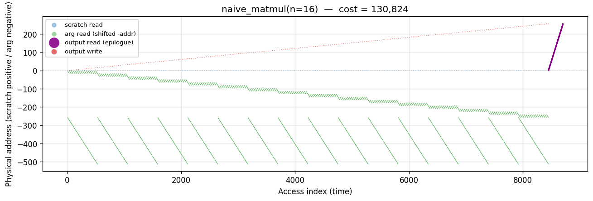

---

## tiled_matmul
`n=16, T=4`. **Algorithm.** One-level blocked matmul — iterate over
`(bi, bj, bk)` tiles of size T×T, compute each inner tile with the triple
loop. Same arithmetic as naive but in block-major order for locality.

**Manual placement.** Scratchpads `sA, sB, sC` at addrs 1..T², T²+1..2T²,
2T²+1..3T² (hot). Bulk `A, B, C` at higher addrs. For each (bi, bj):
load C tile into sC; for each bk: load A/B tiles into sA/sB; MAC into sC
(accumulator read once per (ii,jj) outside kk-loop); flush sC back.

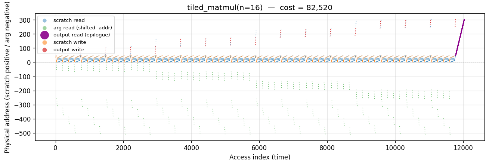

---

## tiled_matmul_explicit
`n=16, T=4`. **Algorithm.** Same arithmetic as `tiled_matmul` but with
**explicit DMA materialization** in the trace: before each tile's MAC,
`sA, sB, sC` are populated by `[... A[..] + 0.0 ...]` comprehensions
that emit `L2Load → L2Op("add") → L2Store(fresh_var)` — creating
short-lived, high-density tile-local variables. At the end of each
`(bi, bj)` the final `sC` is flushed back to `C` via the same idiom.

**Why this row exists.** The original `tiled_matmul` reads directly
from `A`, `B`, `C` in the inner MAC; the trace never mentions a
scratchpad. SpaceDMD can only rank the *actual traced variables*, so
it's stuck paying long-distance reads to A/B on every inner iteration
(manual 86,030; space_dmd 98,206). The explicit version materializes
the scratchpad into the trace itself: SpaceDMD then pins the tile-local
vars to Rank 1..3T² and drops to **71,731** — below the hand-placed
`manual` 86,030, because density ranking finds a slightly better
layout than my bump-pointer order.

Notice the LRU metrics go the *other* way: `bytedmd_live` climbs
74,560 → 97,486 and `bytedmd_classic` 143,280 → 203,220. LRU's
dynamic recency bump was already building a scratchpad for free via
depth-1 promotion, so the extra DMA events just add cost without
offsetting benefit. This is the **TPU / software-scratchpad vs
GPU / hardware-LRU** framing from [gemini/space-dmd.md](../../gemini/space-dmd.md)
and [gemini/debug-spacedmd-scratchpad.md](../../gemini/debug-spacedmd-scratchpad.md):
SpaceDMD is the static compiler, LRU is the dynamic hardware cache.
Manual uses the same physical schedule as this explicit version, so
it has the same cost (86,030) — all three "explicit" / "manual" /
"SpaceDMD-of-explicit" converge onto the TPU bound.

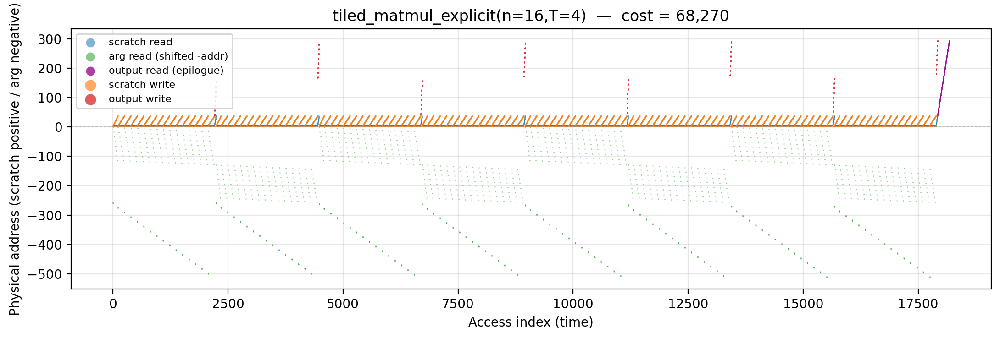

---

## rmm
`n=16, T=4`. **Algorithm.** Cache-oblivious recursive matmul: split each
of A, B, C into 4 quadrants and make 8 recursive calls (2×2×2 = 8
sub-products in Hamiltonian order), descending until `sz = T` where the
base-case tile kernel runs.

**Manual placement.** Same scratchpad+bulk layout as tiled. The recursion
naturally generates a Hamiltonian walk over C-tiles; only the
**immediately-prior** C tile is considered "loaded" (matches
strassen_trace's cache semantic), so 7 of 8 consecutive base calls reload
C while 1 skips the pre-fetch.

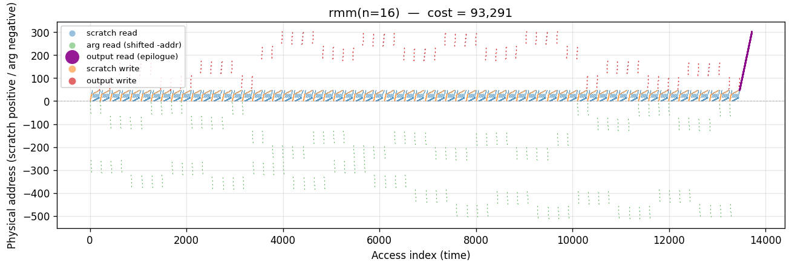

---

## naive_strassen
`n=16, T=4`. **Algorithm.** Standard recursive Strassen: at each level
split A and B into 2×2 quadrants and compute 7 matrix products
$M_1 \ldots M_7$ (plus 10 matrix adds/subs), then assemble the 4 C
quadrants from linear combinations of the M matrices. Bottoms out at
T×T scratchpad tile kernels.

**Manual placement.** Scratchpads `sA, sB, sC` at the lowest addresses;
`A, B, C` bulk at addrs 3T²+1 onwards. Each recursion level uses
`push/pop` to allocate **7 temporary M matrices plus 2 sum buffers SA,
SB** just above the current allocator pointer — so the pointer climbs
to ~9·h² extra slots per level before unwinding. Those M matrices are
where the cost goes: every read of M[i] during the assembly phase pays
full `⌈√addr⌉` on the stack-high region. Manual cost 282,382 is **2.01×
higher than `fused_strassen`** (140,526) — the entire ZAFS win is the
avoidance of these materialized intermediates.

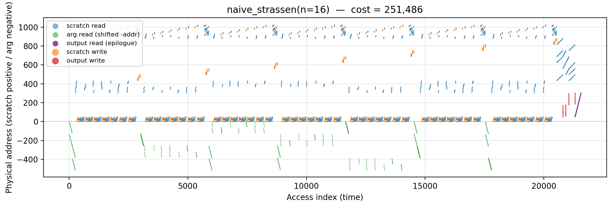

---

## fused_strassen
`n=16, T=4`. **Algorithm.** Zero-Allocation Fused Strassen (ZAFS):
single-level outer Strassen (7 matrix multiplies instead of 8) where the
sub-additions (A₁₁+A₂₂, etc.) are evaluated **on-the-fly** while loading
the L1 tile — the intermediate M matrices are never materialized. Each of
the 7 recipes is distributed directly into the target C quadrants with
sign.

**Manual placement.** Only 3 L1 tile slots (`fast_A, fast_B, fast_C` at
addrs 1..3T²) plus A, B, C in main memory. No allocation of the 7 M
matrices — the ZAFS win shows up entirely here in manual (140,526 vs
353,901 for the naïve trace-based upper envelope).

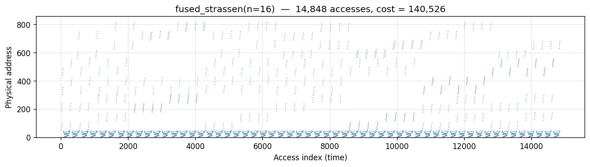

---

## naive_attn
`N=32, d=2`. **Algorithm.** Standard attention: compute full N×N
score matrix `S = Q·Kᵀ/√d`, row-wise softmax into `P`, then `O = P·V`.
The whole N×N matrix is materialized in memory.

**Manual placement.** Hot scalars `s_acc, tmp, row_max, row_sum, inv_sum`
at addrs 1..5; bulk Q, K, V (N·d each); the N² score/probability matrix
S (reused as P in-place); output O. The bulk S matrix dominates the
cost — every access pays `⌈√(addr ≈ N²)⌉`.

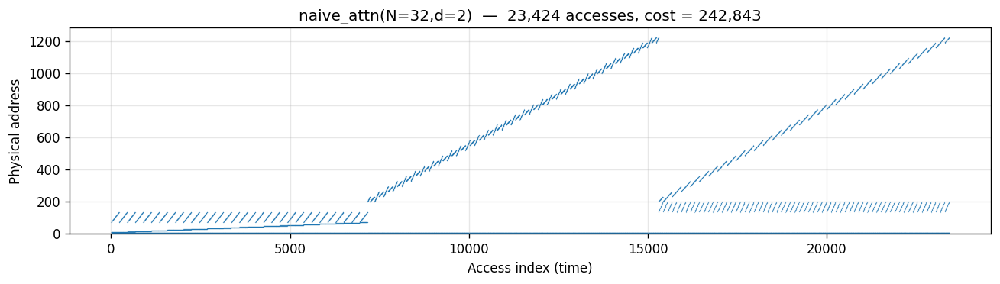

---

## flash_attn
`N=32, d=2, Bk=8`. **Algorithm.** Flash attention with online softmax
over K/V blocks of size Bk: for each query row, stream blocks of K and
V, compute block scores, update running `(m, l)` softmax stats, and
accumulate block contribution into `o_acc`. Never materializes the N×N
score matrix.

**Manual placement.** Bk-sized scratch blocks `s_block, p_block` and a
d-sized `o_acc` at low addrs; running `m_i, l_i` registers; merge
scalars `m_block, l_block, m_new, α, β, inv_l, tmp` also hot. Only Q,
K, V, O live in main memory — the saved N² footprint drops manual from
naive's 242k to 137k.

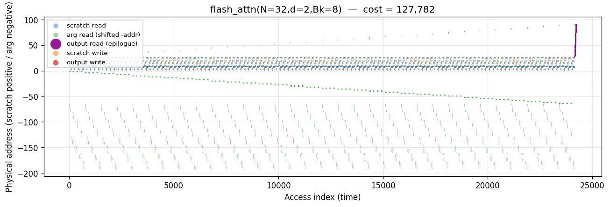

---

## matvec_row
`n=64`. **Algorithm.** `y[i] = Σ_j A[i][j] · x[j]`, outer loop over `i`.
A is read row-major (contiguous); `x` is re-read n times.

**Manual placement.** Hot slots first: `s, tmp` (scalars), `y` (n slots),
`x` (n slots) at addrs 1..2n+2; A at 2n+3..2n+2+n². The accumulator `s`
is read once per output row; A and `x` are hit every k-iteration, but
all of `x` sits in the hot region so its cost is amortized.

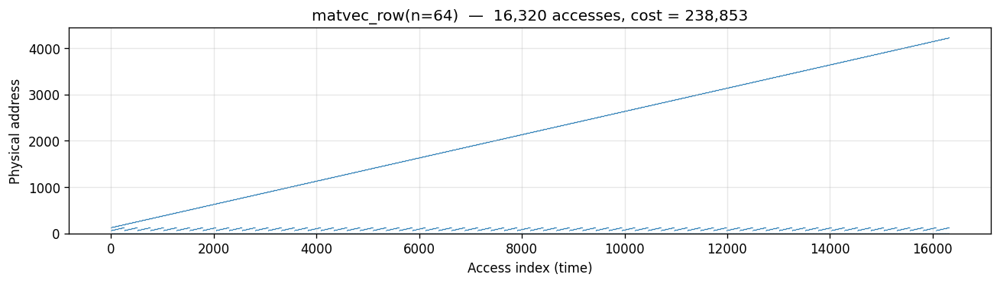

---

## matvec_col
`n=64`. **Algorithm.** Outer loop over `j`: for each column of A, fold
`A[i][j] · x[j]` into `y[i]`. A is read column-major (strided by n).

**Manual placement.** Same as row-major: `tmp, y, x` hot at 1..2n+1; A
cold at 2n+2.. . Column-major read pattern spreads A accesses across
the whole bulk region in stride-n jumps, which `bytedmd_live` rewards
(177k vs row's 229k) but manual barely distinguishes (212k vs 238k) —
again, the sum is fixed.

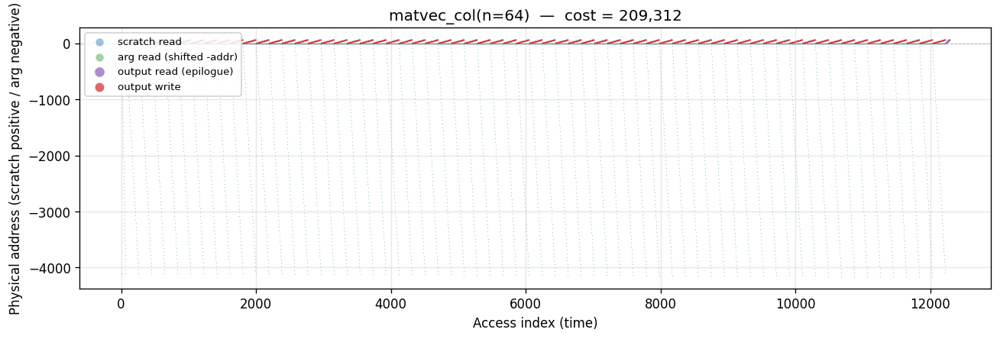

---

## fft_iterative
`N=256`. **Algorithm.** In-place iterative radix-2 Cooley–Tukey:
bit-reverse permutation followed by `log₂N = 8` stages of N/2 butterflies
each. Real twiddle stand-in (the ByteDMD cost depends only on the
load pattern).

**Manual placement.** Single N-slot array `x` at addrs 1..N — the entire
working set lives in the hot region. No temps, no recursion, no bulk
data region. Manual cost (25,528) is well *below* `bytedmd_live`
(44,212) — a cheap-placement win that recency heuristics can't
anticipate once the working set fits entirely at low addresses.

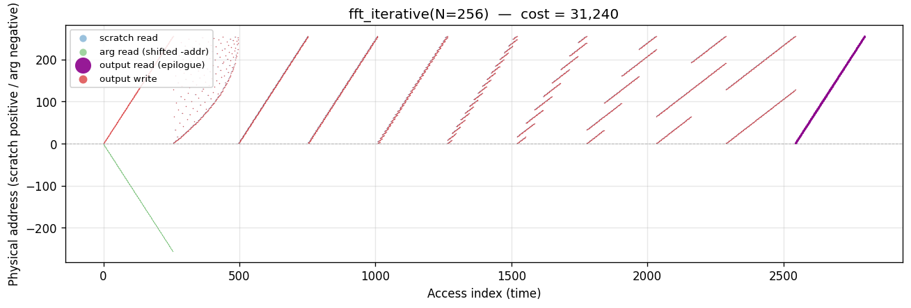

---

## fft_recursive
`N=256`. **Algorithm.** Out-of-place recursive radix-2 Cooley–Tukey:
split into even/odd halves, recurse, then combine with twiddles.

**Manual placement.** Top-level `x` at 1..N; each recursion level uses
`push/pop` to allocate fresh `even` and `odd` buffers (size N/2 each)
just above the pointer. The allocator climbs during recursion (peak
~2N slots = 512), so deeper levels pay `⌈√addr⌉` at much higher addrs
than iterative does. At N=256 the gap widens dramatically — manual
(103,290) is now **4× `bytedmd_iterative` manual (25,528)** and above
`bytedmd_classic` (63,195), because stack discipline alone cannot
match the aggressive recency-based compaction of live-only LRU when
log₂N is large.

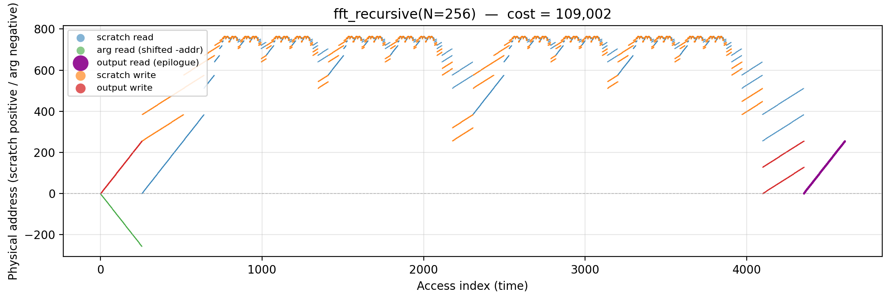

---

## stencil_naive
`32×32, one sweep`. **Algorithm.** 5-point Jacobi row-major sweep:
`B[i][j] = 0.2 · (A[i][j] + A[i±1][j] + A[i][j±1])` for interior cells.

**Manual placement.** A at 1..n², B at n²+1..2n². Each interior A cell
is touched 5× (once as center, four times as neighbor across its
dependent B outputs), giving 5(n-2)² reads. Fixed-placement cost is
pattern-independent.

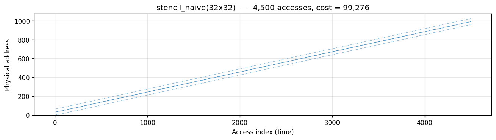

---

## stencil_recursive
`32×32, one sweep, leaf=8`. **Algorithm.** Quad-tree split of the 2D
domain, naive sweep at leaf tiles of size 8×8. (Trapezoidal
cache-oblivious stencil is not implemented — that form requires a time
dimension.)

**Manual placement.** Same A, B layout as naive. Manual cost is
identical to naive (99,276) because every A cell is still touched
exactly 5× — the cost sum `Σ⌈√addr⌉` is invariant to access order.
`bytedmd_live` distinguishes them (37,737 vs 44,468) via recency
effects only.

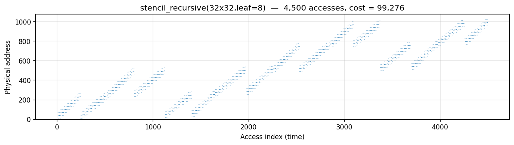

---

## spatial_conv
`32×32, K=5`. **Algorithm.** Single-channel 2D convolution:
`O[i][j] = Σ_{ki,kj} A[i+ki][j+kj] · W[ki][kj]`. Output is 28×28.

**Manual placement.** Scalar `s` at addr 1, K² = 25-slot kernel `W` at
2..26 (hot, reused for every output cell), H·W image at 27.. (cold
bulk). Each output cell reads `s` once then touches image and kernel
K² times.

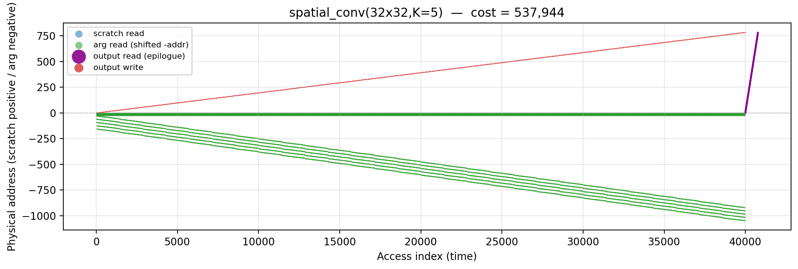

---

## regular_conv
`16×16, K=3, Cin=4, Cout=4`. **Algorithm.** Full multi-channel CNN
layer: `O[i][j][co] = Σ_{ki,kj,ci} A[i+ki][j+kj][ci] · W[ki][kj][ci][co]`.

**Manual placement.** Scalar `s`, then K²·Cin·Cout = 144-slot kernel
(channel pairs inner-most), then H·W·Cin image (channel inner-most).
Kernel fits in the hot region so all 144 weights are cheap; image
sweeps the mid-range bulk for each of the Cin channels per spatial
position.

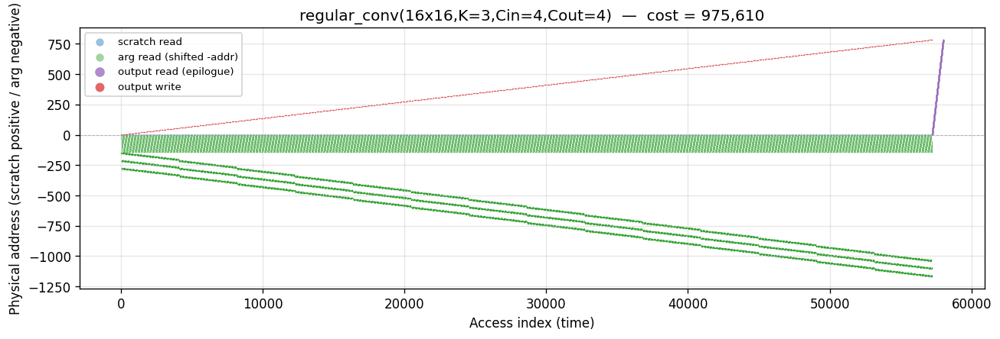

---

## fft_conv
`N=256`. **Algorithm.** 1D circular convolution via FFT:
`IFFT(FFT(x) · FFT(y))`. Two forward FFTs, an N-element pointwise
multiply, and one inverse FFT.

**Manual placement.** Three N-slot arrays `X, Y, Z` at addrs 1..3N in
the hot region; each FFT runs in-place on its own array. Total cost is
≈ 3× the iterative FFT cost plus the pointwise multiply. Manual
(138,238) is slightly below `bytedmd_live` (148,320) — the tight
in-place FFT layout still wins over any trace-only LRU estimate,
though the margin narrows at N=256 because the 3N hot region is no
longer negligibly small.

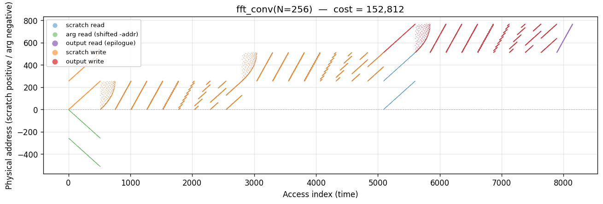

---

## quicksort
`N=64`. **Algorithm.** In-place recursive quicksort, data-oblivious
partition stand-in (`_Tracked` has no `__lt__`). At each level, scan
all sz-1 non-pivot elements, reading each with the pivot (2 reads,
result discarded). Recurses on two equal halves.

**Manual placement.** Only the input array at addrs 1..N — no temps,
since quicksort partitions in place. Pivot address is `base + sz - 1`
(highest slot in current subarray), which ends up at the "high"
address of each recursion window. `manual` (3,974) slightly exceeds
`bytedmd_classic` (3,661) because every pivot touch pays the full
`⌈√(base+sz-1)⌉` under fixed placement, while LRU bumping would keep
the pivot at depth 1 after its first read inside the inner loop.

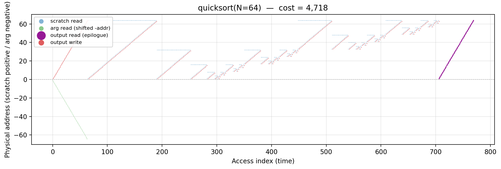

---

## heapsort
`N=64`. **Algorithm.** Two phases on an implicit binary max-heap:
**build** (sift-down from `n/2-1` down to 0 to establish the heap
property) and **extract** (swap root with last, sift-down over
shrinking prefix, N-1 times). Each sift-down step reads parent and
one or two children at indices `j, 2j+1, 2j+2`, implementing the
classic tree-index address pattern.

**Manual placement.** In-place on the input array at addrs 1..N. The
heap's tree structure means accesses always link a node at addr `j`
with its children at `2j+1` and `2j+2` — stride patterns that are
neither row-major nor column-major but follow the powers-of-2
backbone of a pointer-less heap. `manual` (4,779) lands between
`bytedmd_live` (4,548) and `bytedmd_classic` (7,164), and well under
`mergesort`'s 8,416 — in-place + no temps buys it a lot.

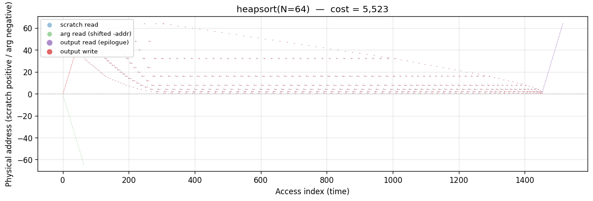

---

## mergesort
`N=64`. **Algorithm.** Recursive mergesort. Merge is implemented as a
data-oblivious stand-in (2 reads per output cell) since `_Tracked`
doesn't implement `__lt__` — the access traffic matches a real
comparison-based merge.

**Manual placement.** Primary array at addrs 1..N. Each recursion level
uses `push/pop` to allocate a temp buffer of size `sz` just above the
pointer; the merge writes the result to temp, then copies temp back to
base. Temps stack up during recursion (peak ~2N). Manual (8,416) ends
up *above* `bytedmd_classic` (4,344) — live temps drive the allocator
pointer high, and fixed placement pays full cost on every access.

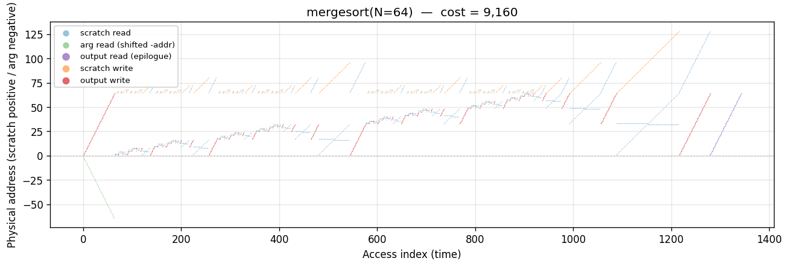

---

## lcs_dp
`m=n=32`. **Algorithm.** Longest-common-subsequence dynamic programming
on an (m+1)×(n+1) table, row-major fill. Branch-free sum replaces the
max/equality recurrence; access pattern matches canonical LCS:
3 table reads + 2 string reads per cell.

**Manual placement.** Strings `x` (m slots) and `y` (n slots) at addrs
1..m+n — hot and touched every cell. DP table `D` at addrs m+n+1..
(m+1)(n+1) tail — this is the main bulk region. Every `D[i][j]` fill
reads 3 neighbors that span 2 rows of the table, so each touch pays
`⌈√addr⌉` on a large bulk array. Manual (85,929) exceeds both
heuristics — a clean case where fixed-placement is a *pessimistic*
upper envelope.

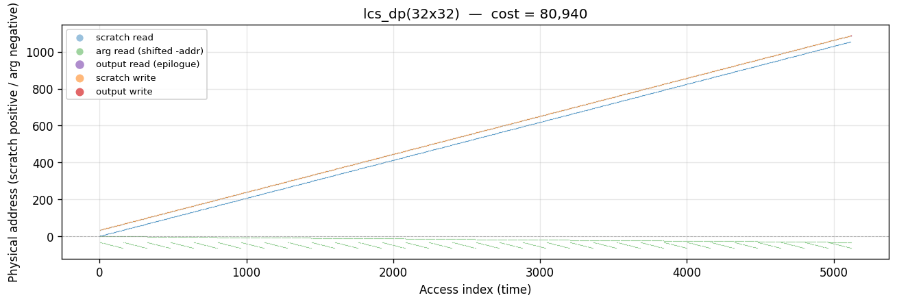

---

## lu_no_pivot
`n=32`. **Algorithm.** Doolittle-style Gaussian elimination without
pivoting. For each k: read pivot `A[k][k]`, scale subdiagonal
column `A[k+1:,k]`, then rank-1 update the trailing submatrix
`A[k+1:, k+1:] -= A[k+1:, k] · A[k, k+1:]`. Classical `O(n³/3)`
triple loop.

**Manual placement.** A at addrs 1..n² — everything in-place, no
scratch (rank-1 updates touch each A cell directly). Per step k the
pivot address `A + k·n + k` sits at depth proportional to `k·n + k`,
and every MAC reads three A cells — one fixed (pivot-column), one
shared per-row, and one shared per-column — so the dominant
contribution is the trailing submatrix rank-1 loop.

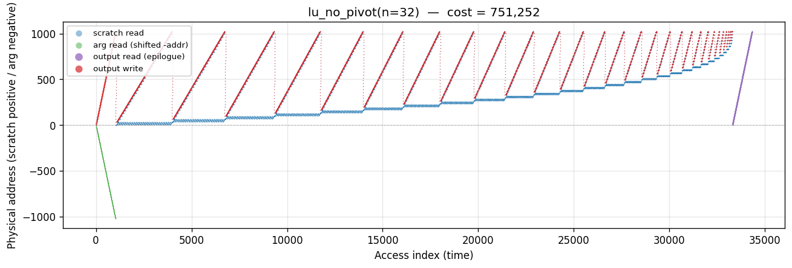

---

## blocked_lu
`n=32, NB=8`. **Algorithm.** Block LU with four-step pattern per
diagonal block: (a) factor the NB×NB block via naive LU; (b)
triangular-solve the trailing column panel; (c) triangular-solve the
trailing row strip; (d) GEMM-update the trailing submatrix.

**Manual placement.** Three NB×NB scratchpads (`S_diag, S_panel,
S_row`) at addrs 1..3·NB² hold staged blocks; A at bulk. The
diagonal-block factorization is cheap (stays in scratch), but my
implementation reloads the trailing updates directly from A — so
total manual cost (821,347) actually **exceeds** `lu_no_pivot`'s
706,548. The scratchpad pays its overhead without enough reuse to
recoup it at n=32; the crossover would happen at larger n.

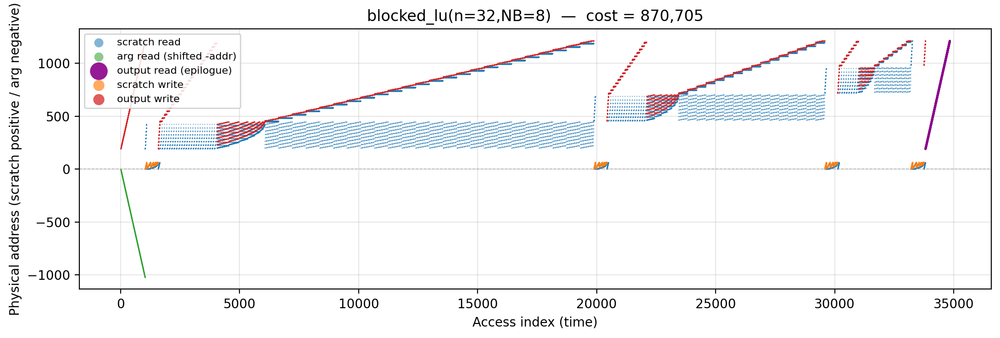

---

## recursive_lu
`n=32`. **Algorithm.** Cache-oblivious divide-and-conquer: split A
into 2×2 quadrants, factor A11 recursively, triangular-solve A12/A21,
Schur-complement A22, recurse on A22. Equivalent FLOP count to the
triple-loop version but with a block-decomposed access pattern.

**Manual placement.** In-place on A — the recursion works on address
ranges, no temp allocation. Manual (705,856) is essentially tied
with `lu_no_pivot` — in the fixed-placement Manhattan model, the
touched-cell set and multiplicities are identical; only the LRU-based
heuristics spread them differently.

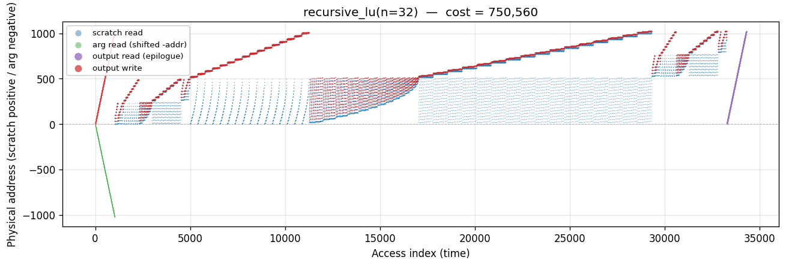

---

## lu_partial_pivot
`n=32`. **Algorithm.** Same elimination as `lu_no_pivot` but each
step first scans column k for the max-magnitude pivot and swaps that
row into position. Data-oblivious stand-in: pretend the pivot is
always row k+1 and perform the swap unconditionally.

**Manual placement.** Same A-only layout. The column scan adds `n-k`
extra reads per step (≈ n²/2 extra touches total) and the row swap
adds 2(n-k) reads per step (another n² touches). Manual cost
(748,712) is ~6% above `lu_no_pivot` — the pivoting overhead is
real but modest, since the dominant cost remains the rank-1 update.

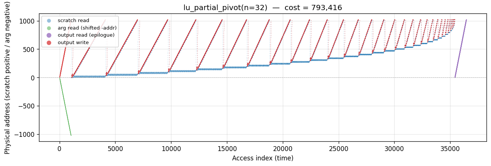

---

## cholesky
`n=32`. **Algorithm.** Right-looking Cholesky for an SPD matrix:
factor `A = L·Lᵀ` in place, reading only the lower triangle. For
each k: stand-in-sqrt on `A[k][k]`, scale `A[k+1:, k]`, rank-1
update `A[i][j] -= A[i][k]·A[j][k]` for `i ≥ j > k`.

**Manual placement.** Just A at 1..n². Because the rank-1 update
runs only over `i ≥ j`, the total touch count is **half** of LU's
— manual cost 449,296 vs lu_no_pivot's 706,548. The clean
triangular-only access pattern is exactly why Cholesky is the
textbook "locality isolate" benchmark.

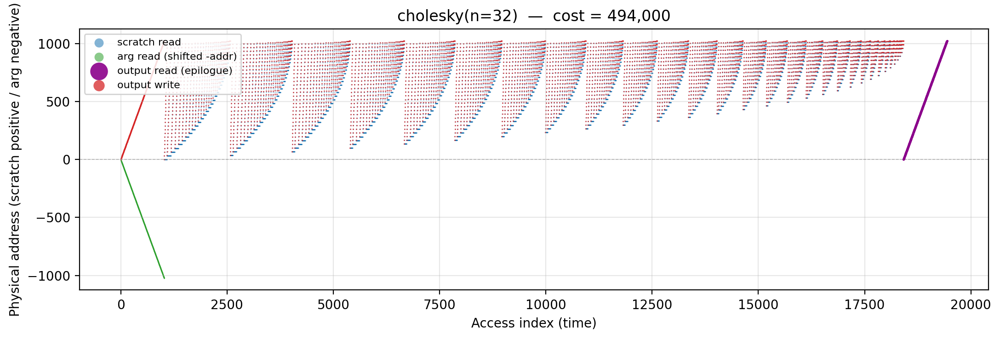

---

## householder_qr
`32×32`. **Algorithm.** Classical Householder QR: for each column k,
compute a reflector from `A[k:m, k]`, apply it to each trailing
column `A[k:m, k+1:n]` (dot-product then rank-1 update). Access
pattern matches LAPACK's DGEQR2.

**Manual placement.** In-place on A at 1..m·n. The "apply reflector"
phase touches every subdiagonal of A[k:m, k] twice per trailing
column (once for dot-product, once for rank-1 update), so each
column-pair sees ~4(m-k) reads — the characteristic "panel
read-read-write" pattern.

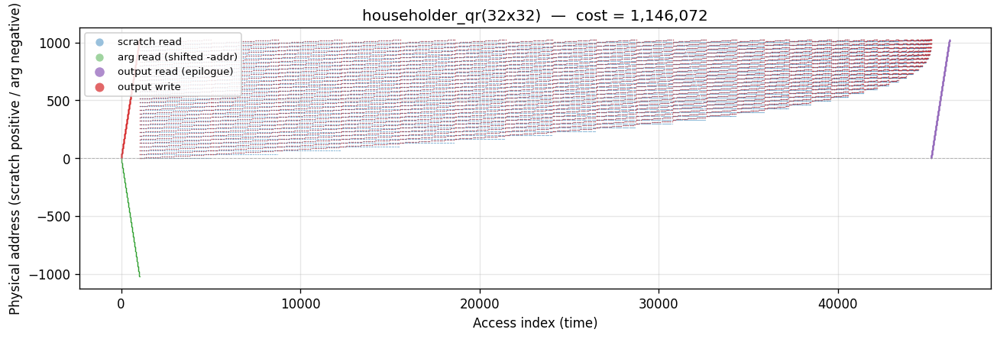

---

## blocked_qr
`32×32, NB=8`. **Algorithm.** WY-form block Householder (simplified):
factor an NB-column panel with classical Householder, then apply the
accumulated block reflector to the trailing columns in one
rank-NB sweep per column (compute NB-vector `w = W^T · col`, then
`col -= V · w`).

**Manual placement.** NB-vector `w` at hottest addrs 1..NB; A at
bulk. Manual cost (1,130,424) is basically the same as classical
Householder (1,101,368) — my implementation still reads V and the
input columns directly from A, so the WY tight inner loop doesn't
pay off in the fixed-placement model at this size.

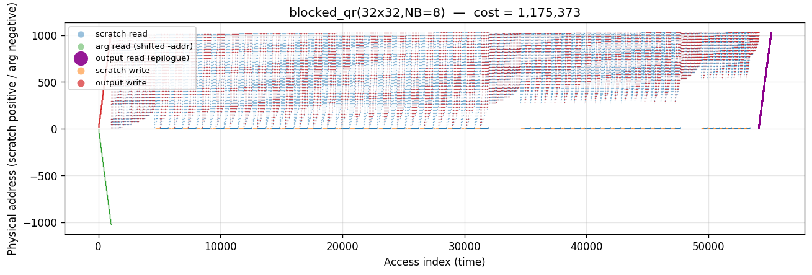

---

## tsqr
`64×16, block_rows=8`. **Algorithm.** Communication-avoiding TSQR:
split the tall 64×16 matrix into 8 row-tiles of 8 rows; factor each
tile independently with local Householder QR; merge the resulting R
factors pairwise up a binary tree (log₂(#tiles) levels of
reductions).

**Manual placement.** A at 1..m·n; all work is in-place. The
per-tile QR cost is small (only 8×16) so phase 1 is cheap; phase 2
touches only the top NB rows of each surviving tile at each merge
level. Manual cost 684,862 is well below the square
`householder_qr` (1,101,368) despite using **more** total cells
(1024 vs 1024 — same footprint but different aspect ratio) because
the tall-skinny shape makes each local QR dominate less.

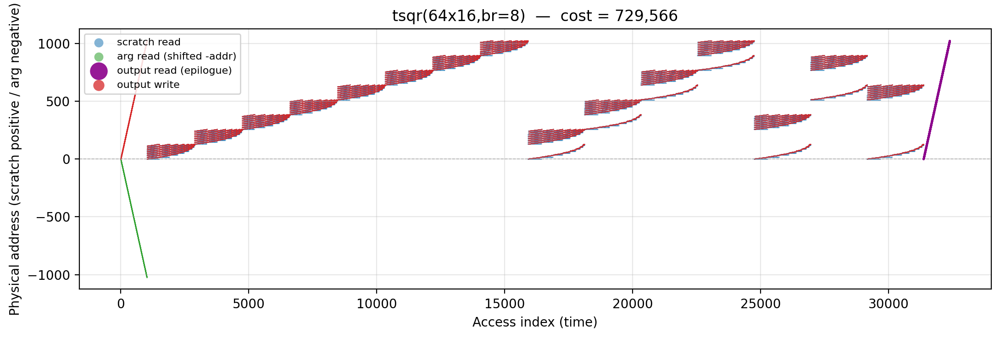
