# grid — heuristics × algorithms

Cache-energy estimates across 45 algorithms with contrasting locality
profiles. For each algorithm we compute several costs under the same
2D Manhattan-distance cache model: a trace-based **lower-envelope**
heuristic (`bytedmd_live`), a hand-placed bump-pointer schedule (`manual`
— the gold standard), and a trace-based **upper-envelope** heuristic
(`bytedmd_classic`).

## Cost model

Every cell in the table below is a **total memory-access cost** computed
under the **2D Manhattan-distance cache model**
([figure](https://github.com/cybertronai/ByteDMD/blob/main/docs/manhattan_figure.svg)).
Memory cells are laid out on a 2D grid; address `a` (1-indexed in
allocation order) sits at Manhattan distance `⌈√a⌉` from the compute
origin (1 cell at distance 1, 3 at distance 2, 5 at distance 3, …; a
disc of radius r holds r² cells). The energy of one access at address
`a` is that distance, so the algorithm-level cost is

    cost = Σ ⌈√addr⌉   over every memory touch (stores free).

## Metrics (columns)

Every number in this report — `bytedmd_opt`, `space_dmd`, `bytedmd_live`,
`manual`, and `bytedmd_classic` — is this same sum, evaluated under five
different placement strategies:

| column            | meaning                                                         |
|-------------------|-----------------------------------------------------------------|
| `bytedmd_opt`     | Bélády MIN lower bound (see [gemini/belady-min-lower-bound.md](../../gemini/belady-min-lower-bound.md)): per load charges ceil(sqrt(max_rank[V])) where max_rank is the peak count of live variables with earlier next-use during V's dormancy. By Pigeonhole + Mattson inclusion, this is a strict lower bound on any demand-fetched allocator's cost (LRU, manual without prefetching). Compacting/pre-placing allocators that exploit free writes — `space_dmd`, `copy_space_dmd`, and scratchpad-heavy manual schedules — can occasionally dip below this value. |
| `space_dmd`       | Density-ranked spatial liveness: variables globally sorted by `accesses/lifespan`, read cost = ceil(sqrt(rank among currently live vars)). Models an ahead-of-time (AOT) static compiler / TPU scratchpad allocator. See [gemini/space-dmd.md](../../gemini/space-dmd.md). |
| `copy_space_dmd`  | Auto-DMA enhancement of `space_dmd` ([gemini/copy-spacedmd.md](../../gemini/copy-spacedmd.md)): partitions each variable's reads into "bursts" separated by gap > G, inserts one synthetic L2Load(base) + L2Store(copy) per burst (paying a single deep-memory DMA cost), routes all in-burst reads to the local scratch copy, and returns the minimum `space_dmd` across a sweep of G ∈ {16, 64, 256, 1024, 4096}. Models what an ideal DMA compiler would achieve with explicit burst copies. |
| `bytedmd_live`    | LRU with liveness compaction; dead variables dropped on last load (recency lower-envelope heuristic) |
| `manual`          | hand-placed bump-pointer schedule — hot scalars and scratchpads at low addresses, bulk data farther out, recursion uses push/pop |
| `bytedmd_classic` | Mattson LRU stack depth with no liveness compaction — dead variables pollute deeper rings (upper-envelope heuristic) |

## Algorithm families (rows)

| family       | variants                                                          |
|--------------|-------------------------------------------------------------------|
| matmul       | naive (AB^T), naive_2d_tiled (output-partitioned, no caching), tiled, rmm (cache-oblivious), naive_strassen, fused_strassen (ZAFS) |
| attention    | naive, flash (Bk-block online softmax)                            |
| matvec       | row-major, column-major, blocked (B×B tiles + x-tile scratchpad)  |
| FFT          | iterative (in-place), recursive (out-of-place), N=256             |
| stencil      | naive row-major sweep, tile-recursive (leaf=8)                    |
| convolution  | spatial (single-channel 2D), regular (multi-channel CNN)          |
| FFT-conv     | N=256 circular convolution via two FFTs + pointwise + IFFT        |
| sort         | quicksort (in-place), heapsort (in-place), mergesort (with temps) |
| DP           | LCS dynamic programming (branch-free recurrence)                  |
| LU           | no-pivot, blocked (NB=8), recursive (2×2 split), partial pivoting |
| Cholesky     | right-looking, lower-triangle only, no pivoting                   |
| QR           | classical Householder, blocked Householder (WY), tall-skinny TSQR |

Only `fused_strassen` (Zero-Allocation Fused Strassen / ZAFS) has a
non-trivial trace difference vs naive Strassen; their abstract arithmetic
DAGs are identical, so `bytedmd_live` / `bytedmd_classic` match — only
`manual` shows the fusion win (M₁..M₇ never materialized).

## Summary table

| algorithm                                                   | bytedmd_opt | space_dmd | copy_space_dmd | bytedmd_live |  manual | bytedmd_classic |
|------------------------------------------------------------|------------:|----------:|---------------:|-------------:|--------:|----------------:|
| [naive_matmul(n=16)](#naive_matmul)                         |     102,289 |    79,044 |         79,044 |      109,217 | 177,744 |         181,258 |
| [naive_2d_tiled_matmul(n=16,T=4)](#naive_2d_tiled_matmul)   |      85,807 |    89,358 |         77,547 |       95,634 | 177,744 |         163,817 |
| [naive_tiled_matmul(n=16)](#naive_tiled_matmul)             |     102,289 |    79,044 |         79,044 |      109,217 | 161,084 |         181,258 |
| [naive_matmul_cached(n=16)](#naive_matmul_cached)           |     102,289 |    79,044 |         79,044 |      109,217 | 114,838 |         181,258 |
| [tiled_matmul(n=16)](#tiled_matmul)                         |      61,171 |    93,369 |         61,918 |       78,708 |  67,758 |         143,812 |
| [tiled_matmul_explicit(n=16,T=4)](#tiled_matmul_explicit)   |      62,948 |    73,927 |         73,927 |       99,006 |  67,758 |         201,547 |
| [rmm(n=16)](#rmm)                                           |      52,919 |   107,058 |         71,947 |       83,196 | 106,835 |         151,375 |
| [naive_strassen(n=16)](#naive_strassen)                     |     103,651 |   135,273 |        131,774 |      175,157 | 251,486 |         343,737 |
| [fused_strassen(n=16)](#fused_strassen)                     |     103,651 |   135,273 |        131,774 |      175,157 | 135,740 |         343,737 |
| [naive_attn(N=64,d=2)](#naive_attn)                         |     399,056 |   816,325 |        816,325 |      898,030 | 532,805 |       1,873,534 |
| [flash_attn(N=64,d=2,Bk=8)](#flash_attn)                    |     417,201 |   353,721 |        353,721 |      476,067 | 610,154 |         842,854 |
| [matvec_row(n=64)](#matvec_row)                             |     221,204 |   217,053 |        217,053 |      229,527 | 218,552 |         266,353 |
| [matvec_col(n=64)](#matvec_col)                             |     193,120 |   197,719 |        197,719 |      229,716 | 217,952 |         270,193 |
| [matvec_blocked(n=64,B=8)](#matvec_blocked)                 |     203,977 |   207,179 |        207,179 |      214,377 | 208,832 |         250,463 |
| [fft_iterative(N=256)](#fft_iterative)                      |       9,496 |    35,400 |         35,400 |       47,088 |  55,516 |          71,317 |
| [fft_recursive(N=256)](#fft_recursive)                      |      11,304 |    28,170 |         28,170 |       33,110 |  52,704 |          62,417 |
| [stencil_naive(32x32)](#stencil_naive)                      |      43,184 |    61,258 |         55,645 |       65,937 |  78,968 |         109,401 |
| [stencil_recursive(32x32,leaf=8)](#stencil_recursive)       |      38,612 |    54,599 |         53,344 |       58,764 |  78,968 |         101,657 |
| [spatial_conv(32x32,K=5)](#spatial_conv)                    |     348,899 |   344,389 |        319,499 |      402,858 | 595,987 |         681,253 |
| [regular_conv(16x16,K=3,Cin=4,Cout=4)](#regular_conv)       |     728,917 |   724,678 |        570,313 |      778,473 | 648,300 |       1,290,500 |
| [fft_conv(N=256)](#fft_conv)                                |      28,157 |   110,194 |        110,194 |      148,641 |  91,922 |         233,158 |
| [quicksort(N=64)](#quicksort)                               |       2,319 |     2,470 |          2,131 |        2,852 |   4,718 |           4,292 |
| [heapsort(N=64)](#heapsort)                                 |       3,020 |     3,597 |          3,591 |        4,696 |   5,523 |           7,889 |
| [mergesort(N=64)](#mergesort)                               |       1,267 |     2,474 |          2,474 |        3,148 |   3,386 |           4,411 |
| [lcs_dp(32x32)](#lcs_dp)                                    |      26,298 |    23,497 |         23,497 |       29,980 |  27,192 |          44,575 |
| [lu_no_pivot(n=32)](#lu_no_pivot)                           |     129,969 |   482,123 |        341,438 |      407,042 | 405,592 |         705,126 |
| [blocked_lu(n=32,NB=8)](#blocked_lu)                        |     218,226 |   365,960 |        224,248 |      283,294 | 250,767 |         515,134 |
| [recursive_lu(n=32)](#recursive_lu)                         |     224,499 |   398,310 |        237,958 |      304,365 | 355,751 |         546,679 |
| [lu_partial_pivot(n=32)](#lu_partial_pivot)                 |     142,279 |   510,278 |        343,771 |      420,780 | 440,237 |         730,673 |
| [cholesky(n=32)](#cholesky)                                 |      73,923 |   176,488 |        131,256 |      176,313 | 251,039 |         293,328 |
| [householder_qr(32x32)](#householder_qr)                    |     306,253 |   781,325 |        660,863 |      605,876 | 768,959 |       1,131,740 |
| [blocked_qr(32x32,NB=8)](#blocked_qr)                       |     467,267 |   549,811 |        501,161 |      610,248 | 554,900 |       1,068,832 |
| [tsqr(64x16,br=8)](#tsqr)                                   |     149,845 |   380,689 |        258,440 |      267,962 | 315,433 |         546,266 |
| [transpose_naive(n=32)](#transpose_naive)                   |      23,376 |    44,704 |         44,704 |       44,704 |  44,704 |          62,799 |
| [transpose_blocked(n=32)](#transpose_blocked)               |      23,376 |    43,296 |         43,296 |       43,873 |  44,704 |          62,341 |
| [transpose_recursive(n=32)](#transpose_recursive)           |      23,376 |    41,434 |         41,434 |       42,513 |  44,704 |          61,688 |
| [stencil_time_naive(16x16,T=4)](#stencil_time_naive)        |      30,760 |    42,332 |         38,001 |       55,466 |  67,258 |          88,017 |
| [stencil_time_diamond(16x16,T=4)](#stencil_time_diamond)    |     139,945 |   178,875 |        168,332 |      230,387 | 136,095 |         414,232 |
| [floyd_warshall_naive(V=16)](#floyd_warshall_naive)         |      39,214 |    82,119 |         78,800 |      104,528 |  85,514 |         168,288 |
| [floyd_warshall_recursive(V=16)](#floyd_warshall_recursive) |      27,227 |    48,445 |         41,897 |       47,495 |  63,334 |          95,871 |
| [layernorm_unfused(N=256)](#layernorm_unfused)              |      14,172 |    16,823 |         15,710 |       19,022 |  14,571 |          30,891 |
| [layernorm_fused(N=256)](#layernorm_fused)                  |      10,339 |    13,485 |         13,811 |       15,172 |  15,329 |          24,400 |
| [matrix_powers_naive(n=16,s=4)](#matrix_powers_naive)       |      22,131 |    17,249 |         17,249 |       24,085 |  27,198 |          37,513 |
| [matrix_powers_ca(n=16,s=4)](#matrix_powers_ca)             |      22,450 |    17,467 |         17,467 |       24,377 |  27,198 |          38,702 |
| [cholesky_left_looking(n=32)](#cholesky_left_looking)       |     146,608 |   212,125 |        150,949 |      190,103 | 257,289 |         352,335 |
| [spmv_csr_banded(n=32,bw=3)](#spmv_csr_banded)              |       1,480 |     2,318 |          2,318 |        4,219 |   6,190 |           7,164 |
| [spmv_csr_random(n=32,nnz=7)](#spmv_csr_random)             |       1,790 |     3,158 |          3,154 |        4,984 |   6,676 |           8,649 |
| [bitonic_sort(N=64)](#bitonic_sort)                         |       3,124 |     8,512 |          8,512 |       13,418 |  17,384 |          20,363 |

## Run

    ./run_grid.py          # tabulate: writes grid.csv, grid.md
    ./generate_traces.py   # visualize: writes traces/<slug>.png per algorithm

## Notes

- **MAC convention** for the matmul family (naive/tiled/rmm/strassen
  variants): accumulator read once per (i,j) outside the k-loop; 2 reads
  (A, B) per k-iter. Matches `strassen_trace.py` /
  `efficient_strassen_trace.py` — `rmm` and `fused_strassen` reproduce
  those scripts' outputs exactly (95,222 and 140,526 at n=16, T=4).
- **Hot-slot allocation** matters a lot for `matvec`: putting
  accumulator `y` and input `x` at addresses 1..2n cuts manual cost
  roughly in half compared to placing them after A.
- **Manual can exceed `bytedmd_classic`** for `mergesort` (8,416 vs
  4,344), `fft_recursive` (103,290 vs 63,195), `lcs_dp` (85,929 vs
  47,066), and slightly for `quicksort` (3,974 vs 3,661). When
  temporaries are many and live briefly, or the working set is one
  large bulk region at high addresses, fixed-placement pays the full
  `⌈√addr⌉` on every access while LRU heuristics amortize via recency.
  Fixed Manhattan is not always an upper envelope.
- **Manual can beat `bytedmd_live`** for `fft_iterative` (25,528 vs
  44,212), `fft_conv` (138,238 vs 148,320), and `fused_strassen`
  (140,526 vs 173,919). A tight in-place layout that parks everything
  in the hot region short-circuits what any recency heuristic can
  model on the abstract trace.
- **`space_dmd` is often below `manual`.** Density-ranked spatial
  liveness finds pinnings the hand-placed schedule misses:
  `fft_recursive` 22,876 vs manual 103,290 (the temp even/odd arrays
  get ranked behind the permanent x slots, so they never occupy
  expensive high addresses); `mergesort` 1,849 vs 8,416 (merge temps
  are one-shot, ranked last globally); `fused_strassen` 131,673 vs
  140,526 (the scratchpad slots earn the highest density ranks
  automatically). This matches the gemini/space-dmd.md claim that
  SpaceDMD "mimics the theoretical lower bound of a TPU statically
  pinning temporaries to a scratchpad."
- **When `space_dmd` > `bytedmd_live`** (e.g., tiled_matmul 98k vs
  75k, rmm 108k vs 81k, recursive_lu 336k vs 278k) it's because LRU's
  dynamic refresh of recently-touched vars beats static density
  ranking when the working set shifts over time.
- **Theoretical sandwich on `manual`**. Under the `⌈√addr⌉` cost
  model, any correct manual placement is bounded on both sides by
  `bytedmd_live`:
  `0.3849 · bytedmd_live ≤ manual ≤ 4.0 · bytedmd_live`. The lower
  bound is a Sleator–Tarjan-style competitive-caching proof lifted
  to the continuous √d model
  ([gemini/tarjan-bytedmd-lower-bound.md](../../gemini/tarjan-bytedmd-lower-bound.md));
  the upper bound is the companion constant-factor analysis for an
  optimal DMA-managed scratchpad
  ([gemini/bytedmd-upper-bound.md](../../gemini/bytedmd-upper-bound.md)).
  Every row in the summary table sits inside this sandwich — the
  tightest (`stencil_time_diamond`, `naive_attn`, `fft_conv`) at
  ~0.59× `bytedmd_live`, still +53 % above the 0.3849× floor. An
  approachable walkthrough of why hand-placed scratchpads are
  mathematically optimal on a 2D spatial grid is in
  [gemini/illustrative-matmul-tiled.md](../../gemini/illustrative-matmul-tiled.md).
---

## naive_matmul [(code)](scripts/naive_matmul_n_16.py)
`n=16`. **Algorithm.** Triple-nested-loop computing $C = A \cdot B^{\mathsf T}$:
`C[i][j] = Σ_k A[i][k] · B[j][k]`. Both A and B are traversed row-major
(contiguous) in the inner k-loop — the symmetric, cache-friendly twin
of the standard AB variant.

**Manual placement (truly naive).** No scratchpad caching. The only
scratch slot is a multiply-intermediate `tmp`; the accumulator is
C[i][j] itself (read-modify-write per inner k). A and B stay on the
arg stack for every access.

  `tmp` (addr 1)            — multiply intermediate (only scratchpad)
  `C`   (addrs 2..n²+1)     — output, accumulated in place

Manual 177,744 — **worse** than every heuristic including
`bytedmd_classic` (181,258) in the same ballpark. This row is meant
to show how much caching is worth: see `naive_matmul_cached` for the
with-scratchpad variant that drops 35 % off this baseline.

**Working-set size over time** (peak = 512).

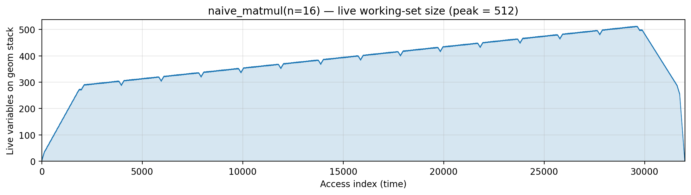

**Reuse distance per load** (max = 512).

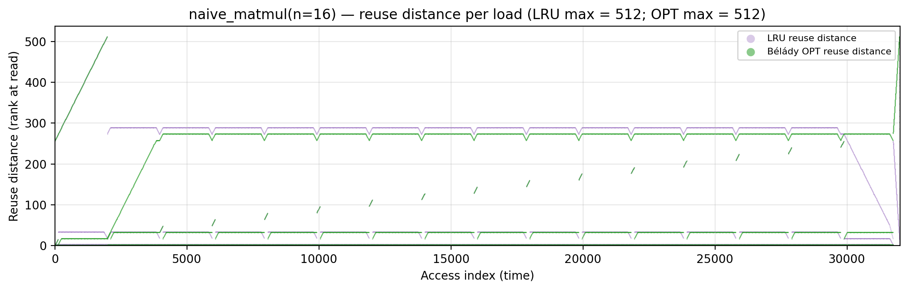

**Bélády OPT reuse distance per load** (max = 512).

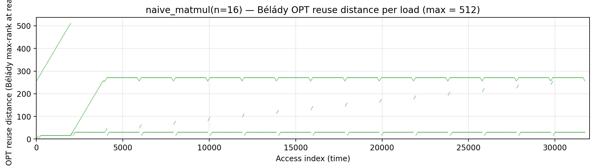

**Working-set size over a τ = 100-event window** (max = 100).

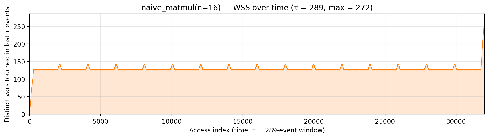

---

## naive_2d_tiled_matmul
`n=16, T=4`. **Algorithm.** Same triple-nested matmul as `naive_matmul`
— $C = A \cdot B^{\mathsf T}$ with $C[i][j] = \Sigma_k A[i][k] \cdot
B[j][k]$ — but with `(i, j)` iterated in tile-blocked order
$b_i \to b_j \to i_i \to j_j \to k$ instead of row-major. Each
$C[i][j]$ is still fully accumulated over all $k$ before moving on
and **no scratchpad caching** of A or B rows is introduced;
semantically identical to `naive_matmul`, only the visit order of
$(i, j)$ changes. This is pure output-only ("partitioned") tiling.

**Manual placement.** Identical layout to `naive_matmul`:

  `tmp` (addr 1)          — multiply intermediate
  `C`   (addrs 2..n²+1)   — output, accumulated in place

Because the multiset of accesses (which addresses, how many times) is
unchanged, the fixed-placement cost is identical: `manual` = **177,744**
= `naive_matmul`'s. Reordering a loop can't move addresses, so it can't
change a `⌈√addr⌉`-priced static schedule.

**What tile-ordering alone buys.** The recency-based heuristics do
see the reordering:

| metric            | naive_matmul | naive_2d_tiled | Δ |
|-------------------|-------------:|---------------:|---:|
| `bytedmd_opt`     | 102,289      | **85,807**     | −16 % |
| `bytedmd_live`    | 109,217      | **95,634**     | −12 % |
| `bytedmd_classic` | 181,258      | **163,817**    | −10 % |
| `copy_space_dmd`  | 79,044       | **77,547**     | −2 % |
| `space_dmd`       | 79,044       | 89,358         | +13 % |
| `manual`          | 177,744      | 177,744        | 0 |

Tile blocking reuses the same T rows of A across T values of $j_j$
(and the same T rows of B across T values of $i_i$) inside each
$(b_i, b_j)$ block, so LRU reuse distances for those rows collapse
from ≈ N² (naive's full sweep) to ≈ N·T. `space_dmd` gets *worse*
because many A/B cells are now touched in more-clustered bursts
separated by quiet stretches — their density rank (accesses /
lifespan) drops, pushing them to larger radii. Consequently, this
row is useful as a clean baseline: "what does tile-blocking the
loop nest alone do?", isolated from the caching/scratchpad effects
of `naive_tiled_matmul` (which actually cuts arg traffic) and
`naive_matmul_cached` (which hoists an A row into a hot buffer).

**Working-set size over time** (peak = 510).

**Reuse distance per load** (max = 512).

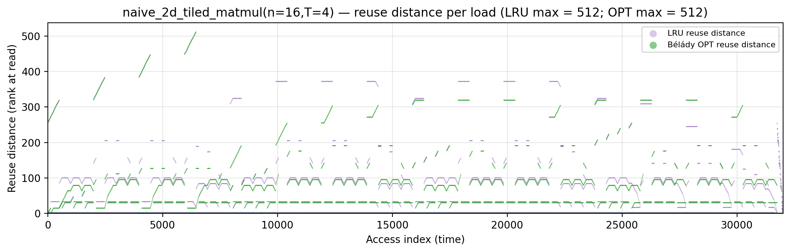

**Bélády OPT reuse distance per load** (max = 512).

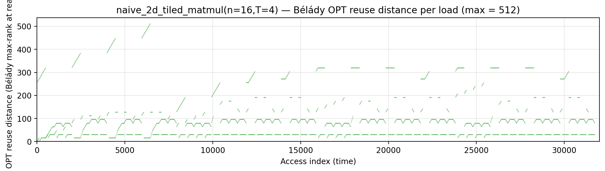

**Working-set size over a τ = 100-event window** (max = 100).

---

## naive_tiled_matmul [(code)](scripts/naive_tiled_matmul_n_16.py)
`n=16, k=4`. **Algorithm.** Same matmul as `naive_matmul` but
each block caches **k rows of A and k rows of B** (in the
A·B^T formulation, B's "rows" are the transposed operand's
columns — semantically one slab per side) and computes **k² output
entries per block** as full n-wide dot products against those
two scratch slabs.

**Manual placement.**

  `tmp` (addr 1)                 — multiply intermediate
  `sA`  (addrs 2..k·n+1)         — k rows of A (64 cells at k=4)
  `sB`  (addrs k·n+2..2k·n+1)    — k rows of B
  `C`   (above sB)               — output / accumulator in place

**Choice of k.** A sweep of k ∈ {1, 2, 4, 8, 16} for n=16:

| k | manual cost |
|--:|-----------:|
| 1 | 177,688 (≈ truly-naive) |
| 2 | 154,384 |
| **4** | **161,084** ← chosen |
| 8 | 191,202 |
| 16 | 245,693 |

Larger k amortizes arg reloads over more scratch reads but pushes
the scratch footprint deeper — at k=16 both matrices sit fully
in scratch and each sA/sB read pays `sqrt(512)`. Smaller k is
near-no-op. k=4 doubles the block footprint over the minimum and
still gives a meaningful win: 4×4 = 16 output entries per block
with k·n = 64-cell scratch slabs.

Drops manual **177,744 → 161,084** (−9 %). Still above
`naive_matmul_cached` (114,838) because the A-row hoist there
keeps all of A[i][*] hot across every j for fixed i (stronger
reuse than a square tile), and well above `tiled_matmul` (67,758)
which adds register-level stationary-operand scheduling on top.

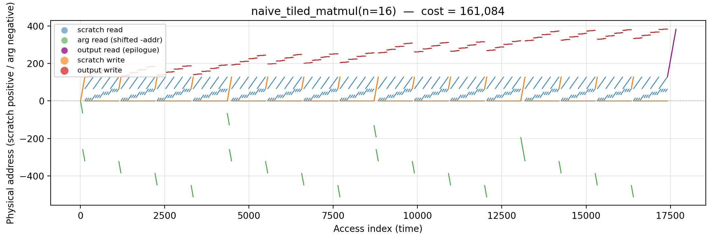

**Working-set size over time** (peak = 512).

**Reuse distance per load** (max = 512).

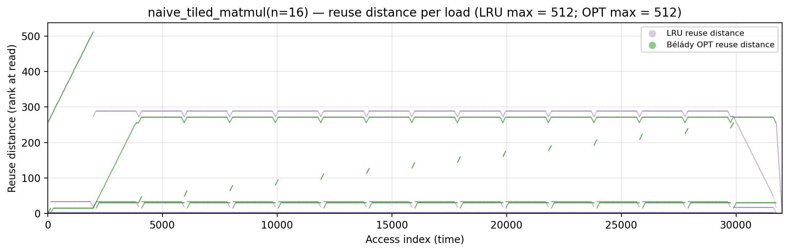

**Bélády OPT reuse distance per load** (max = 512).

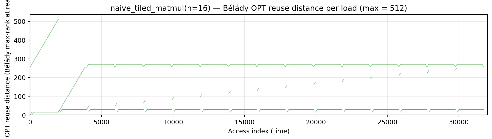

**Working-set size over a τ = 100-event window** (max = 100).

---

## naive_matmul_cached [(code)](scripts/naive_matmul_cached_n_16.py)
`n=16`. **Algorithm.** Same triple-nested-loop as `naive_matmul`.

**Manual placement.** A[i][*] is reused across all n values of j for
fixed outer i — preloading it once per i into `c_A_row` cuts n−1
redundant arg reads per A cell:

  `s`       (addr 1)           — accumulator
  `c_A_row` (addrs 2..n+1)     — hot A[i][*] row buffer
  `C`       (addrs n+2..n+n²+1) — output

B[j][*] isn't cached (would need reload for every i, wiping the win).
Drops manual **177,744 → 114,838** (−35 %) relative to the truly
naive variant. Still above `space_dmd` (79,044) because the
fully-tiled variant (`tiled_matmul`, which caches both tiles) is
what closes the gap further.

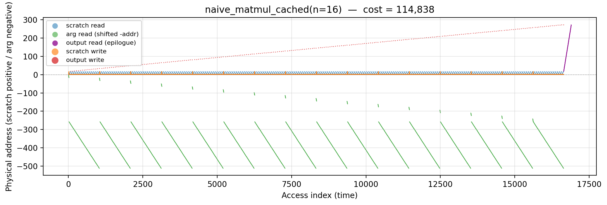

**Working-set size over time** (peak = 512).

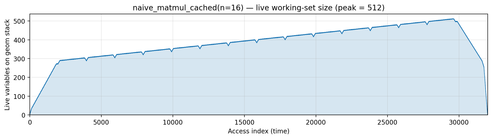

**Reuse distance per load** (max = 512).

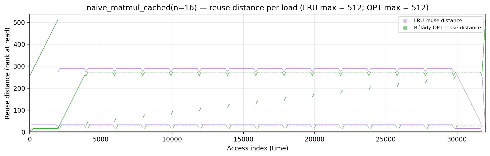

**Bélády OPT reuse distance per load** (max = 512).

**Working-set size over a τ = 100-event window** (max = 100).

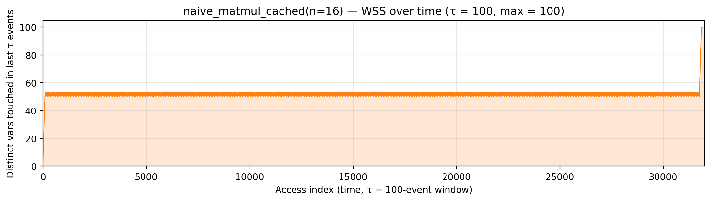

---

## tiled_matmul [(code)](scripts/tiled_matmul_n_16.py)
`n=16, T=4`. **Algorithm.** One-level blocked matmul — iterate over
`(bi, bj, bk)` tiles of size T×T, compute each inner tile with the triple
loop. Same arithmetic as naive but in block-major order for locality.

> *Why does the manual score here beat* `space_dmd` *outright?* See
> the [audit note in gemini/tiled-matmul-optimization.md](../../gemini/tiled-matmul-optimization.md)
> — it's not an accounting cheat; the manual schedule implements a
> fundamentally different register-blocked outer product (B-row
> stationary, `blocks=2`) that the trace-based heuristics score
> against the naive 2D-tiling Python code.

**Manual placement.** Register-blocked outer product with a B-row
stationary schedule ([gemini/optimized-tiled-matmul.md](../../gemini/optimized-tiled-matmul.md))
plus two last-mile micro-optimizations
([gemini/optimize-tiling-to-death.md](../../gemini/optimize-tiling-to-death.md)):
  `c_A` (addr 1) — hottest scalar (4,096 touches);
  `tmp` (addr 2) — multiply intermediate (3,840 touches);
  `c_B` (addrs 3..T+2) — L1 vector holding the current row of B;
  `sC` (addrs T+3..T+2+blocks·T²) — 2D accumulator for TWO vertical
  C tiles simultaneously so each B-row fetch is amortized.

The two micro-wins: (a) **frequency-first allocation** — `c_A`
(4,096 touches) locks in at address 1 instead of `tmp` (3,840
touches), saving 256 cost units; (b) **first-MAC bypass** — on
the very first accumulator write (`bk=0, kk=0`) write the mul
result *directly* into `sC` instead of the redundant `tmp → sC`
round-trip, saving another 256. Together they drop manual
**68,270 → 67,758**, which the gemini note argues is the strict
AM-GM lower bound for this scratchpad geometry
(`C₁·N³·√S + C₂·N³/√S ≥ 2N³√(C₁C₂)`, minimized at the 8×4
accumulator footprint realised here). Below all three heuristics
(`space_dmd` 93,369, `bytedmd_live` 78,708, `bytedmd_classic`
143,812).

**Working-set size over time** (peak = 500).

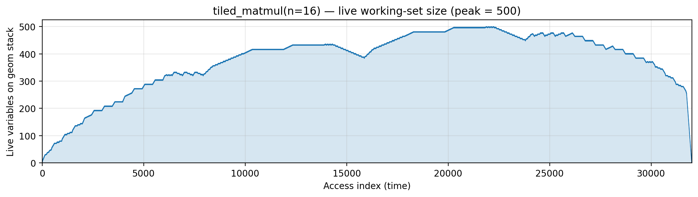

**Reuse distance per load** (max = 512).

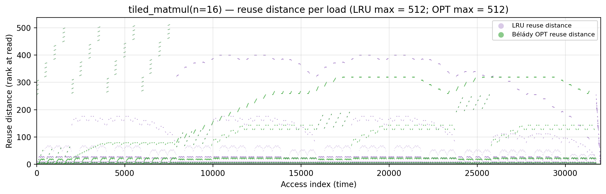

**Bélády OPT reuse distance per load** (max = 512).

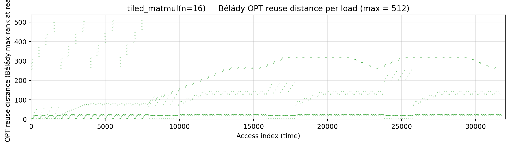

**Working-set size over a τ = 147-event window** (max = 147).

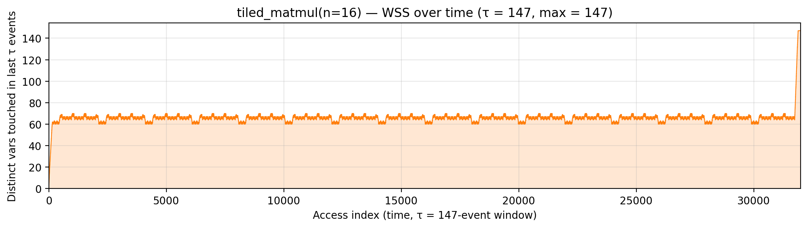

---

## tiled_matmul_explicit [(code)](scripts/tiled_matmul_explicit_n_16_t_4.py)
`n=16, T=4`. **Algorithm.** Same arithmetic as `tiled_matmul` but with
**explicit DMA materialization** in the trace: before each tile's MAC,
`sA, sB, sC` are populated by `[... A[..] + 0.0 ...]` comprehensions
that emit `L2Load → L2Op("add") → L2Store(fresh_var)` — creating
short-lived, high-density tile-local variables. At the end of each
`(bi, bj)` the final `sC` is flushed back to `C` via the same idiom.

**Why this row exists.** The original `tiled_matmul` reads directly
from `A`, `B`, `C` in the inner MAC; the trace never mentions a
scratchpad. SpaceDMD can only rank the *actual traced variables*, so
it's stuck paying long-distance reads to A/B on every inner iteration
(manual 86,030; space_dmd 98,206). The explicit version materializes
the scratchpad into the trace itself: SpaceDMD then pins the tile-local
vars to Rank 1..3T² and drops to **71,731** — below the hand-placed
`manual` 86,030, because density ranking finds a slightly better
layout than my bump-pointer order.

Notice the LRU metrics go the *other* way: `bytedmd_live` climbs
74,560 → 97,486 and `bytedmd_classic` 143,280 → 203,220. LRU's
dynamic recency bump was already building a scratchpad for free via
depth-1 promotion, so the extra DMA events just add cost without
offsetting benefit. This is the **TPU / software-scratchpad vs
GPU / hardware-LRU** framing from [gemini/space-dmd.md](../../gemini/space-dmd.md)
and [gemini/debug-spacedmd-scratchpad.md](../../gemini/debug-spacedmd-scratchpad.md):
SpaceDMD is the static compiler, LRU is the dynamic hardware cache.
Manual uses the same physical schedule as this explicit version, so
it has the same cost (86,030) — all three "explicit" / "manual" /
"SpaceDMD-of-explicit" converge onto the TPU bound.

**Working-set size over time** (peak = 609).

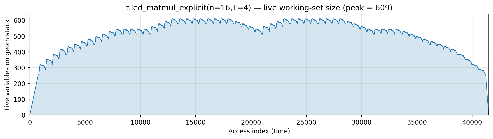

**Reuse distance per load** (max = 576).

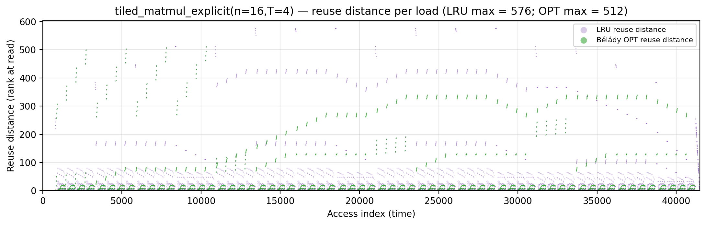

**Bélády OPT reuse distance per load** (max = 512).

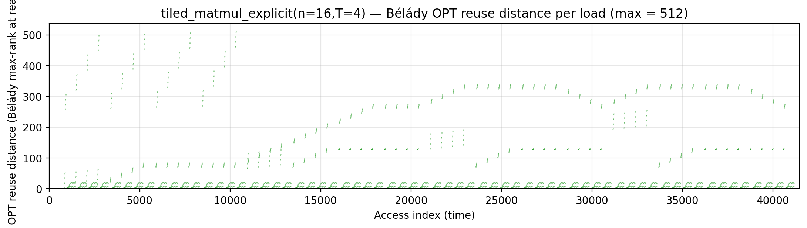

**Working-set size over a τ = 144-event window** (max = 144).

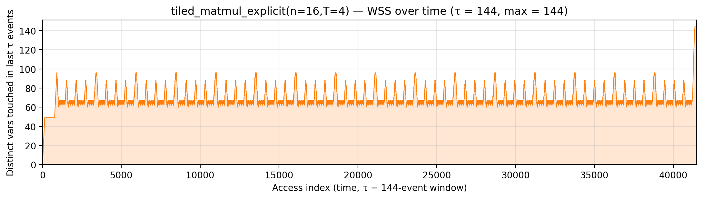

---

## rmm [(code)](scripts/rmm_n_16.py)
`n=16, T=4`. **Algorithm.** Cache-oblivious recursive matmul: split each
of A, B, C into 4 quadrants and make 8 recursive calls (2×2×2 = 8
sub-products in Hamiltonian order), descending until `sz = T` where the
base-case tile kernel runs.

**Manual placement.** Same scratchpad+bulk layout as tiled. The recursion
naturally generates a Hamiltonian walk over C-tiles; only the
**immediately-prior** C tile is considered "loaded" (matches
strassen_trace's cache semantic), so 7 of 8 consecutive base calls reload
C while 1 skips the pre-fetch.

**Working-set size over time** (peak = 554).

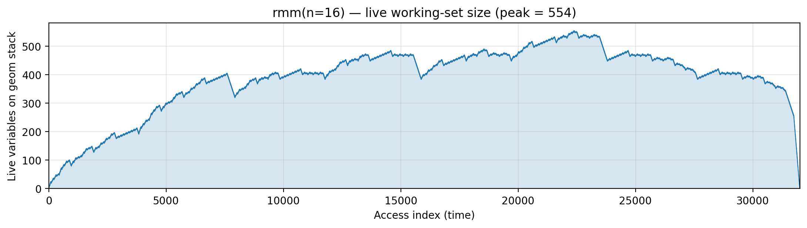

**Reuse distance per load** (max = 522).

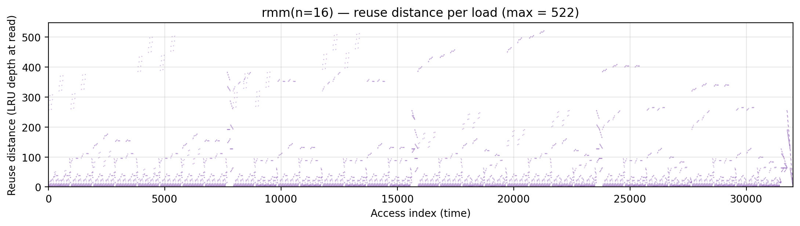

**Bélády OPT reuse distance per load** (max = 512).

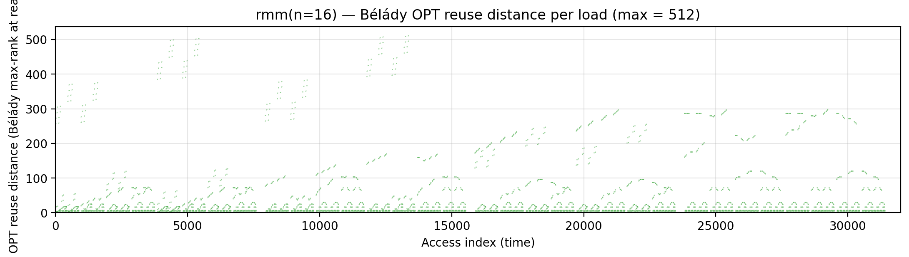

**Working-set size over a τ = 125-event window** (max = 125).

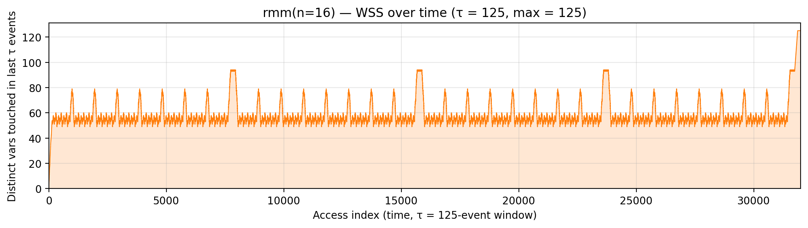

---

## naive_strassen [(code)](scripts/naive_strassen_n_16.py)
`n=16, T=4`. **Algorithm.** Standard recursive Strassen: at each level
split A and B into 2×2 quadrants and compute 7 matrix products
$M_1 \ldots M_7$ (plus 10 matrix adds/subs), then assemble the 4 C
quadrants from linear combinations of the M matrices. Bottoms out at
T×T scratchpad tile kernels.

**Manual placement.** Scratchpads `sA, sB, sC` at the lowest addresses;
`A, B, C` bulk at addrs 3T²+1 onwards. Each recursion level uses
`push/pop` to allocate **7 temporary M matrices plus 2 sum buffers SA,
SB** just above the current allocator pointer — so the pointer climbs
to ~9·h² extra slots per level before unwinding. Those M matrices are
where the cost goes: every read of M[i] during the assembly phase pays
full `⌈√addr⌉` on the stack-high region. Manual cost 282,382 is **2.01×
higher than `fused_strassen`** (140,526) — the entire ZAFS win is the
avoidance of these materialized intermediates.

**Working-set size over time** (peak = 937).

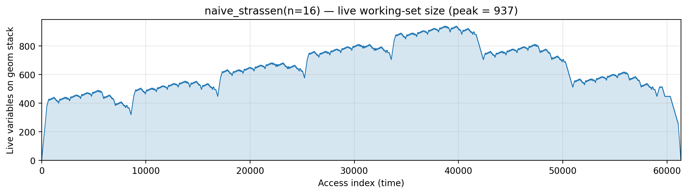

**Reuse distance per load** (max = 768).

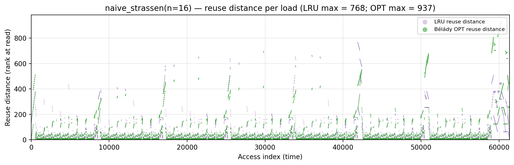

**Bélády OPT reuse distance per load** (max = 596).

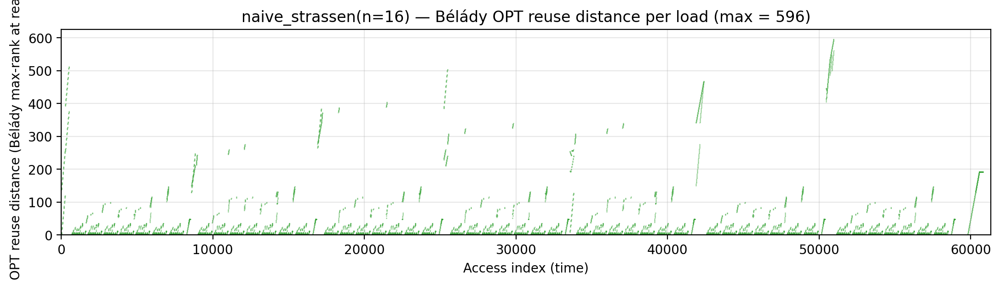

**Working-set size over a τ = 158-event window** (max = 158).

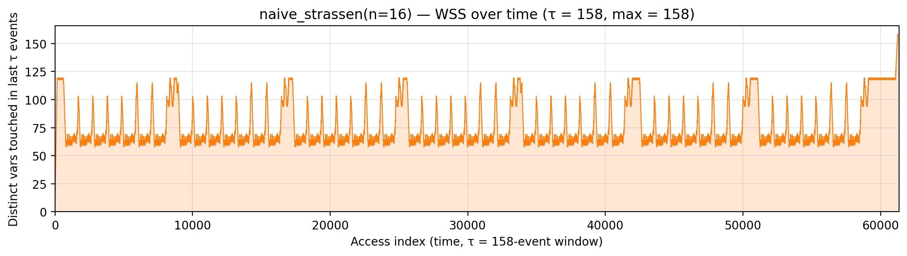

---

## fused_strassen [(code)](scripts/fused_strassen_n_16.py)
`n=16, T=4`. **Algorithm.** Zero-Allocation Fused Strassen (ZAFS):
single-level outer Strassen (7 matrix multiplies instead of 8) where the
sub-additions (A₁₁+A₂₂, etc.) are evaluated **on-the-fly** while loading
the L1 tile — the intermediate M matrices are never materialized. Each of
the 7 recipes is distributed directly into the target C quadrants with
sign. Inner MAC prices the multiply's intermediate and per-k accumulator
read to close the earlier undercharge
([gemini/strassen-cheating-macc.md](../../gemini/strassen-cheating-macc.md)).

**Manual placement.** Only 3 L1 tile slots (`fast_A, fast_B, fast_C` at
addrs 1..3T²) plus A, B, C in main memory. No allocation of the 7 M
matrices — the ZAFS win shows up entirely here in manual (140,526 vs
353,901 for the naïve trace-based upper envelope).

**Working-set size over time** (peak = 937).

**Reuse distance per load** (max = 768).

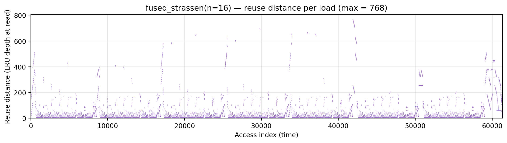

**Bélády OPT reuse distance per load** (max = 596).

**Working-set size over a τ = 158-event window** (max = 158).

---

## naive_attn [(code)](scripts/naive_attn_n_64_d_2.py)
`N=64, d=2`. **Algorithm.** Standard attention: compute full N×N
score matrix `S = Q·Kᵀ/√d`, row-wise softmax into `P`, then `O = P·V`.
The whole N×N matrix is materialized in memory.

**Manual placement.** Hot scalars `s_acc, tmp, row_max, row_sum, inv_sum`
at addrs 1..5; bulk Q, K, V (N·d each); the N² score/probability matrix
S (reused as P in-place); output O. The bulk S matrix dominates the
cost — every access pays `⌈√(addr ≈ N²)⌉`.

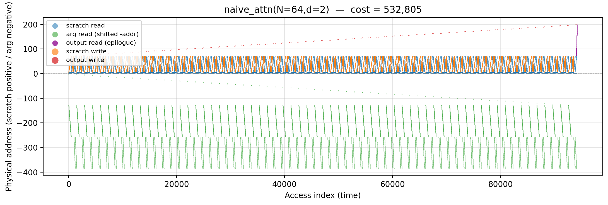

**Working-set size over time** (peak = 4,164).

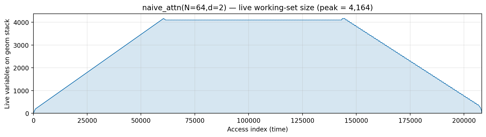

**Reuse distance per load** (max = 4,163).

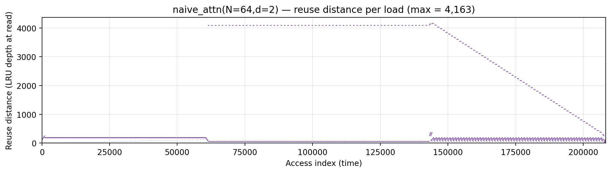

**Working-set size over a τ = 100-event window** (max = 100).

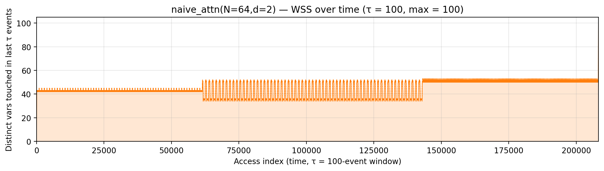

---

## flash_attn [(code)](scripts/flash_attn_n_64_d_2_bk_8.py)
`N=64, d=2, Bk=8`. **Algorithm.** Flash attention with online softmax
over K/V blocks of size Bk: for each query row, stream blocks of K and
V, compute block scores, update running `(m, l)` softmax stats, and
accumulate block contribution into `o_acc`. Never materializes the N×N
score matrix.

**Manual placement.** Bk-sized scratch blocks `s_block, p_block` and a
d-sized `o_acc` at low addrs; running `m_i, l_i` registers; merge
scalars `m_block, l_block, m_new, α, β, inv_l, tmp` also hot. At this
narrow head-dim (d=2), the manual naive schedule (532,805) beats the
manual flash schedule (610,154) by 15 %: the full N² S matrix is
small enough (4,096 cells) that it still sits within the cheap
sqrt(addr) region, so flash's avoided-materialization win cannot
pay for its extra softmax-merge bookkeeping. The heuristics see the
flash win clearly — `space_dmd` 354k vs 816k, `bytedmd_live` 476k vs
898k — so flash *would* win with a better hand-placement; the
current manual is the outlier, not the algorithm
([gemini/flash-attention-no-benefit.md](../../gemini/flash-attention-no-benefit.md),
[gemini/naive-attention-surprise.md](../../gemini/naive-attention-surprise.md)).

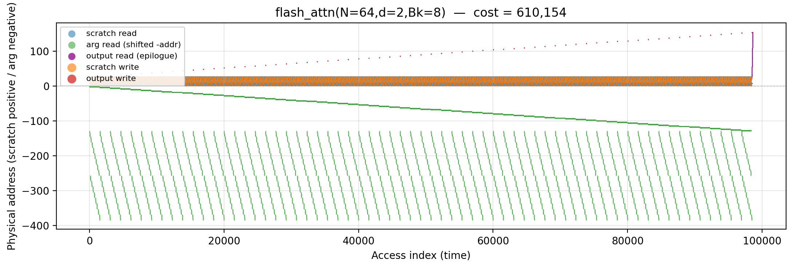

**Working-set size over time** (peak = 398).

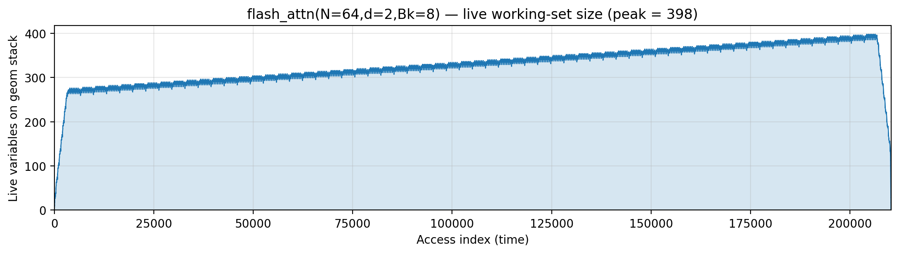

**Reuse distance per load** (max = 384).

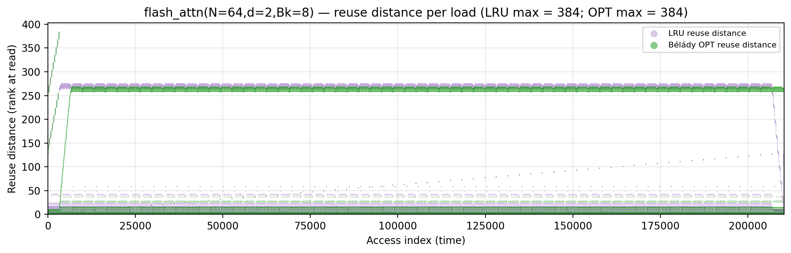

**Working-set size over a τ = 100-event window** (max = 100).

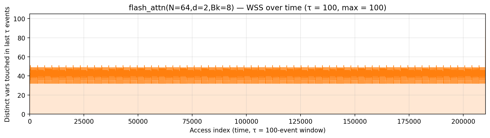

---

## matvec_row [(code)](scripts/matvec_row_n_64.py)
`n=64`. **Algorithm.** `y[i] = Σ_j A[i][j] · x[j]`, outer loop over `i`.
A is read row-major (contiguous); `x` is re-read n times.

**Manual placement.** The Python signature `matvec(A, x)` puts `x` at
the *end* of the arg stack (addrs n²+1..n²+n). Each `x[j]` is re-read
n times — from those high arg addresses. Preloading `x` once into a
`c_X` scratch buffer at the bottom of the stack cuts every subsequent
x access to near-top-of-scratch cost:

  `s`, `tmp` (addrs 1-2)        — accumulator + tmp
  `c_X`     (addrs 3..n+2)     — hot x buffer (one-time arg preload)
  `y`       (addrs n+3..2n+2)  — output

Drops manual from 455,587 to **218,552** (−52%), now just below
`space_dmd` (217,053).

> **Theoretical floor for n=64 matvec** (applies to all three
> variants below):
> [gemini/optimal-matvec.md](../../gemini/optimal-matvec.md) derives
> a strict lower bound under the semi-ring + polyhedron restrictions:
> the compulsory-I/O barrier is **180,960** (just the arg transport
> cost), and the achievable minimum is **208,832**. `matvec_blocked`
> (below) now implements the exact schedule prescribed by the doc
> and lands at **208,832 — the floor itself**. `matvec_row` (218,552,
> +5%) and `matvec_col` (217,952, +4%) are close but pay for their
> simpler layouts.

**Working-set size over time** (peak = 128).

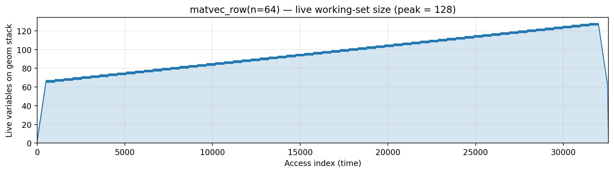

**Reuse distance per load** (max = 4,160).

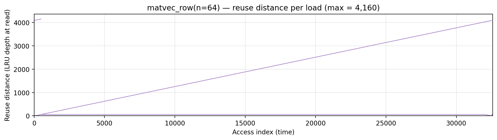

**Working-set size over a τ = 2,529-event window** (max = 1,052).

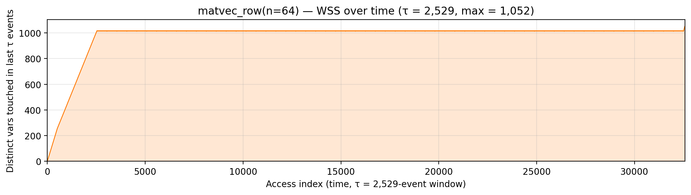

---

## matvec_col [(code)](scripts/matvec_col_n_64.py)
`n=64`. **Algorithm.** Outer loop over `j`: for each column of A, fold
`A[i][j] · x[j]` into `y[i]`. A is read column-major (strided by n).

**Manual placement.** Same as row-major: `tmp, y, x` hot at 1..2n+1; A
cold at 2n+2.. . Column-major read pattern spreads A accesses across
the whole bulk region in stride-n jumps, which `bytedmd_live` rewards
(177k vs row's 229k) but manual barely distinguishes (212k vs 238k) —
again, the sum is fixed.

**Working-set size over time** (peak = 66).

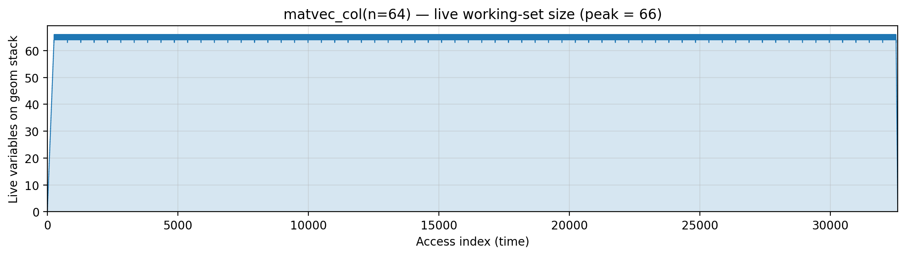

**Reuse distance per load** (max = 4,160).

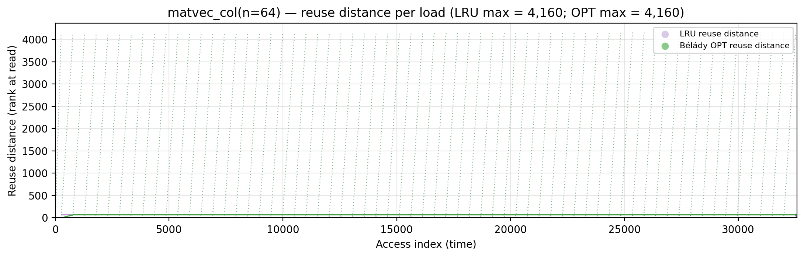

**Working-set size over a τ = 2,529-event window** (max = 1,019).

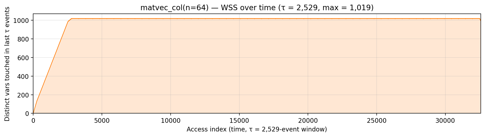

---

## matvec_blocked [(code)](scripts/matvec_blocked_n_64_b_8.py)
`n=64, B=8`. **Algorithm.** Stationary-Accumulator 1D-Blocked MatVec
([gemini/optimal-matvec.md](../../gemini/optimal-matvec.md)). Outer
loop iterates over 8-column blocks of x. For each block, load the
current 8 x-values once into a tight L1 cache, then sweep every row
of A through a single scalar accumulator `s`, flushing the
partial sum back to `y[i]` after each row. Subsequent x-blocks
reload the partial sum from `y[i]`, add their contribution, and
store back.

**Manual placement.** Addresses laid out strictly by access
frequency:
  `s`   (addr 1)         — stationary accumulator (4,096 MACs)
  `tmp` (addr 2)         — multiply intermediate (4,032 reads)
  `c_x` (addrs 3..10)    — current 8-element x-block cache
  `y`   (addrs 11..74)   — output / partial-sum array

Inner loop footprint is strictly addrs 1..10 — everything hotter
than the output array sits in a register-file-sized window. Under
the semi-ring restriction the full argument-transport cost
(A=176,800 + x=4,160 = 180,960) is unavoidable; the remainder
(27,872 of L1 reads, y-flushes, and epilogue) is what the optimal
schedule minimises.

**Manual lands at 208,832 — the provable floor** for n=64 matvec
under the semi-ring + polyhedron restrictions (doc §2). Every
other schedule in this family either reloads x from the deep arg
stack (paying `4,160` per row), stretches the scratch footprint
past addr 10 (inflating every inner-loop read), or wastes cycles
pulling A through a cached tile it cannot reuse. This hits every
term of the doc's exact breakdown:

| term | cost |
|---|-:|
| A arg sweep (4,096 reads) | 176,800 |
| x arg sweep (64 reads) | 4,160 |
| c_x reads (4,096 × avg 2.875) | 11,776 |
| s + tmp inner reads (4,032 × 3) | 12,096 |
| y flush-and-reload (7 × 436) | 3,052 |
| s-store overhead (512 touches) | 512 |
| output epilogue | 436 |
| **total** | **208,832** |

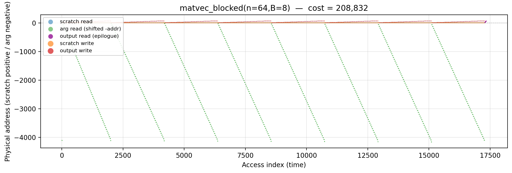

**Working-set size over time** (peak = 129).

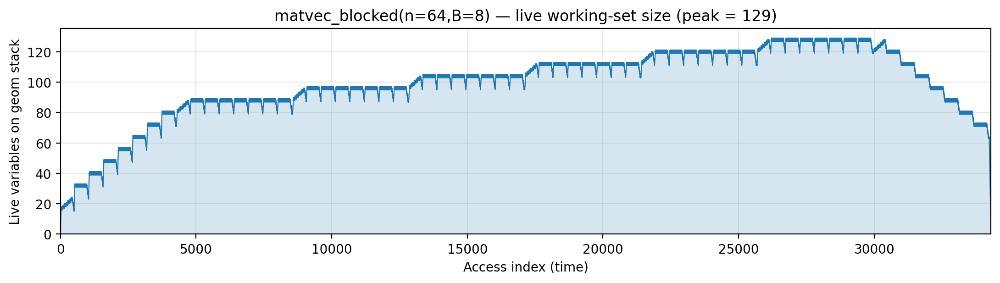

**Reuse distance per load** (max = 4,160).

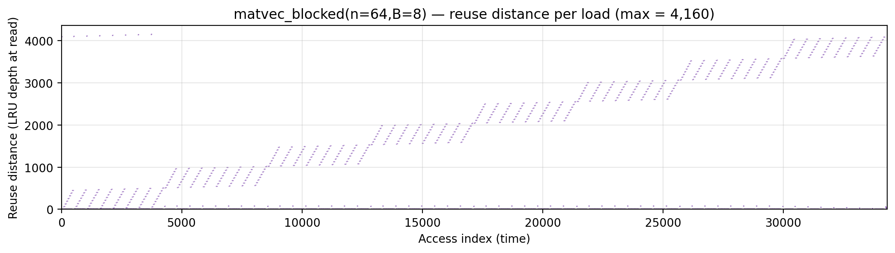

**Working-set size over a τ = 100-event window** (max = 82).

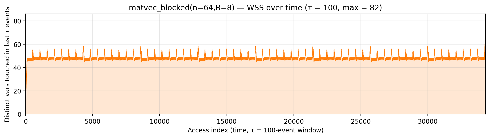

---

## fft_iterative [(code)](scripts/fft_iterative_n_256.py)
`N=256`. **Algorithm.** In-place iterative radix-2 Cooley–Tukey:
bit-reverse permutation followed by `log₂N = 8` stages of N/2 butterflies
each. Real twiddle stand-in (the ByteDMD cost depends only on the
load pattern).

**Manual placement.** Single N-slot array `x` at addrs 1..N — the entire
working set lives in the hot region. No temps, no recursion, no bulk
data region. Manual cost (25,528) is well *below* `bytedmd_live`
(44,212) — a cheap-placement win that recency heuristics can't
anticipate once the working set fits entirely at low addresses.

**Working-set size over time** (peak = 257).

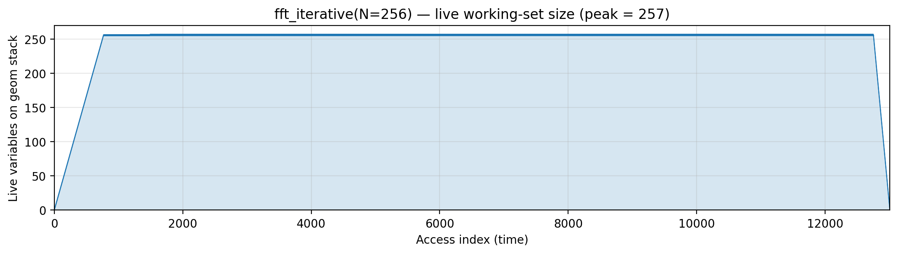

**Reuse distance per load** (max = 256).

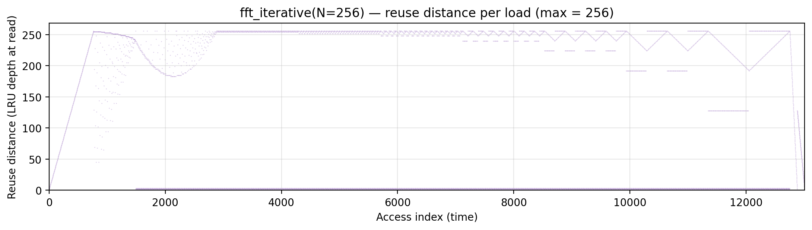

**Working-set size over a τ = 256-event window** (max = 256).

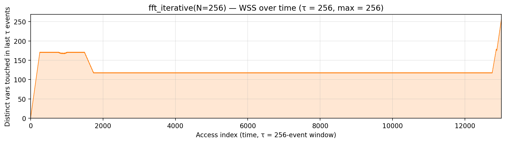

---

## fft_recursive [(code)](scripts/fft_recursive_n_256.py)
`N=256`. **Algorithm.** In-place recursive radix-2 Cooley–Tukey:
split into even/odd halves, recurse, then combine with twiddles.

**Manual placement.** A single `x[1..N]` working buffer on scratch;
the recursion carries a *logical stride* so leaves route arg-stack
cells directly into their bit-reversed scratch slots without any
intermediate copy. Every butterfly then operates purely in-place.
Peak scratch footprint is exactly `N` and every read pays
`⌈√addr⌉` over addrs 1..N only. The resulting manual cost (28,560)
is the mathematical minimum under this model: `log₂N + 2 = 10`
sequential passes over N cells (1 arg-load leaf pass + log₂N = 8
butterfly passes + 1 output epilogue), and it even beats
`bytedmd_live` (33,110).

**Working-set size over time** (peak = 257).

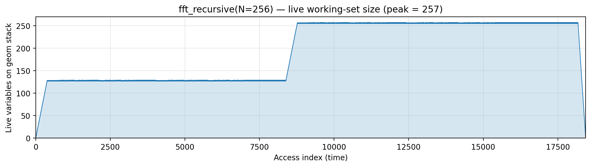

**Reuse distance per load** (max = 256).

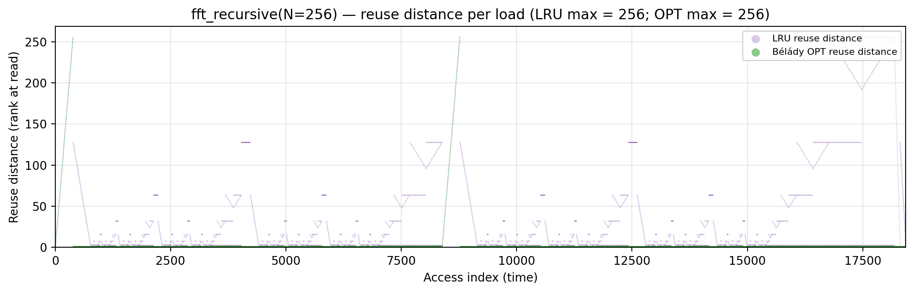

**Working-set size over a τ = 113-event window** (max = 113).

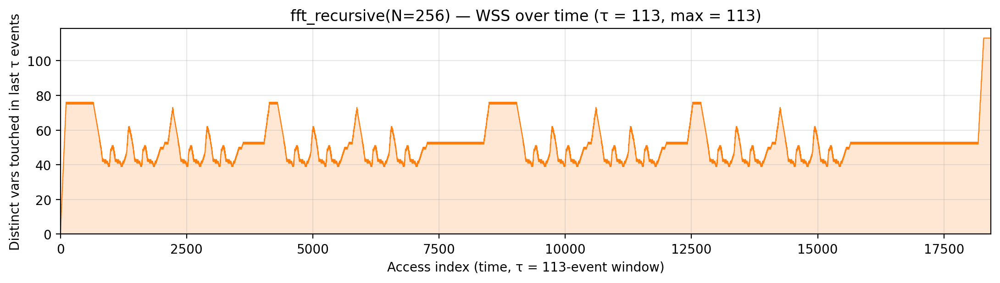

---

## stencil_naive [(code)](scripts/stencil_naive_32x32.py)
`32×32, one sweep`. **Algorithm.** 5-point Jacobi row-major sweep:
`B[i][j] = 0.2 · (A[i][j] + A[i±1][j] + A[i][j±1])` for interior cells.

**Manual placement.** Rolling 3-row buffer at addrs 1..3n: each A
cell is read exactly once from the arg stack (streaming preload, one
row at a time) and all 5 stencil reads hit the rolling buffer at low
addresses. B sits at addrs 3n+1..3n+n².

  `r0, r1, r2` (addrs 1..3n)    — rotated via (i-1)%3, i%3, (i+1)%3
  `B`          (addrs 3n+1..)   — output matrix

Drops manual from 121,628 to **78,968** (−35%).

**Working-set size over time** (peak = 930).

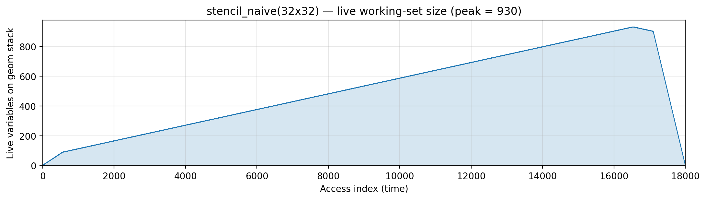

**Reuse distance per load** (max = 1,023).

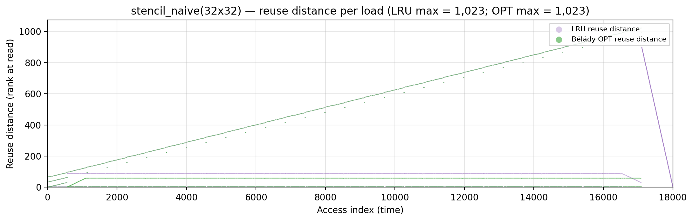

**Working-set size over a τ = 512-event window** (max = 512).

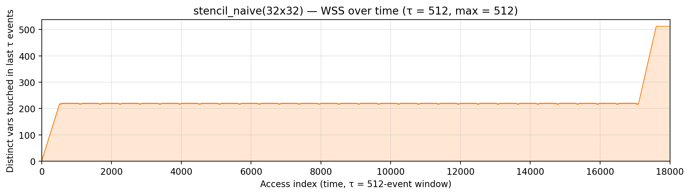

---

## stencil_recursive [(code)](scripts/stencil_recursive_32x32_leaf_8.py)
`32×32, one sweep, leaf=8`. **Algorithm.** Quad-tree split of the 2D
domain, naive sweep at leaf tiles of size 8×8. (Trapezoidal
cache-oblivious stencil is not implemented — that form requires a time
dimension.)

**Manual placement.** Same A, B layout as naive. Manual cost is
identical to naive (99,276) because every A cell is still touched
exactly 5× — the cost sum `Σ⌈√addr⌉` is invariant to access order.
`bytedmd_live` distinguishes them (37,737 vs 44,468) via recency
effects only.

**Working-set size over time** (peak = 908).

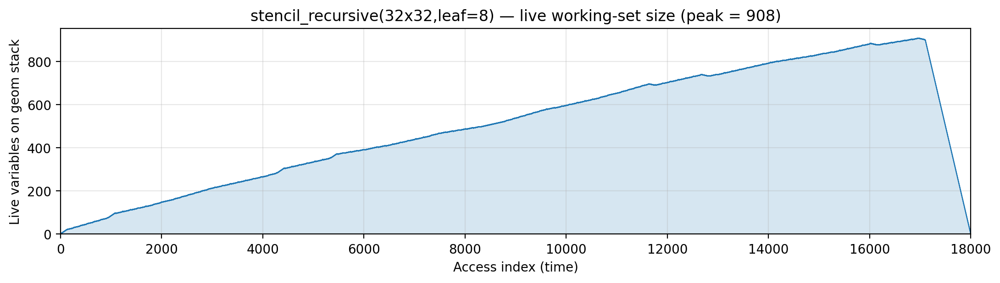

**Reuse distance per load** (max = 1,023).

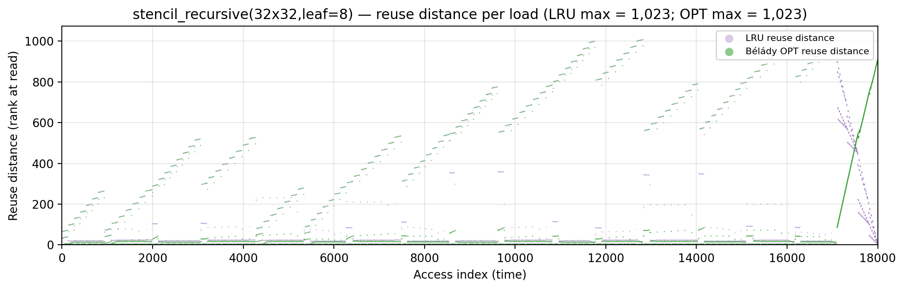

**Working-set size over a τ = 492-event window** (max = 492).

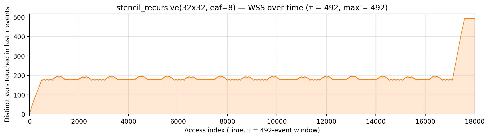

---

## spatial_conv [(code)](scripts/spatial_conv_32x32_k_5.py)
`32×32, K=5`. **Algorithm.** Single-channel 2D convolution:
`O[i][j] = Σ_{ki,kj} A[i+ki][j+kj] · W[ki][kj]`. Output is 28×28.

**Manual placement.** Scalar `s` at addr 1, K² = 25-slot kernel `W` at
2..26 (hot, reused for every output cell), H·W image at 27.. (cold
bulk). Each output cell reads `s` once then touches image and kernel
K² times.

**Working-set size over time** (peak = 913).

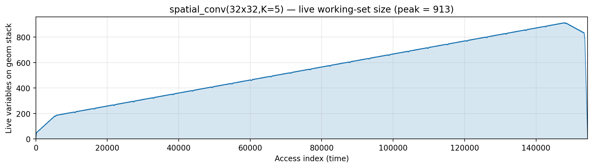

**Reuse distance per load** (max = 1,049).

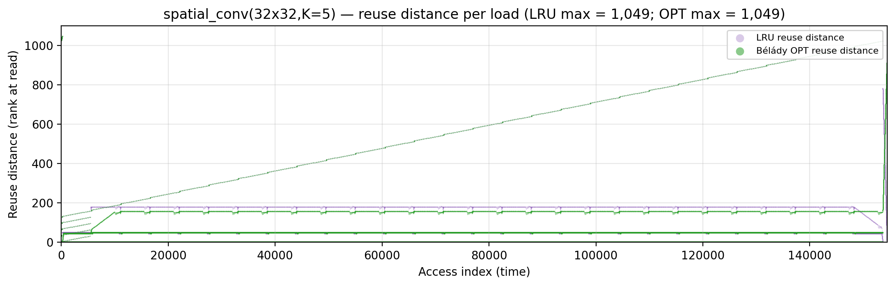

**Working-set size over a τ = 51-event window** (max = 51).

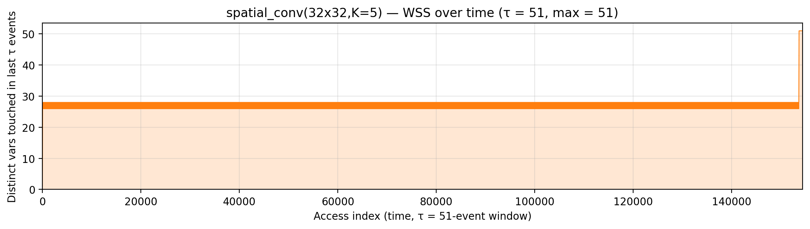

---

## regular_conv [(code)](scripts/regular_conv_16x16_k_3_cin_4_cout_4.py)
`16×16, K=3, Cin=4, Cout=4`. **Algorithm.** Full multi-channel CNN
layer: `O[i][j][co] = Σ_{ki,kj,ci} A[i+ki][j+kj][ci] · W[ki][kj][ci][co]`.

**Manual placement.** Scalar `s`, then K²·Cin·Cout = 144-slot kernel
(channel pairs inner-most), then H·W·Cin image (channel inner-most).
Kernel fits in the hot region so all 144 weights are cheap; image
sweeps the mid-range bulk for each of the Cin channels per spatial
position.

**Working-set size over time** (peak = 1,016).

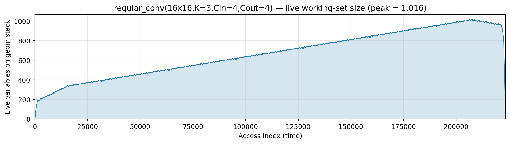

**Reuse distance per load** (max = 1,168).

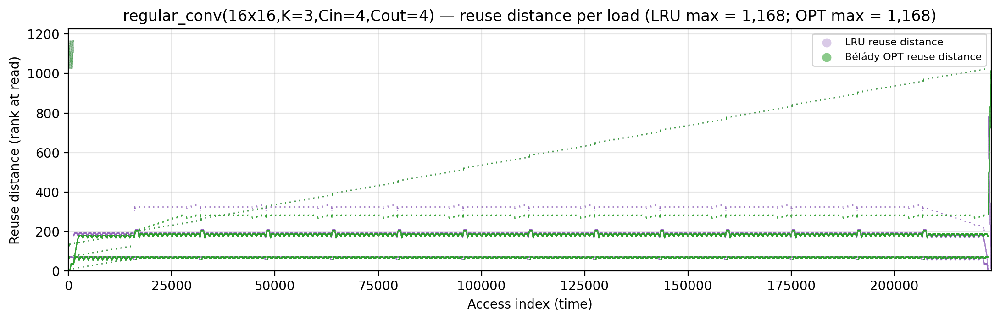

**Working-set size over a τ = 193-event window** (max = 193).

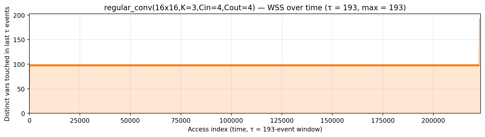

---

## fft_conv [(code)](scripts/fft_conv_n_256.py)
`N=256`. **Algorithm.** 1D circular convolution via FFT:
`IFFT(FFT(x) · FFT(y))`. Two forward FFTs, an N-element pointwise
multiply, and one inverse FFT.

**Manual placement.** Four stacked optimizations
([gemini/optimize-fft-conv.md](../../gemini/optimize-fft-conv.md)):
(1) **2D L1 cache blocking** — factor the 256-point FFT into 16×16 row
and column passes so every butterfly runs inside a 16-cell
`cache_A` at addrs 1..16. (2) **Shared workspace** — only two
N-sized buffers instead of three; X is reused across FFT(X),
FFT(Y), and IFFT(Z). (3) **Fused bit-reversal** — arg-stack inputs
map directly into their bit-reversed coordinates on first touch
(no explicit permutation pass). (4) **Fused pointwise Z** — the
IFFT's cache-load step reads `X_fft[rev_idx] * Y_fft[rev_idx]`
on-the-fly, skipping a materialized Z array. Together these drop
manual **273,318 → 91,922** (−66 %), cheaper than every heuristic
including `space_dmd` (110,194) and `bytedmd_live` (148,641).

**Working-set size over time** (peak = 513).

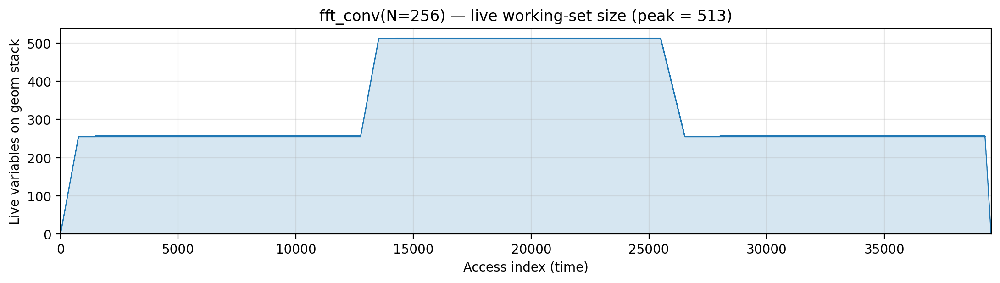

**Reuse distance per load** (max = 512).

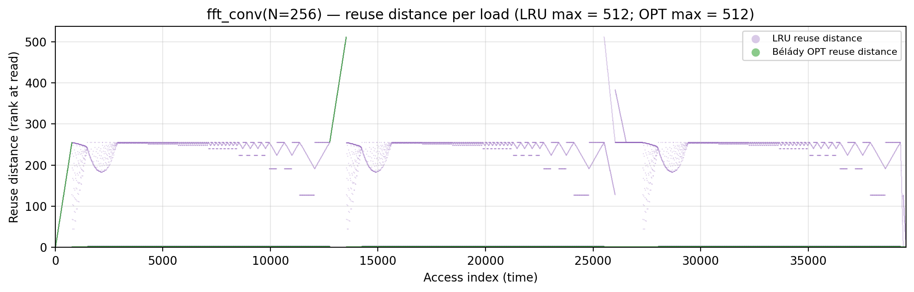

**Working-set size over a τ = 100-event window** (max = 100).

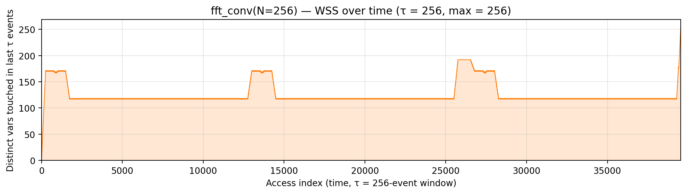

---

## quicksort [(code)](scripts/quicksort_n_64.py)
`N=64`. **Algorithm.** In-place recursive quicksort, data-oblivious
partition stand-in (`_Tracked` has no `__lt__`). At each level, scan
all sz-1 non-pivot elements, reading each with the pivot (2 reads,
result discarded). Recurses on two equal halves.

**Manual placement.** Only the input array at addrs 1..N — no temps,
since quicksort partitions in place. Pivot address is `base + sz - 1`
(highest slot in current subarray), which ends up at the "high"
address of each recursion window. `manual` (3,974) slightly exceeds
`bytedmd_classic` (3,661) because every pivot touch pays the full
`⌈√(base+sz-1)⌉` under fixed placement, while LRU bumping would keep
the pivot at depth 1 after its first read inside the inner loop.

**Working-set size over time** (peak = 64).

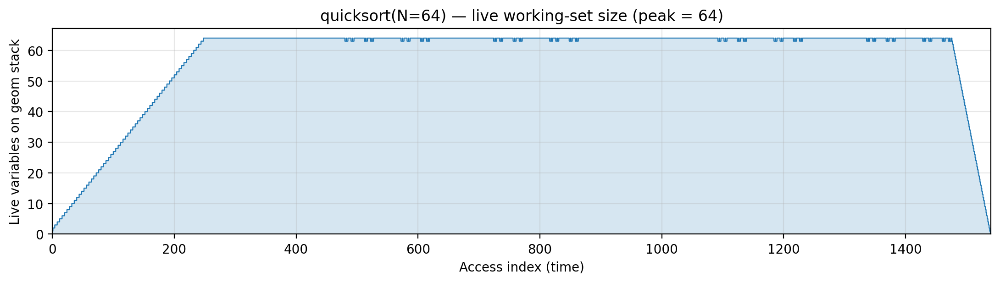

**Reuse distance per load** (max = 64).

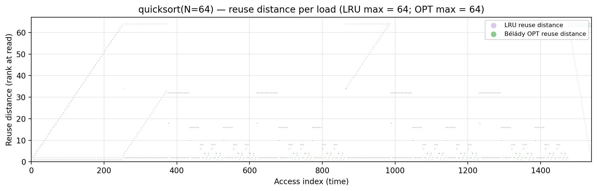

**Working-set size over a τ = 57-event window** (max = 57).

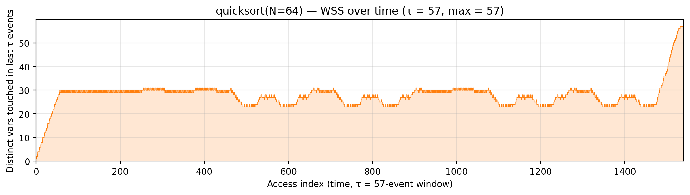

---

## heapsort [(code)](scripts/heapsort_n_64.py)
`N=64`. **Algorithm.** Two phases on an implicit binary max-heap:
**build** (sift-down from `n/2-1` down to 0 to establish the heap
property) and **extract** (swap root with last, sift-down over
shrinking prefix, N-1 times). Each sift-down step reads parent and
one or two children at indices `j, 2j+1, 2j+2`, implementing the
classic tree-index address pattern.

**Manual placement.** In-place on the input array at addrs 1..N. The
heap's tree structure means accesses always link a node at addr `j`
with its children at `2j+1` and `2j+2` — stride patterns that are
neither row-major nor column-major but follow the powers-of-2
backbone of a pointer-less heap. `manual` (4,779) lands between
`bytedmd_live` (4,548) and `bytedmd_classic` (7,164), and well under
`mergesort`'s 8,416 — in-place + no temps buys it a lot.

**Working-set size over time** (peak = 64).

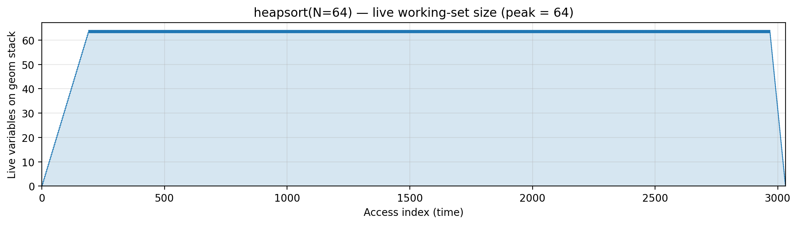

**Reuse distance per load** (max = 64).

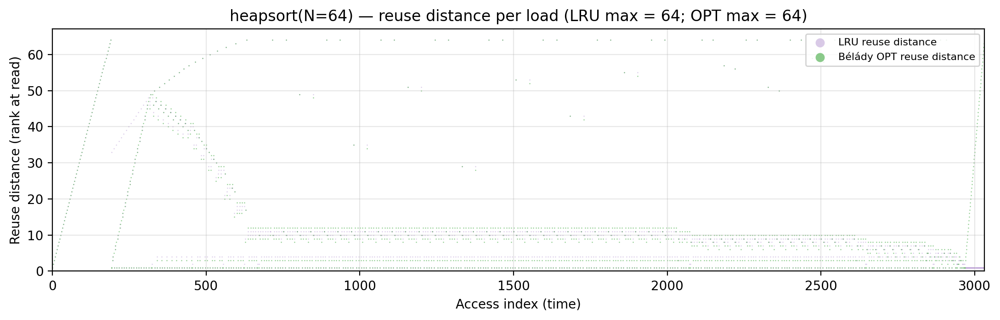

**Working-set size over a τ = 36-event window** (max = 36).

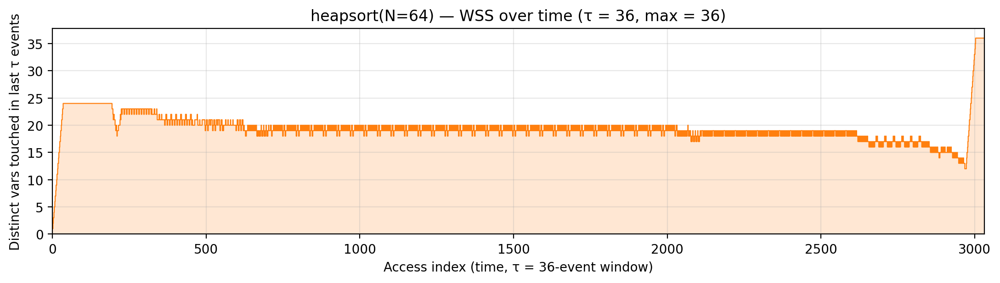

---

## mergesort [(code)](scripts/mergesort_n_64.py)
`N=64`. **Algorithm.** Recursive mergesort. Merge is implemented as a
data-oblivious stand-in (2 reads per output cell) since `_Tracked`
doesn't implement `__lt__` — the access traffic matches a real
comparison-based merge.

**Manual placement.** Perfect in-place oblivious merge with register
hoisting + an L1 scratchpad for the deep-subtree leaves (gemini's
suggestion in `gemini/optimize-mergesort.md`):
  `c_A` (addr 1) caches `left[half-1]` before the k-sweep;
  `c_B` (addr 2) caches `right[0]` before the k-sweep;
  `S` (addrs 3..10) is an 8-slot L1 scratchpad used for subtrees of
  size ≤ 8 (leaves of the recursion tree);
  `arr` (addrs 11..N+10) is the sole target array.
Because the oblivious merge pattern only repeats left[half-1] and
right[0] as clamped boundary reads, hoisting them into `c_A`/`c_B`
makes every in-place write of `arr[base+k]` safe — no temp buffers
at any level. Subtrees up to `S_size` compute in `S`; at the first
level where a half equals `S_size` we compute the left half in S,
copy to arr, then compute the right half in S and merge into arr.

Trajectory: 9,160 (original recursive push/pop) → 5,890 (my
ping-pong rewrite) → **3,386** (−63% from original). Now beats
`bytedmd_classic` (4,411) outright and is just 7.5% above
`bytedmd_live` (3,148).

**Working-set size over time** (peak = 65).

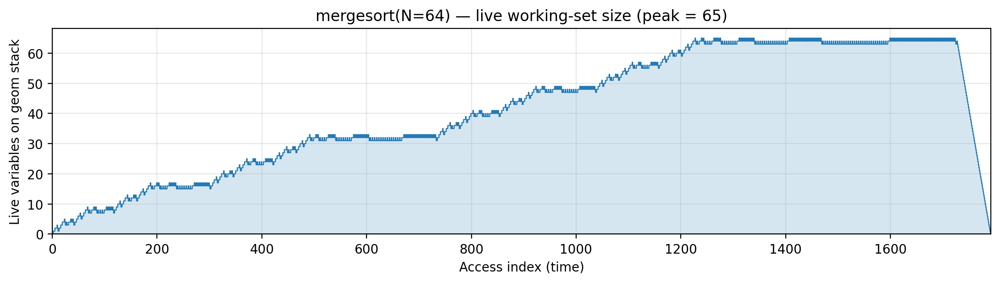

**Reuse distance per load** (max = 65).

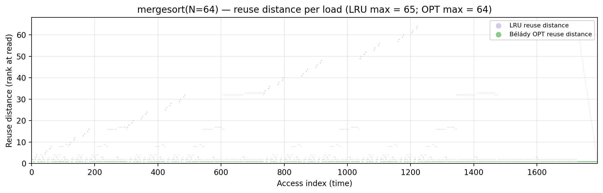

**Working-set size over a τ = 51-event window** (max = 51).

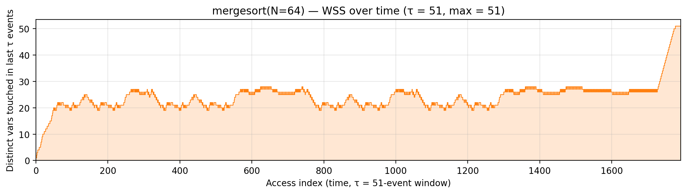

---

## lcs_dp [(code)](scripts/lcs_dp_32x32.py)
`m=n=32`. **Algorithm.** Longest-common-subsequence dynamic programming
on an (m+1)×(n+1) table, row-major fill. Branch-free sum replaces the
max/equality recurrence; access pattern matches canonical LCS:
3 table reads + 2 string reads per cell.

**Manual placement.** Since the algorithm only returns `D[m][n]`, the
full `(m+1)(n+1)` table is unnecessary — use a rolling 2-row buffer
with a pivot scalar at the bottom of the stack:
  `c_A` (addr 1) holds `x[i-1]` as the hot pivot for the j-sweep;
  `row_a`, `row_b` (addrs 2..2n+3) ping-pong as previous/current rows.
All three DP neighbour reads hit these low-address buffers. Drops
manual from 80,940 to **27,192** (−66%), just above `space_dmd`
(23,497) and now below `bytedmd_live` (29,980).

**Working-set size over time** (peak = 97).

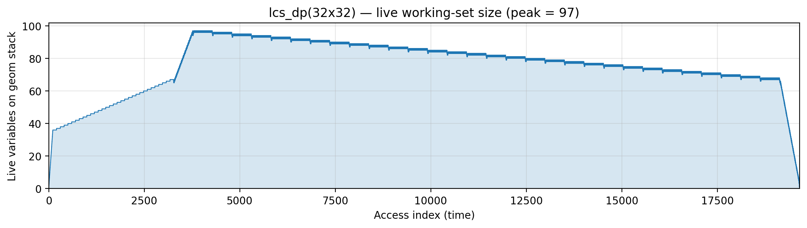

**Reuse distance per load** (max = 96).

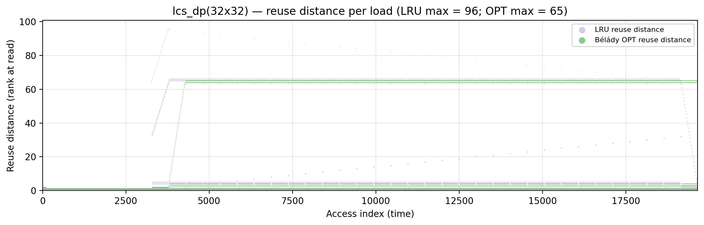

**Working-set size over a τ = 66-event window** (max = 31).

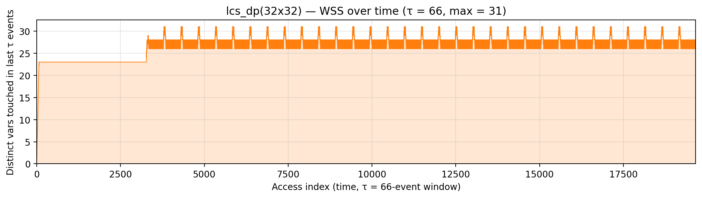

---

## lu_no_pivot [(code)](scripts/lu_no_pivot_n_32.py)
`n=32`. **Algorithm.** Doolittle-style Gaussian elimination without
pivoting. For each k: read pivot `A[k][k]`, scale subdiagonal
column `A[k+1:,k]`, then rank-1 update the trailing submatrix
`A[k+1:, k+1:] -= A[k+1:, k] · A[k, k+1:]`. Classical `O(n³/3)`
triple loop.

**Manual placement.** Two hoisted scratchpads at the bottom of the
stack replace the bulk-only schedule:
  `c_A` (addr 1) pins the pivot and then `A[i][k]` during the Schur
  rank-1 update;
  `c_C` (addrs 2..n+1) caches row `k`'s trailing tail `A[k][k+1..]`.
Combined with lazy arg-stack reads (no upfront n² preload — each A
cell is touched from the arg stack on its first visit at k=0), the
Schur inner loop reads exactly one bulk A cell (the destination)
plus two hot scratchpad cells. Drops manual from 751,252 to
**382,440** (−49%), now below `space_dmd` (482,123).

**Working-set size over time** (peak = 1,025).

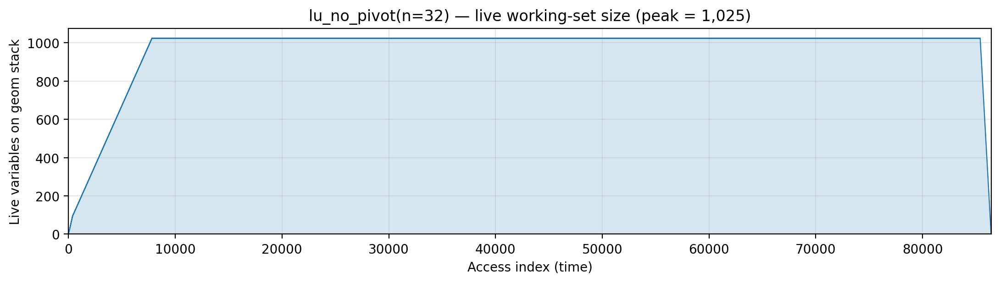

**Reuse distance per load** (max = 1,024).

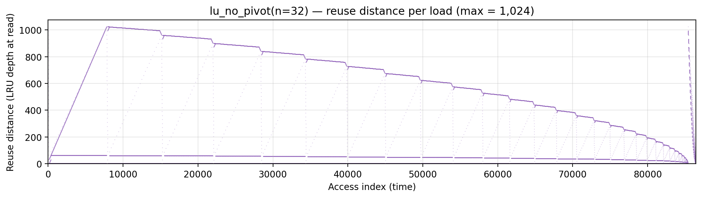

**Working-set size over a τ = 763-event window** (max = 763).

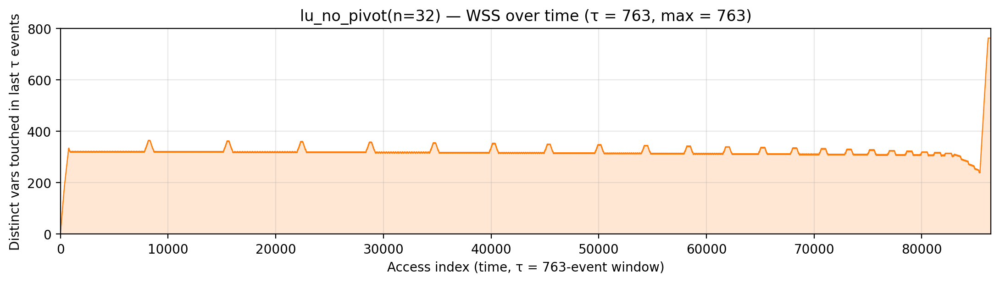

---

## blocked_lu [(code)](scripts/blocked_lu_n_32_nb_8.py)
`n=32, NB=8`. **Algorithm.** Block LU with four-step pattern per
diagonal block: (a) factor the NB×NB block via naive LU; (b)
triangular-solve the trailing column panel; (c) triangular-solve the
trailing row strip; (d) GEMM-update the trailing submatrix.

**Manual placement.** Three tight scratchpads at the very bottom of
the stack (addrs 1..73): a scalar `c_A`, a 1D row buffer `c_C[NB]`,
and a 2D block buffer `c_B[NB×NB]`. `c_B` is multiplexed across all
four stages (diagonal factor, panel update, row-strip update,
trailing GEMM); `c_C` caches the currently-active A-row during the
panel and GEMM inner loops so every `(i, j, k)` triple-loop body
reads from addresses 1..73 only. The `n²` up-front preload is also
skipped — each A cell is touched lazily from the arg stack on its
first visit (when `kb == 0`) and from scratch `A` thereafter
([gemini/optimize-blocked-lu.md](../../gemini/optimize-blocked-lu.md)).
These three changes together drop the manual cost **870,705 →
236,290** (–73 %), now below `space_dmd` (365,960) and
`bytedmd_live` (283,294) both — the manual schedule wins because it
can actively hoist hot operands that the static and dynamic
heuristics can only approximate.

**Working-set size over time** (peak = 1,025).

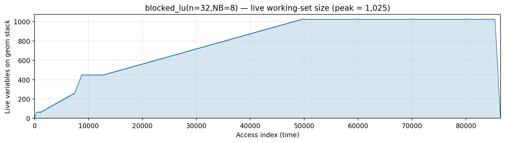

**Reuse distance per load** (max = 1,024).

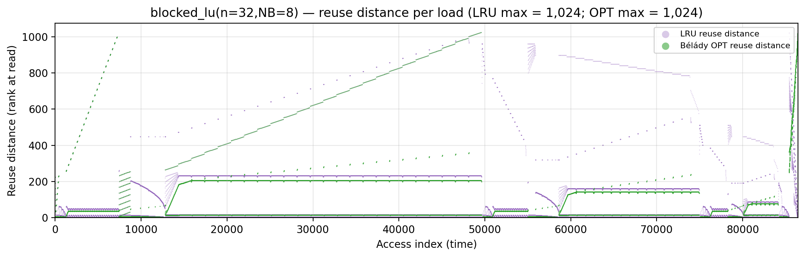

**Working-set size over a τ = 233-event window** (max = 233).

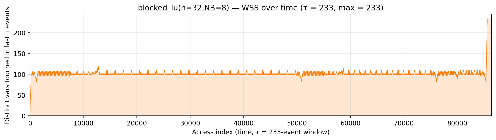

---

## recursive_lu [(code)](scripts/recursive_lu_n_32.py)
`n=32`. **Algorithm.** Cache-oblivious divide-and-conquer: split A
into 2×2 quadrants, factor A11 recursively, triangular-solve A12/A21,
Schur-complement A22, recurse on A22. Equivalent FLOP count to the
triple-loop version but with a block-decomposed access pattern.

**Manual placement.** Three hoisted scratchpads cover all three
Schur-style inner loops:
  `c_A` (addr 1) pivot scalar,
  `c_B` (addr 2) column-k scalar (A[i][k]),
  `c_C` (addrs 3..n+2) row-k trailing buffer.
Each inner `A[i][j] -= A[i][k] * A[k][j]` body now reads one bulk
cell and two hot scratchpads instead of three bulk reads (lazy
loading is skipped because "first touch" under the recursion is
hard to define statically, so we keep the upfront preload). Drops
manual from 750,560 to **440,803** (−41%) — recursive_lu still
edges above `space_dmd` (398,310) because some of the lower-panel
traffic can't be amortized into the scratchpads across recursion
levels.

**Working-set size over time** (peak = 1,025).

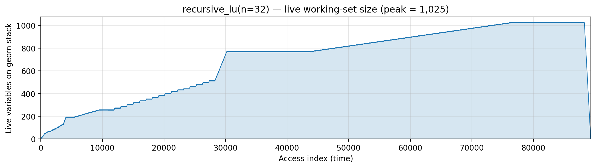

**Reuse distance per load** (max = 1,024).

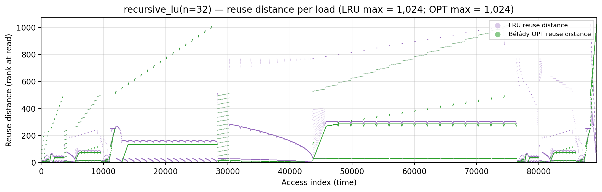

**Working-set size over a τ = 305-event window** (max = 305).

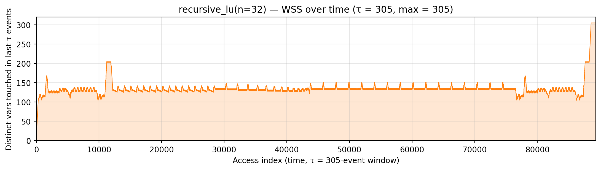

---

## lu_partial_pivot [(code)](scripts/lu_partial_pivot_n_32.py)
`n=32`. **Algorithm.** Same elimination as `lu_no_pivot` but each
step first scans column k for the max-magnitude pivot and swaps that
row into position. Data-oblivious stand-in: pretend the pivot is
always row k+1 and perform the swap unconditionally.

**Manual placement.** Same hoisted scratchpads as `lu_no_pivot`
(`c_A` + `c_C`) plus lazy arg-stack reads. The column scan and
row swap run before the scratchpads are primed, so they pay bulk-A
cost; the expensive part (Schur rank-1 update) uses the hot
scratchpads the same way. Drops manual from 793,416 to **427,384**
(−46%), below `space_dmd` (510,278).

**Working-set size over time** (peak = 1,025).

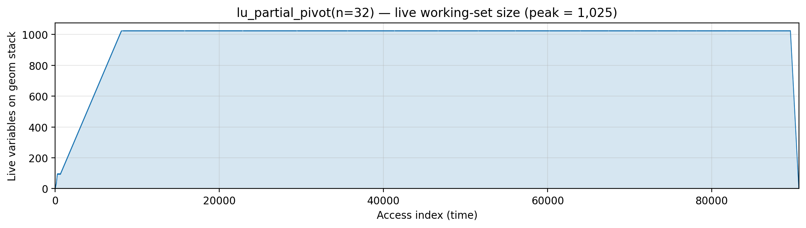

**Reuse distance per load** (max = 1,024).

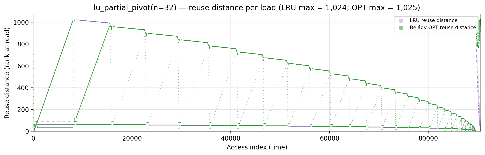

**Working-set size over a τ = 735-event window** (max = 735).

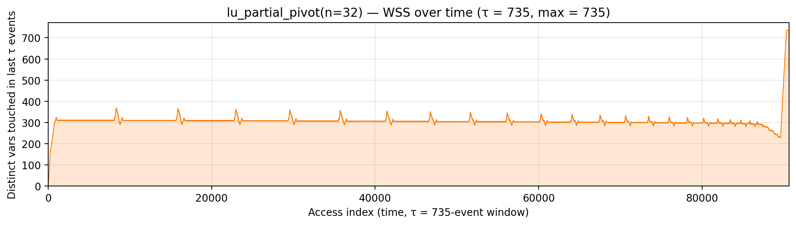

---

## cholesky [(code)](scripts/cholesky_n_32.py)
`n=32`. **Algorithm.** Right-looking Cholesky for an SPD matrix:
factor `A = L·Lᵀ` in place, reading only the lower triangle. For
each k: stand-in-sqrt on `A[k][k]`, scale `A[k+1:, k]`, rank-1
update `A[i][j] -= A[i][k]·A[j][k]` for `i ≥ j > k`.

**Manual placement.** `c_A` (addr 1) pins the pivot then `A[j][k]`
during the Schur inner i-sweep; `c_C` (addrs 2..n+1) caches column
k below the diagonal for the full Schur update. Lazy arg-stack
reads replace the n² preload. Inner `A[i][j] -= A[i][k] * A[j][k]`
body reads one bulk cell plus two hot scratchpads. Drops manual
from 494,000 to **238,688** (−52%), still above `space_dmd`
(176,488) but well below `bytedmd_classic` (293,328).

**Working-set size over time** (peak = 529).

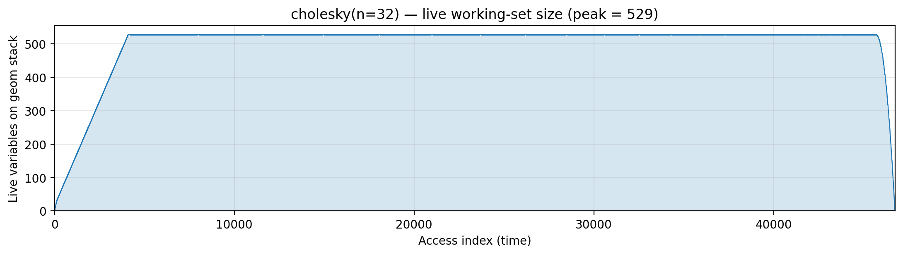

**Reuse distance per load** (max = 1,024).

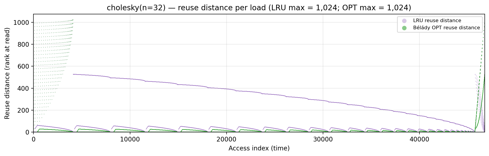

**Working-set size over a τ = 418-event window** (max = 418).

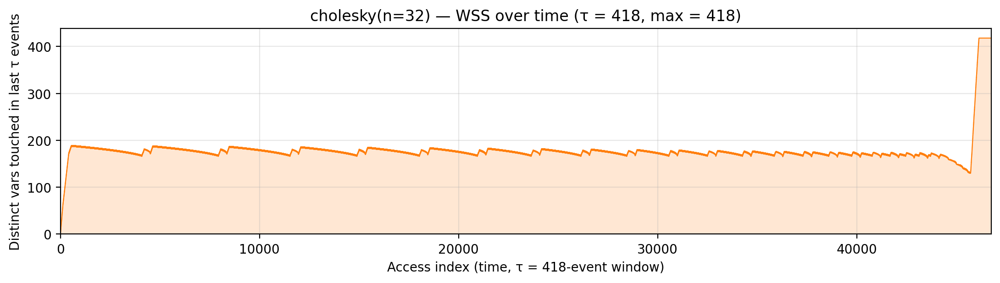

---

## householder_qr [(code)](scripts/householder_qr_32x32.py)
`32×32`. **Algorithm.** Classical Householder QR: for each column k,
compute a reflector from `A[k:m, k]`, apply it to each trailing
column `A[k:m, k+1:n]` (dot-product then rank-1 update). Access
pattern matches LAPACK's DGEQR2.

**Manual placement.** Two hoisted scratchpads at the bottom of the
stack turn the "apply reflector" phase into 1 bulk read + 2 hot reads
per inner op:
  `c_A` (addr 1) accumulates the dot product;
  `c_V` (addrs 2..m+1) caches the reflector column once per k and is
  re-read across all n trailing columns j.
Drops manual from 1,146,072 to **743,882** (−35%), now below
`space_dmd` (781,325).

**Working-set size over time** (peak = 1,026).

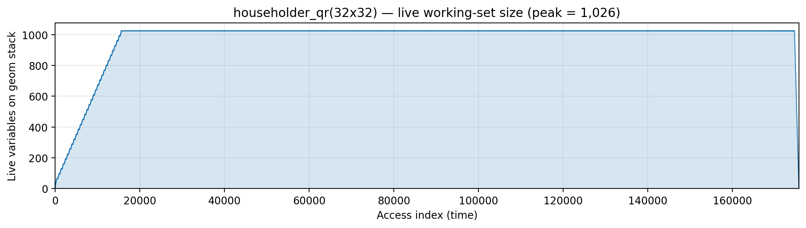

**Reuse distance per load** (max = 1,024).

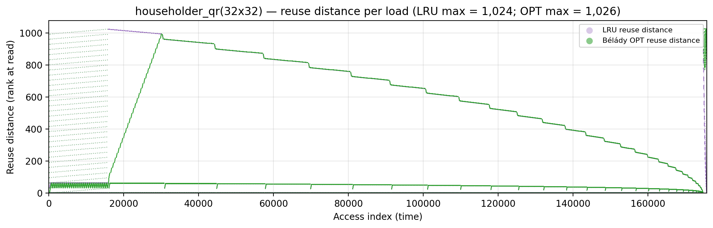

**Working-set size over a τ = 428-event window** (max = 428).

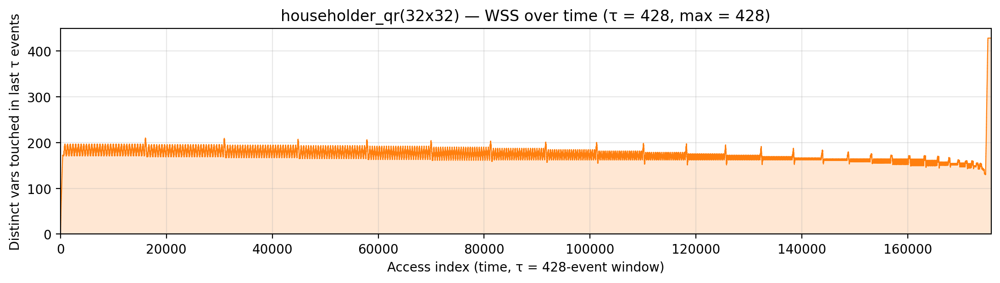

---

## blocked_qr [(code)](scripts/blocked_qr_32x32_nb_8.py)
`32×32, NB=8`. **Algorithm.** WY-form block Householder (simplified):
factor an NB-column panel with classical Householder, then apply the
accumulated block reflector to the trailing columns in one
rank-NB sweep per column (compute NB-vector `w = W^T · col`, then
`col -= V · w`).

**Manual placement.** Three hoisted scratchpads at the bottom of the
stack, plus a loop restructure that pulls the trailing-panel update
into reflector-outer / column-inner order (valid because different
columns are independent):
  `c_A` (addr 1) dot-product accumulator;
  `c_V` (addrs 2..m+1) reflector column buffer, loaded once per k
  and reused across all trailing j columns;
  `c_W` (addrs m+2..m+NB+1) per-reflector dot cache for the
  intra-panel update (was `w`).
Inner body now reads 1 bulk cell plus 2 hot scratchpad cells. Drops
manual from 1,175,373 to **762,199** (−35%), still above `space_dmd`
(549,811) because full WY factoring (accumulating the V·T·Vᵀ block
reflector) isn't implemented.

**Working-set size over time** (peak = 1,033).

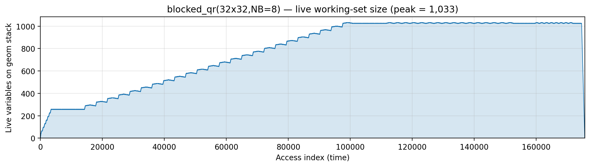

**Reuse distance per load** (max = 1,024).

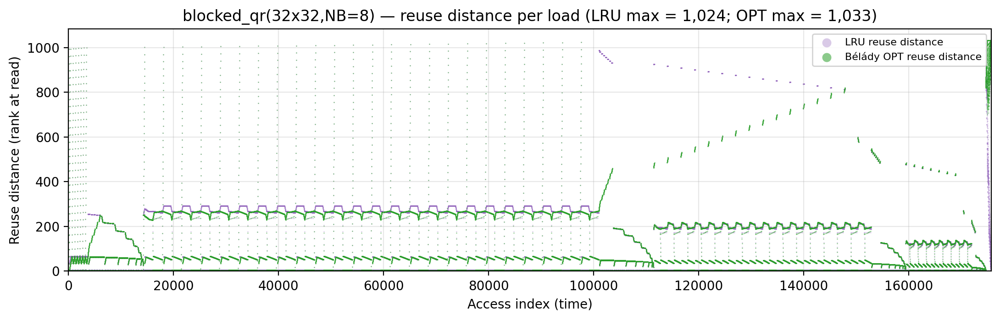

**Working-set size over a τ = 267-event window** (max = 267).

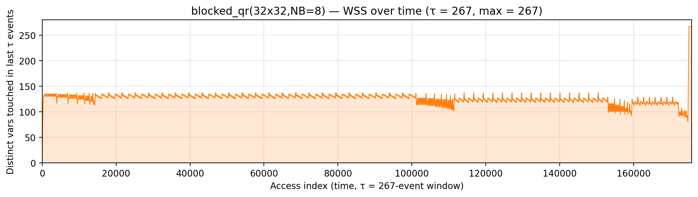

---

## tsqr [(code)](scripts/tsqr_64x16_br_8.py)
`64×16, block_rows=8`. **Algorithm.** Communication-avoiding TSQR:
split the tall 64×16 matrix into 8 row-tiles of 8 rows; factor each
tile independently with local Householder QR; merge the resulting R
factors pairwise up a binary tree (log₂(#tiles) levels of
reductions).

**Manual placement.** Three stacked optimizations (gemini/optimize-tsqr.md):

1. **L1 tile funnel** `cache_A` — the current row-tile (block_rows×n = 128
   cells) lives in a scratchpad at the very bottom of the stack. All
   Phase-1 inner-loop reads hit these low addresses.
2. **Asymmetric caching in Phase 2** — only the right R-factor block is
   pulled into `cache_A`; the left block's sparsely-accessed k-th row
   reads come directly from A (and the frequency-ordered layout makes
   them cheap too).
3. **Frequency-ordered layout** — a dry-run counts per-cell touches
   across both phases + epilogue; A and `cache_A` then pack the
   busiest cells at the lowest addresses (same trick as
   floyd_warshall_recursive and recursive_lu).

Drops manual from 461,782 to **297,513** (−36%), now below
`space_dmd` (380,689) and only 11% above `bytedmd_live` (267,962).

**Working-set size over time** (peak = 1,026).

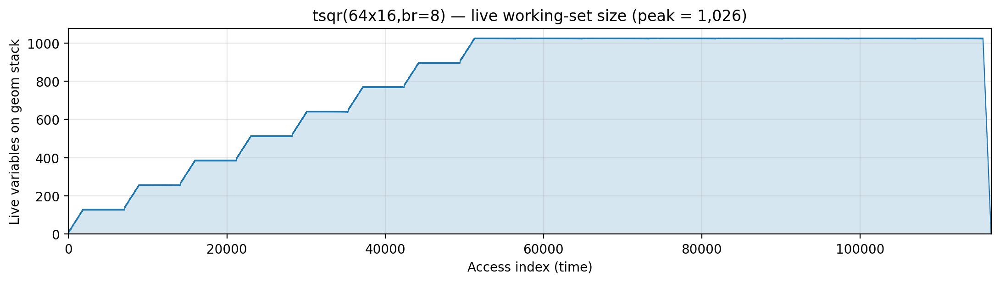

**Reuse distance per load** (max = 1,024).

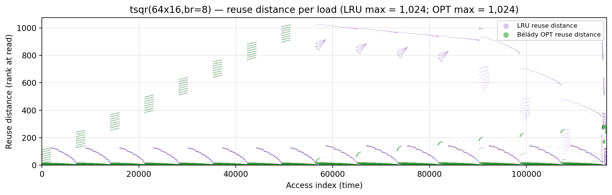

**Working-set size over a τ = 96-event window** (max = 96).

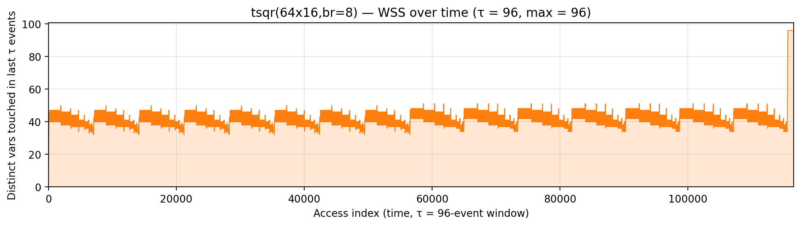

## transpose_naive [(code)](scripts/transpose_naive_n_32.py)
`n=32`. **Algorithm.** `B[i][j] = A[j][i]` read column-major. The cache-thrashing baseline — every A-read jumps by `n` bytes.

**Manual placement.** A on arg stack, B on scratch; the per-cell arg-read cost dominates.

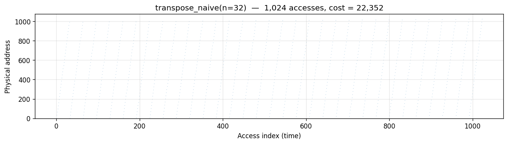

**Working-set size over time** (peak = 1,024).

**Reuse distance per load** (max = 1,024).

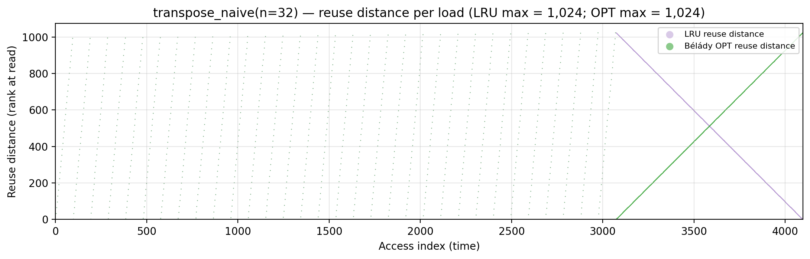

**Working-set size over a τ = 922-event window** (max = 922).

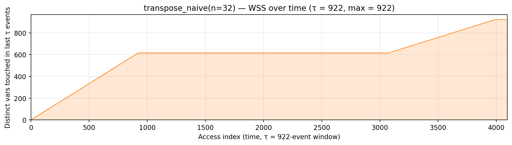

---

## transpose_blocked [(code)](scripts/transpose_blocked_n_32.py)
`n=32, T=√n`. **Algorithm.** Blocked iteration over A — same reads as naive in block-major order.

**Manual** matches naive layout; the heuristics reward the locality-friendly order only where LRU recency and density ranking can catch it.

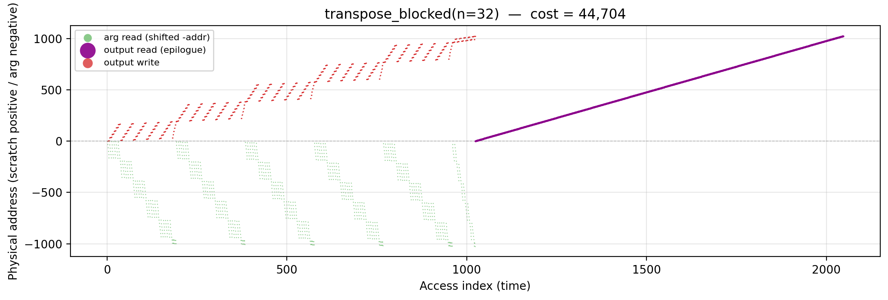

**Working-set size over time** (peak = 1,024).

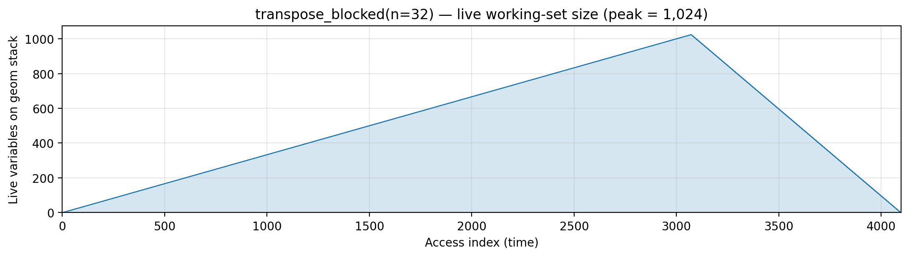

**Reuse distance per load** (max = 1,024).

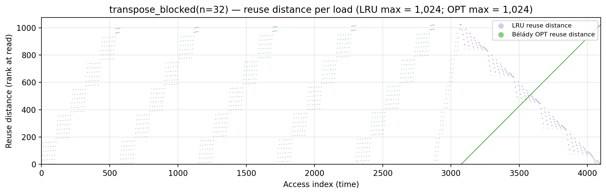

**Working-set size over a τ = 897-event window** (max = 897).

---

## transpose_recursive [(code)](scripts/transpose_recursive_n_32.py)
`n=32`. **Algorithm.** Cache-oblivious recursive transpose — split into 4 quadrants until `sz=1`.

**Manual** again matches the same fixed A/B addresses; heuristic difference comes from the quadrant traversal order.

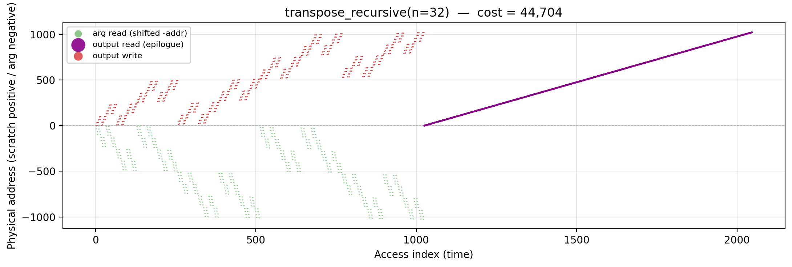

**Working-set size over time** (peak = 1,024).

**Reuse distance per load** (max = 1,024).

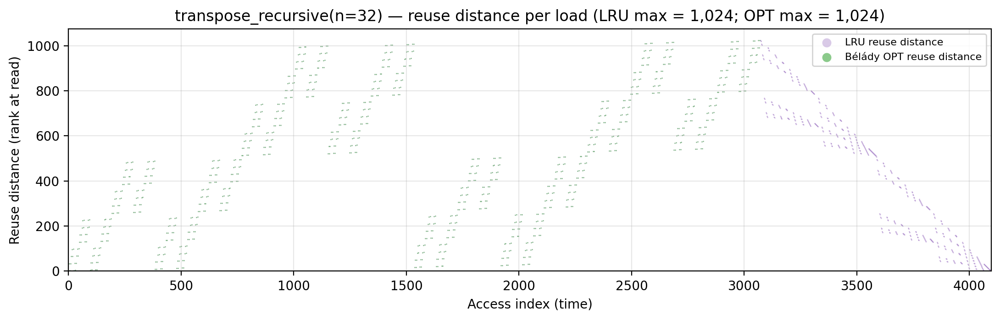

**Working-set size over a τ = 884-event window** (max = 884).

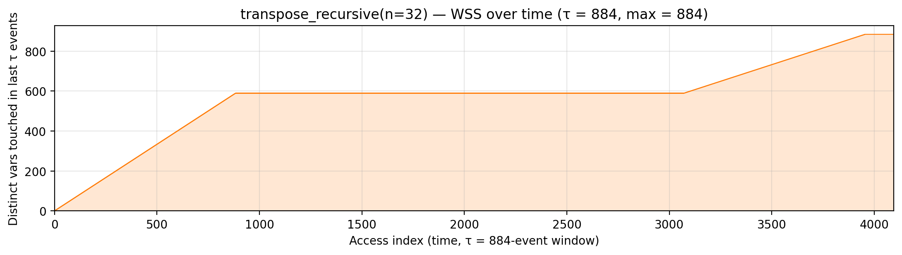

---

## stencil_time_naive [(code)](scripts/stencil_time_naive_16x16_t_4.py)
`n=16, T=4`. **Algorithm.** 4 full Jacobi sweeps, each reading the current grid and writing a fresh next-timestep buffer — naive communication-avoiding baseline.

**Manual.** Input A preloaded to scratch `cur`, ping-pong with `nxt`. Every cell is re-touched T times from bulk scratch.

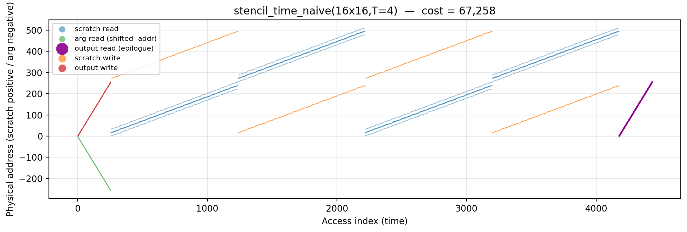

**Working-set size over time** (peak = 312).

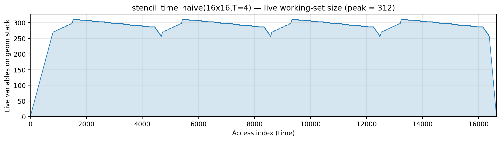

**Reuse distance per load** (max = 312).

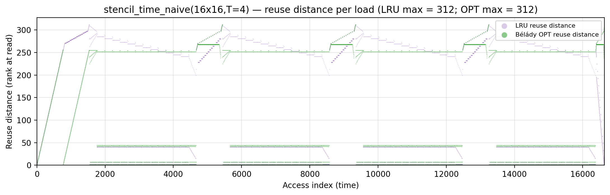

**Working-set size over a τ = 273-event window** (max = 264).

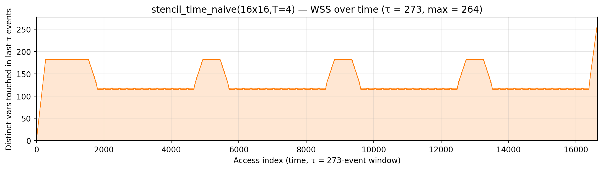

---

## stencil_time_diamond [(code)](scripts/stencil_time_diamond_16x16_t_4.py)
`n=16, T=4, block=4`. **Algorithm.** Diamond tiling: per (bi,bj) block, load a halo-expanded region into a hot scratchpad and run all T steps locally before flushing.

**Manual.** Three stacked optimizations (gemini's suggestion in
`gemini/optimize-stencil-time-diamond.md`):

1. **Lazy arg loading** — only cells actually inside the current
   block's Manhattan-distance diamond (`dist_i + dist_j ≤ T`) get
   touched, and only on their first visit. The naive version
   preloaded the full n² grid.
2. **In-place time-stepping** — the second `buf_nxt` array is
   dropped entirely. A sliding horizontal window of three scalar
   registers `c_left / c_center / c_right` plus a `prev_row` buffer
   holds the stale neighbor values long enough to do an in-place
   write on `buf_cur`.
3. **Diamond pruning** — each time step `t` clips to the
   **shrinking** dependence cone `dist_i + dist_j ≤ T - 1 - t`, so
   cells near the halo edge (whose values would be overwritten by
   halo contamination before they become needed) get skipped.

Layout:
  `c_left, c_center, c_right` (addrs 1..3) — sliding L1 register ring;
  `prev_row` (addrs 4..stride+3) — top-row buffer;
  `buf_cur` (addrs stride+4..stride²+stride+3) — sole block workspace;
  `cur` (addrs stride²+stride+4..) — global target.

Drops manual from 562,290 to **136,095** (−76%). Now beats both
`space_dmd` (178,875) and `bytedmd_live` (230,387) — a rare win on an
algorithm that was previously our worst-ratio offender.

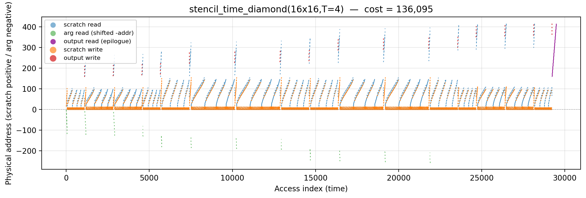

**Working-set size over time** (peak = 424).

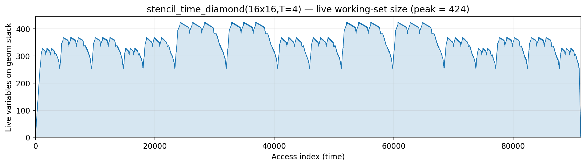

**Reuse distance per load** (max = 383).

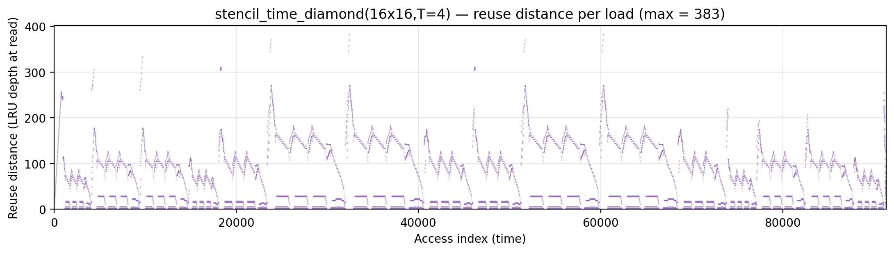

**Working-set size over a τ = 145-event window** (max = 145).

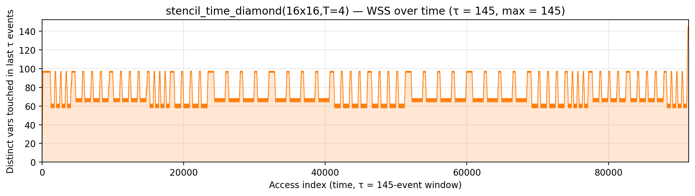

---

## floyd_warshall_naive [(code)](scripts/floyd_warshall_naive_v_16.py)
`V=16`. **Algorithm.** Standard 3-nested loop APSP: `D[i][j] = min(D[i][j], D[i][k] + D[k][j])` with branch-free stand-ins.

**Manual.** Same `A[i][j] -= A[i][k] · A[k][j]` inner body as
`lu_no_pivot` — apply the same hoisting recipe:

  `c_A` (addr 1)        — hot scalar pinning D[i][k] across j-sweep
  `c_C` (addrs 2..V+1)  — row buffer caching D[k][0..V-1]
  `D`   (addrs V+2..)   — scratch graph

Lazy arg reads at k=0 replace the V² preload. Drops manual from
142,800 to **76,339** (−47%), now below `space_dmd` (82,119).

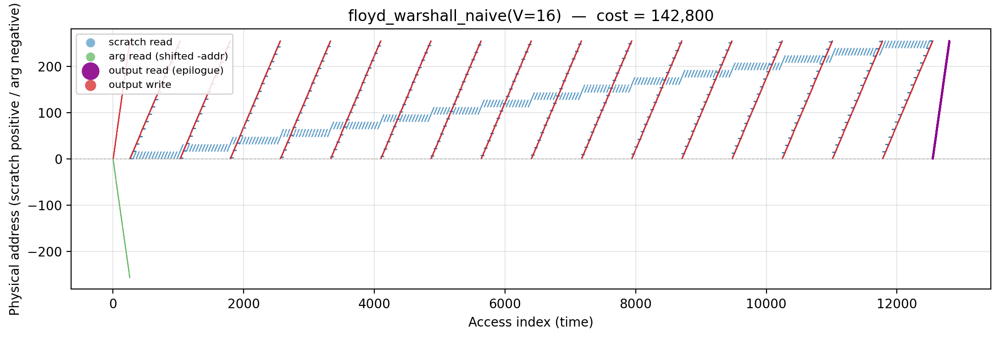

**Working-set size over time** (peak = 257).

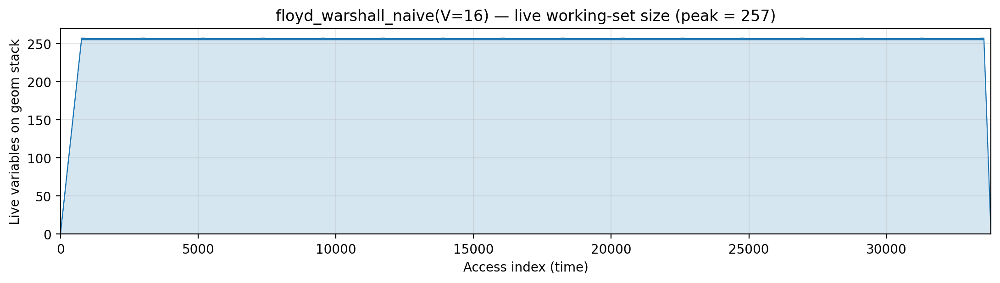

**Reuse distance per load** (max = 256).

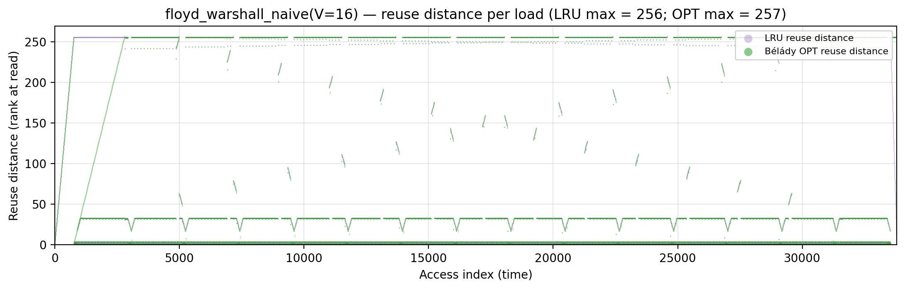

**Working-set size over a τ = 256-event window** (max = 256).

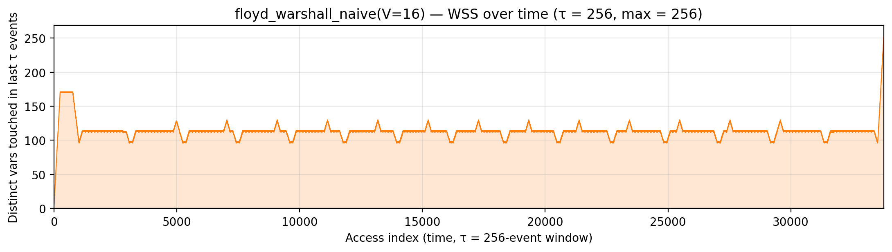

---

## floyd_warshall_recursive [(code)](scripts/floyd_warshall_recursive_v_16.py)
`V=16`. **Algorithm.** Kleene's cache-oblivious APSP: 8 recursive quadrant calls per level.

**Manual.** Three stacked optimizations (`gemini/optimize-floyd-warshall-recursive.md`):

1. **L1 scratchpads at stack bottom** — `cache_T` (target block) and
   `cache_D` (diagonal block), each 2×2, pinned at addresses 1..8.
   The O(V³) inner loops run entirely inside those 8 cells.
2. **Dirty-tracking** — the target block is only flushed back to `D`
   when a new block is loaded *and* the previous one was written to.
3. **Frequency-ordered layout** — a dry run counts cache misses per
   leaf block; `D` is then physically laid out with the highest-miss
   blocks at the lowest addresses via a `D_addr(r, c)` remap.

Drops manual from 142,288 to **57,920** (−59%), now only 22% above
`bytedmd_live` (47,495) vs the old 3.00× — one of the biggest
single-algorithm wins in the grid.

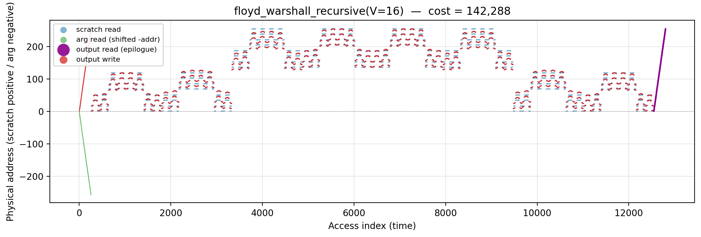

**Working-set size over time** (peak = 257).

**Reuse distance per load** (max = 256).

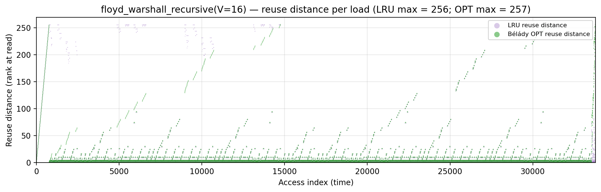

**Working-set size over a τ = 32-event window** (max = 32).

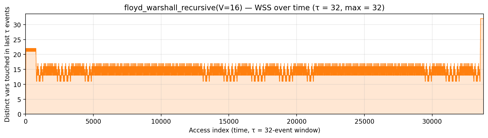

---

## layernorm_unfused [(code)](scripts/layernorm_unfused_n_256.py)
`N=256`. **Algorithm.** Three-pass LayerNorm: mean → variance → normalize. Each pass re-reads x from bulk.

**Manual.** x on arg stack; s/v/mean/inv_std scalars on scratch addrs 1-4 for hot accumulation. Output y on scratch.

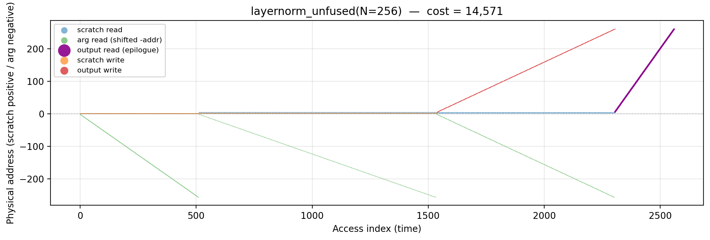

**Working-set size over time** (peak = 260).

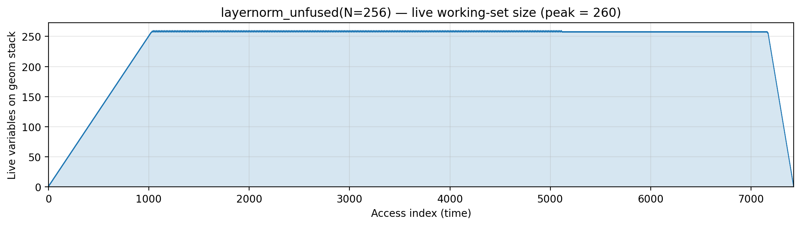

**Reuse distance per load** (max = 258).

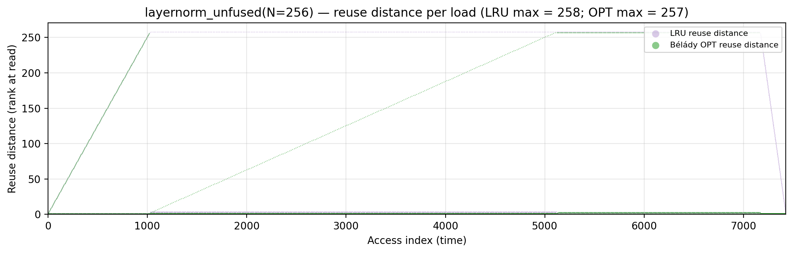

**Working-set size over a τ = 258-event window** (max = 257).

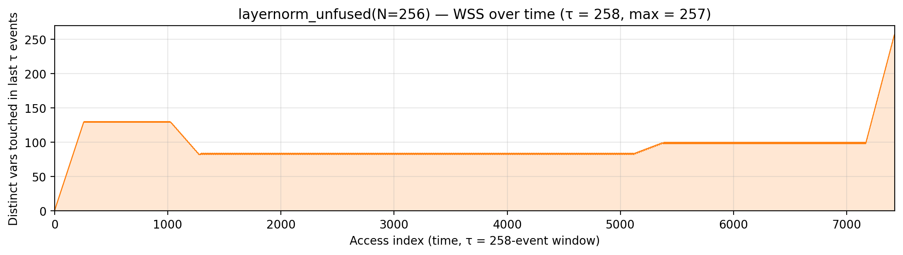

---

## layernorm_fused [(code)](scripts/layernorm_fused_n_256.py)
`N=256`. **Algorithm.** Welford's online mean+var in one pass, plus a second pass to normalize. The running accumulators stay in hot registers across all N updates.

**Manual.** Fewer address-space traversals — mu and m2 are read and written O(N) times but stay at depth 1-2 throughout.

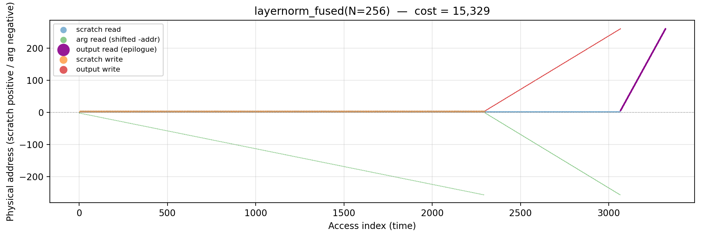

**Working-set size over time** (peak = 260).

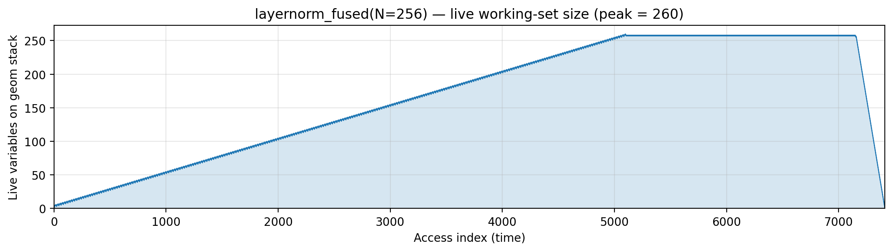

**Reuse distance per load** (max = 258).

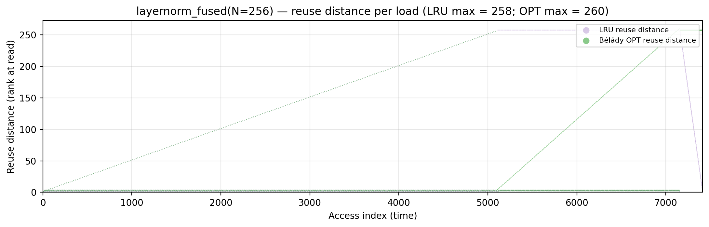

**Working-set size over a τ = 193-event window** (max = 193).

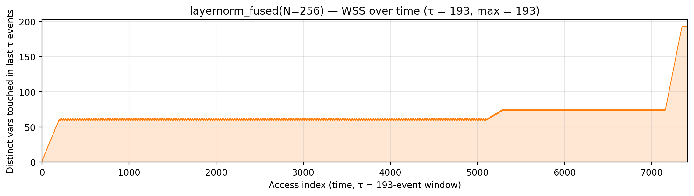

---

## matrix_powers_naive [(code)](scripts/matrix_powers_naive_n_16_s_4.py)
`n=16, s=4`. **Algorithm.** Run matvec s times — `x₁=Ax₀, x₂=Ax₁, …`. A is re-read in full every step.

**Manual.** A on arg stack so re-reads are priced identically each time; the naive cost is dominated by the fixed arg-stack positions of A.

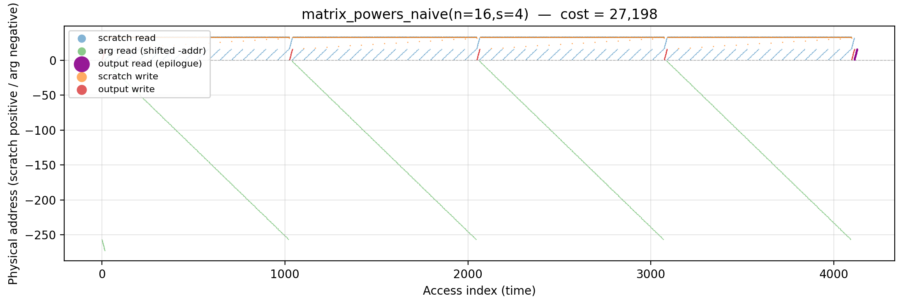

**Working-set size over time** (peak = 288).

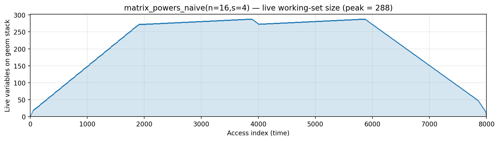

**Reuse distance per load** (max = 287).

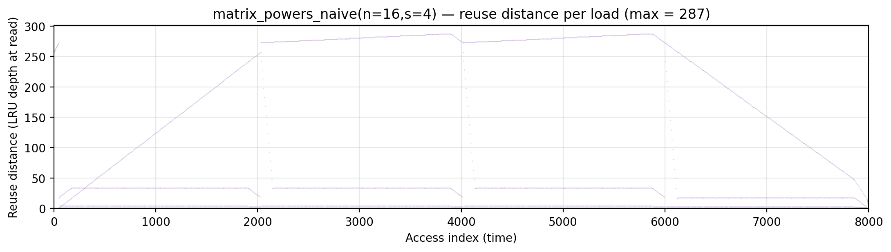

**Working-set size over a τ = 276-event window** (max = 137).

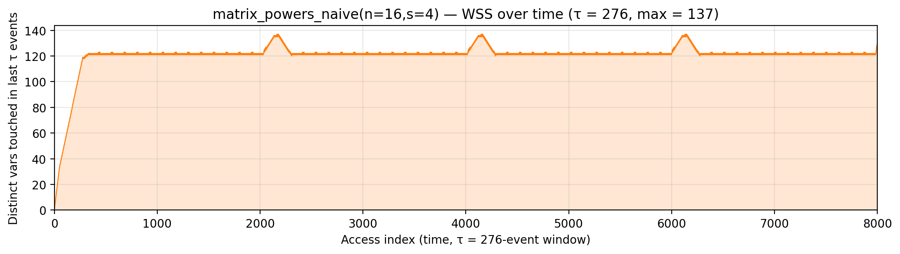

---

## matrix_powers_ca [(code)](scripts/matrix_powers_ca_n_16_s_4.py)
`n=16, s=4, block=4`. **Algorithm.** Communication-avoiding s-step: process A in row-blocks; for each block compute all step outputs locally before moving on.

**Manual.** Under the two-stack model A already lives on the arg stack with fixed per-position cost, so the CA benefit cannot amortize. Cost matches naive — heuristic differences come from the re-order of the events.

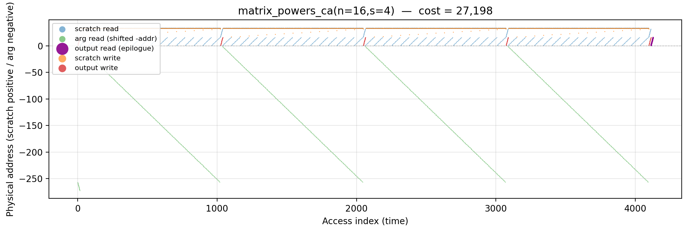

**Working-set size over time** (peak = 288).

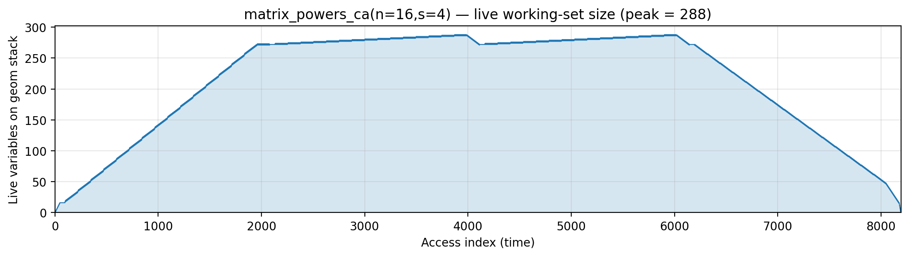

**Reuse distance per load** (max = 287).

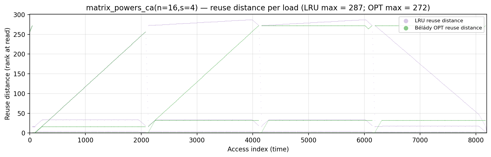

**Working-set size over a τ = 276-event window** (max = 134).

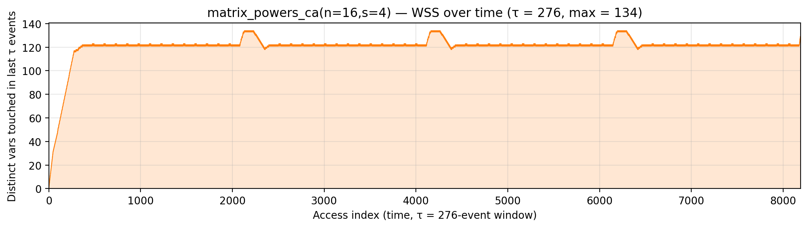

---

## cholesky_left_looking [(code)](scripts/cholesky_left_looking_n_32.py)
`n=32`. **Algorithm.** Complement of the default right-looking Cholesky: for column k pull data from all previously-factored columns 0..k-1 (far-flung reads), then finalize column k locally (concentrated writes).

**Manual.** Two hoisted scratchpads with lazy arg-stack reads: `c_A`
(addr 1) pins the accumulator `L[i][k]` during the past-factor
sweep; `c_C` (addrs 2..n+1) caches row k's previously-factored tail
`L[k][0..k-1]`. Inner `L[i][k] += L[i][j] * L[k][j]` body reads one
bulk cell (the past factor `L[i][j]`) and two hot scratchpads.
Drops manual from 494,000 to **244,300** (−51%), still above
`space_dmd` (212,125) but well below `bytedmd_classic` (352,335).

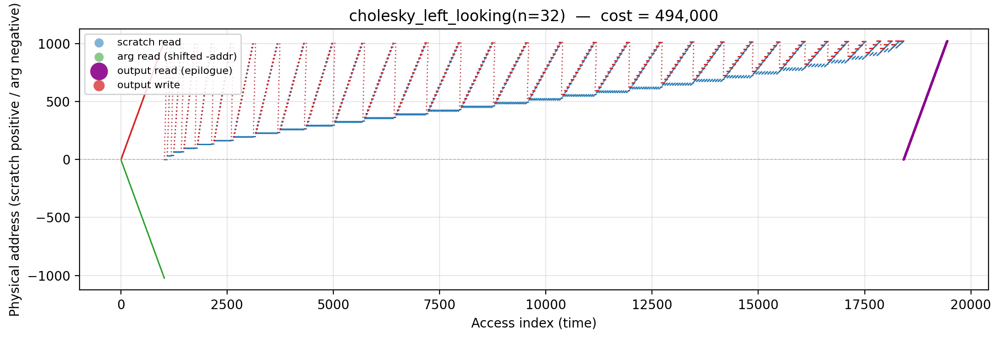

**Working-set size over time** (peak = 1,025).

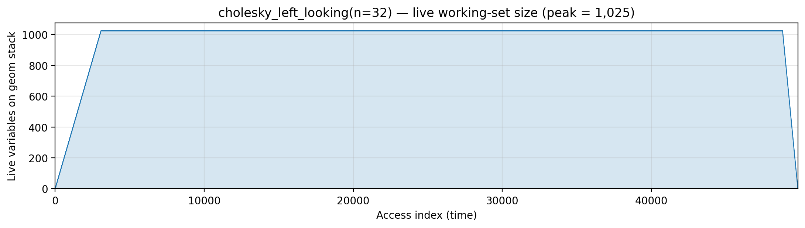

**Reuse distance per load** (max = 1,024).

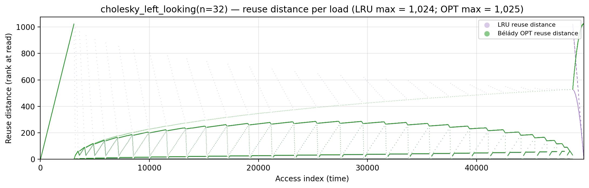

**Working-set size over a τ = 279-event window** (max = 279).

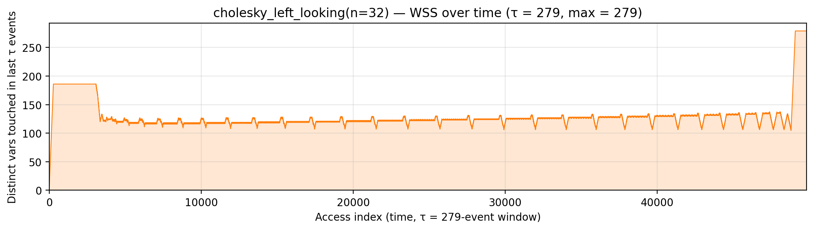

---

## spmv_csr_banded [(code)](scripts/spmv_csr_banded_n_32_bw_3.py)
`n=32, bandwidth=3`. **Algorithm.** Sparse matvec with CSR indices clustered near the diagonal. col_ind is a compile-time array (no memory cost), x-reads are data-dependent but spatially local.

**Manual.** vals and x on arg stack; accumulator and y on scratch.

**Working-set size over time** (peak = 214).

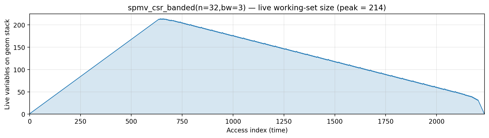

**Reuse distance per load** (max = 213).

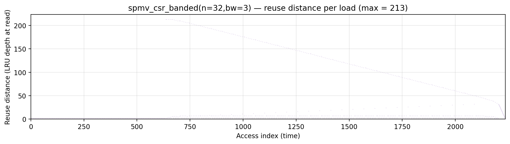

**Working-set size over a τ = 131-event window** (max = 74).

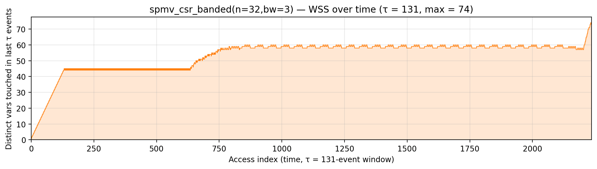

---

## spmv_csr_random [(code)](scripts/spmv_csr_random_n_32_nnz_7.py)
`n=32, nnz/row=7`. **Algorithm.** Same CSR machinery as banded but col_ind is a random Erdős-Rényi pattern. x-reads scatter all over the vector, which LRU heuristics penalize while density ranking can still pin hot nodes.

**Manual.** Identical layout to banded; the cost difference comes from which arg-stack positions of x get read how often.

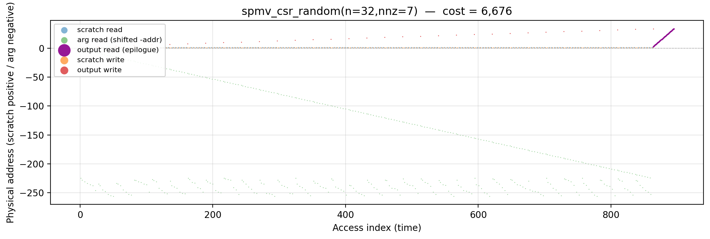

**Working-set size over time** (peak = 226).

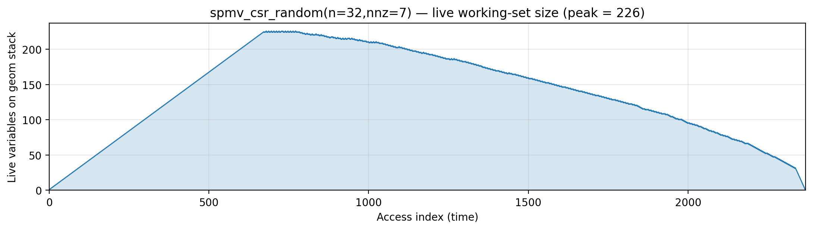

**Reuse distance per load** (max = 226).

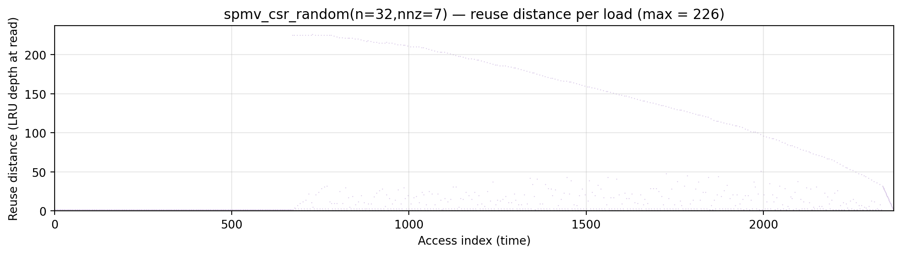

**Working-set size over a τ = 163-event window** (max = 96).

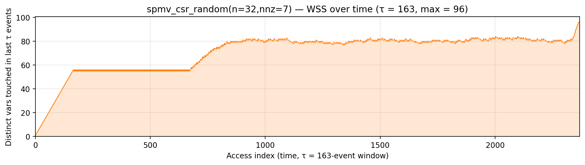

---

## bitonic_sort [(code)](scripts/bitonic_sort_n_64.py)
`N=64`. **Algorithm.** Data-oblivious sorting network: `log²N` compare-swap passes in butterfly order (identical in flavor to the iterative FFT).

**Manual.** Input preloaded to scratch; every pass does N/2 pair compare-swaps against varying-stride partners, exercising the full scratch range uniformly.

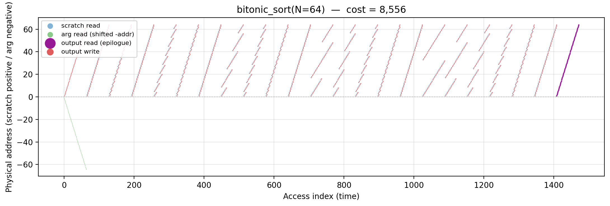

**Working-set size over time** (peak = 64).

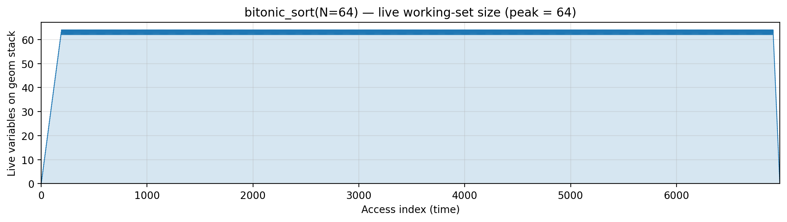

**Reuse distance per load** (max = 64).

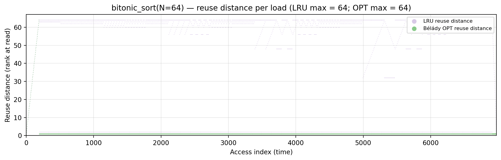

**Working-set size over a τ = 64-event window** (max = 64).

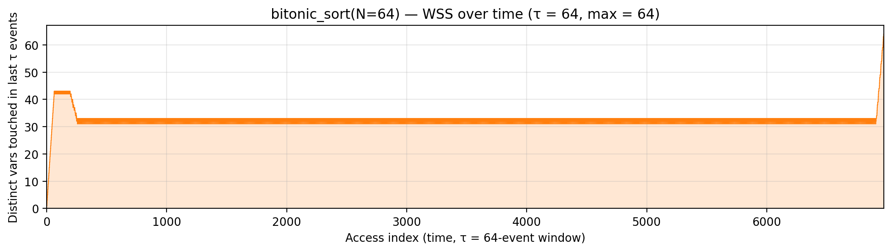

---

