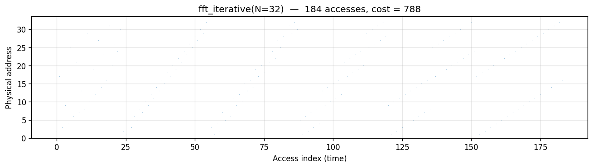
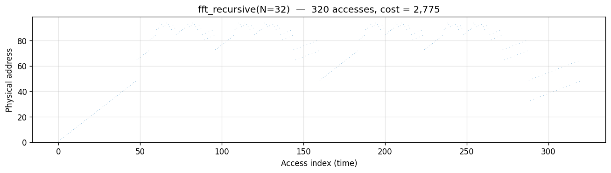
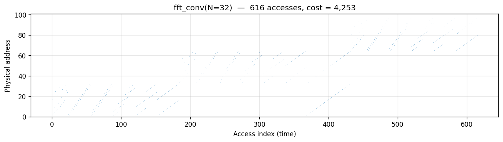

# grid — per-algorithm report

Cache-energy estimates under the 2D Manhattan-distance model
(`cost = Σ ⌈√addr⌉` over every memory touch, stores free). Each row is
one algorithm. Columns:

- **bytedmd_live** — LRU with liveness compaction (trace-based heuristic)
- **manual** — hand-placed bump-pointer schedule (gold standard)
- **bytedmd_classic** — Mattson LRU stack depth, no liveness (upper envelope)

| algorithm                                                             | bytedmd_live | manual      | bytedmd_classic |
|-----------------------------------------------------------------------|-------------:|------------:|----------------:|
| [naive_matmul(n=16)](#naive_matmul)                                   |      107,178 |     128,304 |         178,324 |
| [tiled_matmul(n=16)](#tiled_matmul)                                   |       74,560 |      86,030 |         143,280 |
| [rmm(n=16)](#rmm)                                                     |       80,716 |      95,222 |         154,251 |
| [fused_strassen(n=16)](#fused_strassen)                               |      173,919 |     140,526 |         353,901 |
| [naive_attn(N=32,d=2)](#naive_attn)                                   |      145,972 |     242,843 |         286,197 |
| [flash_attn(N=32,d=2,Bk=8)](#flash_attn)                              |       97,856 |     137,184 |         167,803 |
| [transpose_naive(n=32)](#transpose_naive)                             |       15,636 |      22,352 |          36,637 |
| [transpose_blocked(n=32)](#transpose_blocked)                         |       16,654 |      22,352 |          37,206 |
| [transpose_recursive(n=32)](#transpose_recursive)                     |       18,016 |      22,352 |          38,034 |
| [matvec_row(n=64)](#matvec_row)                                       |      229,199 |     238,853 |         450,939 |
| [matvec_col(n=64)](#matvec_col)                                       |      177,873 |     212,776 |         433,535 |
| [fft_iterative(N=32)](#fft_iterative)                                 |        1,646 |         788 |           2,330 |
| [fft_recursive(N=32)](#fft_recursive)                                 |        1,461 |       2,775 |           2,468 |
| [stencil_naive(32x32)](#stencil_naive)                                |       44,468 |      99,276 |          92,817 |
| [stencil_recursive(32x32,leaf=8)](#stencil_recursive)                 |       37,737 |      99,276 |          85,079 |
| [spatial_conv(32x32,K=5)](#spatial_conv)                              |      373,936 |     527,312 |         678,749 |
| [regular_conv(16x16,K=3,Cin=4,Cout=4)](#regular_conv)                 |      762,860 |     963,512 |       1,289,844 |
| [fft_conv(N=32)](#fft_conv)                                           |        5,629 |       4,253 |           8,489 |
| [mergesort(N=64)](#mergesort)                                         |        2,691 |       8,416 |           4,344 |
| [lcs_dp(32x32)](#lcs_dp)                                              |       30,253 |      85,929 |          47,066 |

---

## naive_matmul
`n=16`. **Algorithm.** Standard triple-nested-loop matrix multiplication:
`C[i][j] = Σ_k A[i][k] · B[k][j]`. A is read row-major per output row; B
sweeps column-major across `k`.

**Manual placement.** Accumulator `s` at addr 1 (hot scalar); then `A`,
`B`, `C` laid out contiguously at addrs 2..n²+1, n²+2..2n²+1, 2n²+2..3n²+1.
Each output cell reads `s` once outside the k-loop, then touches A[i][k]
and B[k][j] per k-iteration. `C[i][j]` is written for free.

---

## tiled_matmul
`n=16, T=4`. **Algorithm.** One-level blocked matmul — iterate over
`(bi, bj, bk)` tiles of size T×T, compute each inner tile with the triple
loop. Same arithmetic as naive but in block-major order for locality.

**Manual placement.** Scratchpads `sA, sB, sC` at addrs 1..T², T²+1..2T²,
2T²+1..3T² (hot). Bulk `A, B, C` at higher addrs. For each (bi, bj):
load C tile into sC; for each bk: load A/B tiles into sA/sB; MAC into sC
(accumulator read once per (ii,jj) outside kk-loop); flush sC back.

---

## rmm
`n=16, T=4`. **Algorithm.** Cache-oblivious recursive matmul: split each
of A, B, C into 4 quadrants and make 8 recursive calls (2×2×2 = 8
sub-products in Hamiltonian order), descending until `sz = T` where the
base-case tile kernel runs.

**Manual placement.** Same scratchpad+bulk layout as tiled. The recursion
naturally generates a Hamiltonian walk over C-tiles; only the
**immediately-prior** C tile is considered "loaded" (matches
strassen_trace's cache semantic), so 7 of 8 consecutive base calls reload
C while 1 skips the pre-fetch.

---

## fused_strassen
`n=16, T=4`. **Algorithm.** Zero-Allocation Fused Strassen (ZAFS):
single-level outer Strassen (7 matrix multiplies instead of 8) where the
sub-additions (A₁₁+A₂₂, etc.) are evaluated **on-the-fly** while loading
the L1 tile — the intermediate M matrices are never materialized. Each of
the 7 recipes is distributed directly into the target C quadrants with
sign.

**Manual placement.** Only 3 L1 tile slots (`fast_A, fast_B, fast_C` at
addrs 1..3T²) plus A, B, C in main memory. No allocation of the 7 M
matrices — the ZAFS win shows up entirely here in manual (140,526 vs
353,901 for the naïve trace-based upper envelope).

---

## naive_attn
`N=32, d=2`. **Algorithm.** Standard attention: compute full N×N
score matrix `S = Q·Kᵀ/√d`, row-wise softmax into `P`, then `O = P·V`.
The whole N×N matrix is materialized in memory.

**Manual placement.** Hot scalars `s_acc, tmp, row_max, row_sum, inv_sum`
at addrs 1..5; bulk Q, K, V (N·d each); the N² score/probability matrix
S (reused as P in-place); output O. The bulk S matrix dominates the
cost — every access pays `⌈√(addr ≈ N²)⌉`.

---

## flash_attn
`N=32, d=2, Bk=8`. **Algorithm.** Flash attention with online softmax
over K/V blocks of size Bk: for each query row, stream blocks of K and
V, compute block scores, update running `(m, l)` softmax stats, and
accumulate block contribution into `o_acc`. Never materializes the N×N
score matrix.

**Manual placement.** Bk-sized scratch blocks `s_block, p_block` and a
d-sized `o_acc` at low addrs; running `m_i, l_i` registers; merge
scalars `m_block, l_block, m_new, α, β, inv_l, tmp` also hot. Only Q,
K, V, O live in main memory — the saved N² footprint drops manual from
naive's 242k to 137k.

---

## transpose_naive
`n=32`. **Algorithm.** `B[i][j] = A[j][i]` in row-major sweep over B,
which reads A in column-major (strided) order.

**Manual placement.** A at addrs 1..n², B at n²+1..2n² (writes free). No
scratchpad — in the fixed-address Manhattan model, blocking gives zero
savings when each A cell is touched exactly once (the total
`Σ ⌈√addr⌉` is order-independent). The recency-aware heuristics catch
the stride penalty; manual cannot.

---

## transpose_blocked
`n=32, T=6`. **Algorithm.** Iterate over T×T blocks of B; within each
block, the column-major A reads are still strided but stay within one
narrow band of rows, improving hit rates on a real cache.

**Manual placement.** Same A, B layout as naive — no scratchpad
(redundant here: a copy-in/copy-out would double the touches without
changing the `Σ ⌈√addr⌉` total). Only the access order changes, so
manual cost equals the naive case; `bytedmd_classic` / `bytedmd_live`
differ because their LRU stacks grow differently under block-order
reads.

---

## transpose_recursive
`n=32`. **Algorithm.** Cache-oblivious 4-way recursive split of both
input and output quadrants, bottoming out at single elements.

**Manual placement.** A at 1..n², B at n²+1..2n², no scratchpad — same
reasoning as blocked. Recursion yields a Z-order (Morton) walk over A,
which the recency heuristics like slightly less than naive's row-major
and slightly more than blocked's tile-major, but all three manual costs
collapse to the same 22,352.

---

## matvec_row
`n=64`. **Algorithm.** `y[i] = Σ_j A[i][j] · x[j]`, outer loop over `i`.
A is read row-major (contiguous); `x` is re-read n times.

**Manual placement.** Hot slots first: `s, tmp` (scalars), `y` (n slots),
`x` (n slots) at addrs 1..2n+2; A at 2n+3..2n+2+n². The accumulator `s`
is read once per output row; A and `x` are hit every k-iteration, but
all of `x` sits in the hot region so its cost is amortized.

---

## matvec_col
`n=64`. **Algorithm.** Outer loop over `j`: for each column of A, fold
`A[i][j] · x[j]` into `y[i]`. A is read column-major (strided by n).

**Manual placement.** Same as row-major: `tmp, y, x` hot at 1..2n+1; A
cold at 2n+2.. . Column-major read pattern spreads A accesses across
the whole bulk region in stride-n jumps, which `bytedmd_live` rewards
(177k vs row's 229k) but manual barely distinguishes (212k vs 238k) —
again, the sum is fixed.

---

## fft_iterative
`N=32`. **Algorithm.** In-place iterative radix-2 Cooley–Tukey:
bit-reverse permutation followed by `log₂N` stages of N/2 butterflies
each. Real twiddle stand-in (the ByteDMD cost depends only on the
load pattern).

**Manual placement.** Single N-slot array `x` at addrs 1..N — the entire
working set lives in the hot region. No temps, no recursion, no bulk
data region. Manual cost (788) is *below* `bytedmd_live` (1,646) — a
cheap-placement win that recency heuristics can't anticipate.

---

## fft_recursive
`N=32`. **Algorithm.** Out-of-place recursive radix-2 Cooley–Tukey:
split into even/odd halves, recurse, then combine with twiddles.

**Manual placement.** Top-level `x` at 1..N; each recursion level uses
`push/pop` to allocate fresh `even` and `odd` buffers (size N/2 each)
just above the pointer. The allocator climbs during recursion (peak
~2N), so deeper levels pay `⌈√addr⌉` at higher addrs. The temps also
push manual cost above `bytedmd_classic` (2,775 vs 2,468) — stack
discipline alone can't match liveness-aware LRU at this scale.

---

## stencil_naive
`32×32, one sweep`. **Algorithm.** 5-point Jacobi row-major sweep:
`B[i][j] = 0.2 · (A[i][j] + A[i±1][j] + A[i][j±1])` for interior cells.

**Manual placement.** A at 1..n², B at n²+1..2n². Each interior A cell
is touched 5× (once as center, four times as neighbor across its
dependent B outputs), giving 5(n-2)² reads. Fixed-placement cost is
pattern-independent.

---

## stencil_recursive
`32×32, one sweep, leaf=8`. **Algorithm.** Quad-tree split of the 2D
domain, naive sweep at leaf tiles of size 8×8. (Trapezoidal
cache-oblivious stencil is not implemented — that form requires a time
dimension.)

**Manual placement.** Same A, B layout as naive. Manual cost is
identical to naive (99,276) because every A cell is still touched
exactly 5× — the cost sum `Σ⌈√addr⌉` is invariant to access order.
`bytedmd_live` distinguishes them (37,737 vs 44,468) via recency
effects only.

---

## spatial_conv
`32×32, K=5`. **Algorithm.** Single-channel 2D convolution:
`O[i][j] = Σ_{ki,kj} A[i+ki][j+kj] · W[ki][kj]`. Output is 28×28.

**Manual placement.** Scalar `s` at addr 1, K² = 25-slot kernel `W` at
2..26 (hot, reused for every output cell), H·W image at 27.. (cold
bulk). Each output cell reads `s` once then touches image and kernel
K² times.

---

## regular_conv
`16×16, K=3, Cin=4, Cout=4`. **Algorithm.** Full multi-channel CNN
layer: `O[i][j][co] = Σ_{ki,kj,ci} A[i+ki][j+kj][ci] · W[ki][kj][ci][co]`.

**Manual placement.** Scalar `s`, then K²·Cin·Cout = 144-slot kernel
(channel pairs inner-most), then H·W·Cin image (channel inner-most).
Kernel fits in the hot region so all 144 weights are cheap; image
sweeps the mid-range bulk for each of the Cin channels per spatial
position.

---

## fft_conv
`N=32`. **Algorithm.** 1D circular convolution via FFT:
`IFFT(FFT(x) · FFT(y))`. Two forward FFTs, an N-element pointwise
multiply, and one inverse FFT.

**Manual placement.** Three N-slot arrays `X, Y, Z` at addrs 1..3N in
the hot region; each FFT runs in-place on its own array. Total cost is
≈ 3× the iterative FFT cost plus the pointwise multiply. Note manual
(4,253) is below `bytedmd_live` (5,629) — the tight in-place FFT
layout is cheaper than any trace-only LRU estimate.

---

## mergesort
`N=64`. **Algorithm.** Recursive mergesort. Merge is implemented as a
data-oblivious stand-in (2 reads per output cell) since `_Tracked`
doesn't implement `__lt__` — the access traffic matches a real
comparison-based merge.

**Manual placement.** Primary array at addrs 1..N. Each recursion level
uses `push/pop` to allocate a temp buffer of size `sz` just above the
pointer; the merge writes the result to temp, then copies temp back to
base. Temps stack up during recursion (peak ~2N). Manual (8,416) ends
up *above* `bytedmd_classic` (4,344) — live temps drive the allocator
pointer high, and fixed placement pays full cost on every access.

---

## lcs_dp
`m=n=32`. **Algorithm.** Longest-common-subsequence dynamic programming
on an (m+1)×(n+1) table, row-major fill. Branch-free sum replaces the
max/equality recurrence; access pattern matches canonical LCS:
3 table reads + 2 string reads per cell.

**Manual placement.** Strings `x` (m slots) and `y` (n slots) at addrs
1..m+n — hot and touched every cell. DP table `D` at addrs m+n+1..
(m+1)(n+1) tail — this is the main bulk region. Every `D[i][j]` fill
reads 3 neighbors that span 2 rows of the table, so each touch pays
`⌈√addr⌉` on a large bulk array. Manual (85,929) exceeds both
heuristics — a clean case where fixed-placement is a *pessimistic*
upper envelope.

