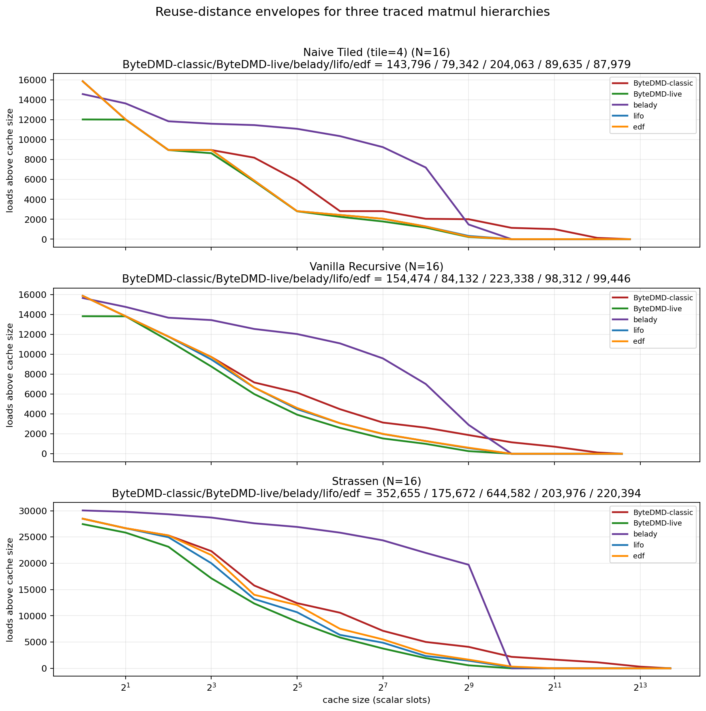

# Final Report: Three-Level Matmul Trace Hierarchy

This experiment adds an explicit three-level pipeline for matrix multiplication traces:

1. **Python algorithm level**: regular Python implementations of one-level tiled matmul, 8-way recursive matmul, and Strassen live in [hierarchy.py](./hierarchy.py).
2. **Abstract load/store level**: running those algorithms over traced scalar values emits a flat logical access stream like `load A[0,0]`, `store t17_mul`, `load t17_mul`, without concrete addresses.
3. **Compiled concrete-address level**: the same logical stream is compiled to slot traces under concrete reuse policies such as `belady`, `lifo`, and offline `edf`, producing accesses like `load A[0,0] addr=1`, `store t17_mul addr=769`.

The implementation is in [hierarchy.py](./hierarchy.py), the runner is [run_experiment.py](./run_experiment.py), the raw data is [results.json](./results.json), and the unit tests are [test_matmul_hierarchy.py](/Users/yaroslavvb/Library/CloudStorage/Dropbox/git0/ByteDMDcodex/test_matmul_hierarchy.py).

## Why this exists

The repo already had abstract ByteDMD tracers, but not a single experiment that makes the hierarchy explicit end to end:

- source algorithm
- logical loads/stores
- compiled address trace

That missing layer matters if we want to compare:

- **ByteDMD-classic**, the original total-bytes logical stack model
- **ByteDMD-live**, the live-bytes logical stack model
- concrete address reuse strategies that a compiler could plausibly generate

on the **same** execution.

## Cost model

The discrete ByteDMD cost of a load at reuse depth `d` is:

```text
cost(d) = ceil(sqrt(d))
```

That means the cost tiers are:

| Cost | Depth range | Cumulative capacity |
|------|-------------|--------------------:|
| 1 | `1` | 1 |
| 2 | `2..4` | 4 |
| 3 | `5..9` | 9 |
| 4 | `10..16` | 16 |

So the natural interpretation is **square cumulative capacities** `1, 4, 9, 16, ...`.
If you look at the *incremental shell sizes* between tiers, those are the odd numbers
`1, 3, 5, 7, ...`.

## Method glossary

| Method | Level | Future knowledge | Stable addresses | Meaning |
|--------|-------|------------------|------------------|---------|
| `ByteDMD-classic` | abstract | no | no | Logical LRU over all values ever created; dead temps still contribute to depth |
| `ByteDMD-live` | abstract | no | no | Logical LRU after removing dead values immediately |
| `never-reuse` | concrete | no | yes | Compiled addresses never recycled; concrete analog of `ByteDMD-classic` |
| `lifo` | concrete | no | yes | Reuse the most recently freed concrete slot |
| `edf` | concrete | yes, at interval level | yes | Offline interval packing of temp lifetimes into fixed slots |
| `belady` | concrete | yes, exact next use | yes | Two-pass Belady-inspired heuristic that chooses fixed base addresses using next-use information |

The crucial distinction now is that `belady` **is** a stable-address compiler heuristic.
It uses future knowledge only when assigning a base address to a value. Once assigned,
that address stays fixed until the value dies.

## Sample trace

For the tiled kernel, the first few logical events are:

```text
 load A[0,0]         role=input
 load B[0,0]         role=input
store t1_mul         role=temp
 load A[0,1]         role=input
 load B[1,0]         role=input
store t2_mul         role=temp
 load t1_mul         role=temp
 load t2_mul         role=temp
store t3_add         role=temp
```

Compiling the same prefix with `lifo` produces:

```text
 load A[0,0]         addr=   1 role=input
 load B[0,0]         addr= 257 role=input
store t1_mul         addr= 769 role=temp
 load A[0,1]         addr=   2 role=input
 load B[1,0]         addr= 273 role=input
store t2_mul         addr= 770 role=temp
 load t1_mul         addr= 769 role=temp
 load t2_mul         addr= 770 role=temp
store t3_add         addr= 770 role=temp
```

The logical and concrete traces have the same control/dataflow, but concrete slot reuse changes the reuse-distance curve.

## What Belady means now

`belady` is no longer a free oracle re-ranking of the live set.

Instead:

1. Pass 1 records every future load.
2. When a new value is stored, the allocator looks at the next use of every currently live value.
3. It assigns the **new value a fixed base address** using that next-use information.
4. Later loads are charged from that concrete address using the same tiered cost model.

So `belady` is now a genuine **offline stable-address heuristic**, not an oracle lower bound.
Because early temporaries often arrive only after the input matrices have already occupied the
cheapest addresses, this fixed-address Belady can actually be **more expensive** than
`ByteDMD-live`, `lifo`, or `edf`.

## N=16 results

The runner fixes `N=16`, uses a one-level tile size of `4`, computes logical reuse depths under:

- `ByteDMD-classic`
- `ByteDMD-live`

and concrete reuse depths under:

- `never-reuse`
- `belady`
- `lifo`
- `edf`

then converts each depth trace into:

- a memory-size sweep `misses(M) = #{depth > M}`
- a discrete ByteDMD total `sum ceil(sqrt(depth))`

### ByteDMD totals

| Algorithm | ByteDMD-classic | ByteDMD-live | never-reuse | belady | lifo | edf |
|-----------|-----------------:|-------------:|------------:|-------:|-----:|----:|
| Tiled | 143,796 | 79,342 | 143,796 | 204,063 | 89,635 | 87,979 |
| Recursive | 154,474 | 84,132 | 154,474 | 223,338 | 98,312 | 99,446 |
| Strassen | 352,655 | 175,672 | 352,655 | 644,582 | 203,976 | 220,394 |

`never-reuse` is included explicitly because it is the compiled concrete policy that corresponds to `ByteDMD-classic` in this pipeline.

`belady` is now a true **offline two-pass stable-address heuristic** over the logical trace:
in pass 1 it records every future load, and in pass 2 it uses the next-use times of the live
set only when picking a new fixed base address for each stored value.

The qualitative interpretation stays the same:

- **ByteDMD-live** is a clear lower envelope and **ByteDMD-classic** is a clear upper envelope.
- `belady`, `lifo`, and `edf` are all concrete stable-address policies now.
- `belady` uses more future knowledge than `lifo` or `edf`, but because it pays from fixed base addresses rather than from free re-ranking, it is not automatically cheaper.
- Their ordering is empirical rather than guaranteed by one simple dominance relation.

## Plot



The curves show `loads above cache size` against cache capacity in scalar slots. For every algorithm, the concrete curves stay inside the abstract envelope:

- `ByteDMD-live` is the optimistic lower bound
- `ByteDMD-classic` is the pessimistic upper bound
- `lifo` and `edf` stay between them on this experiment
- `belady` is a fixed-address heuristic and can land above either abstract model

## Tests

The unit tests cover:

- correctness of all three algorithms on small matrices
- emission of all three levels
- equality between `ByteDMD-classic` and compiled `never-reuse`
- envelope sanity for small recursive examples

Run them with:

```bash
uv run pytest -q test_matmul_hierarchy.py
```

Regenerate the figure and data with:

```bash
uv run experiments/matmul_hierarchy/run_experiment.py
```
