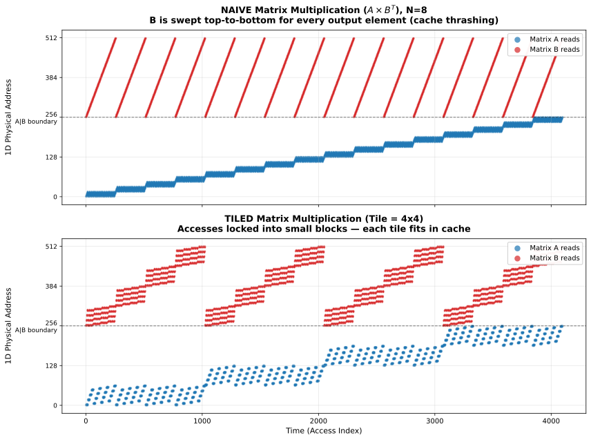

# Tiled Matrix Multiplication: Visualizing Cache Locality

This experiment visualizes why tiled (blocked) matrix multiplication is more energy-efficient than the naive algorithm by plotting their memory access patterns.

## The Key Insight

By plotting **Time** (operation sequence) on the X-axis and **1D Physical Memory Address** on the Y-axis, cache locality becomes visually obvious:

- **Cache-friendly algorithm**: small vertical footprint at any given time — the CPU repeatedly reads a small neighborhood of addresses that fits in L1/L2 cache.
- **Cache-hostile algorithm**: large vertical sweeps — the CPU touches distant addresses, causing constant cache misses.

## Results



### Naive (top panel)

Matrix B forms massive diagonal sweeps across its entire memory space (0 to N^2). The time gap between reusing the first row of B is O(N^2) operations — by then the cache has completely overwritten it. Almost every read of B is a slow RAM fetch.

### Naive-tiled / output-partitioned (second panel)

Same loop order as naive (`i → j → k`) but applied only within T×T output
tiles. Each `C[i, j]` is still fully accumulated over the full N-length
reduction in k before moving to the next output cell, so the full-column
B sweeps persist inside every tile. Tiling the output alone — without
interchanging the inner loops — delivers no cache benefit on the inputs.

### 2D-tiled / output-stationary (third panel)

Same tile partitioning as naive-tiled, but with `k` hoisted to the
outermost position inside the tile (`bi → bj → k → i → j`). The T×T
output block is pinned as an accumulator and A/B panels stream in rank-1
per k. This is the standard output-stationary tiling.

### 3D-tiled (bottom panel)

Accesses form tight, localized blocks ("clouds"). For hundreds of
operations, the CPU is locked into a tiny vertical band of memory.
Because the T×T block easily fits in cache, the CPU executes the math at
near-lightspeed before moving to the next block.

## Working-set size over time


Two complementary working-set definitions, with naive (red) and tiled (blue)
overlaid on each panel. Same plot style as the `_liveset.png` / `_wss.png`
traces in `experiments/grid`.

- **Top — live working set.** An address is live on $[$first-use, last-use$]$;
  W(t) counts currently-live addresses. This is the minimum scratchpad
  capacity a liveness-aware allocator (`bytedmd_live`) would require at $t$.
  On the *raw compute trace* this does **not** favour tiling — the bi-bj-bk
  ordering actually spreads each B element's last use slightly later, so
  tiled peaks a little higher (5,120) than naive (4,160). Tiling alone
  doesn't shrink liveness; the payoff has to come from DMA into a fast
  scratchpad whose slots rebind per block.

- **Bottom — sliding-window $W(t, \tau)$** (Denning 1968): distinct addresses
  in the trailing $\tau$ reads, with $\tau = 2T^3$ (one tiled `bk`-block's
  worth of reads). Here tiling's real locality benefit is obvious: the tiled
  window sees ~784 addresses (one $T{\times}T$ tile of A and B, ≈ $2T^2$),
  while the naive window is pinned at ~4,224 because every output element
  sweeps all of B. ~5× gap at this $\tau$.

## Locality measures (Yuan et al. 2019)

See [`locality_report.md`](locality_report.md) for a full implementation of
every locality measure in [`gemini/locality-measures.md`](../../gemini/locality-measures.md)
(frequency / hotness, reuse interval, reuse distance, footprint $fp(x)$,
miss-ratio curve, eviction time), each with a plot contrasting naive vs
tiled. Regenerate with `uv run --script visualize_locality.py`.

## Running

```bash
uv run --script visualize_tiling.py          # (time, address) scatter
uv run --script visualize_working_set.py     # working-set over time
uv run --script visualize_locality.py        # all locality measures
```

`visualize_tiling.py` generates `matmul_access_pattern.svg` (N=64, T=16,
~262k access points). `visualize_working_set.py` generates
`working_set_over_time.svg`. `visualize_locality.py` writes
`locality_*.svg` referenced in `locality_report.md`.
